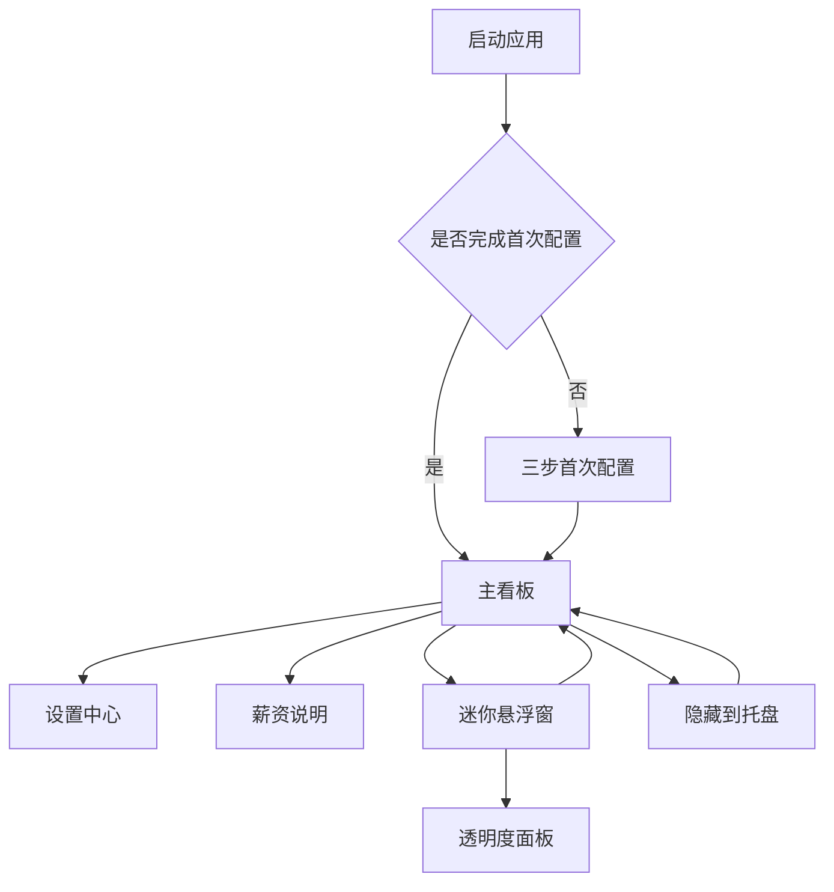

# 薪跳 PayDance 产品需求文档

## 文档信息

| 项目         | 内容                                                    |
| ------------ | ------------------------------------------------------- |
| 产品名称     | 薪跳 PayDance                                           |
| 产品形态     | 桌面实时工资看板、Web Preview                           |
| 当前产品基线 | v0.9.9，提交 `7b88933cec19f17da63cb7cc4df7e929248f2ecd` |
| PRD 版本     | 1.0                                                     |
| 文档状态     | 可执行基线                                              |
| 创建日期     | 2026-08-25                                              |
| 产品负责人   | 待补充                                                  |
| 设计负责人   | 待补充                                                  |
| 开发负责人   | 待补充                                                  |

### 文档用途

本文档用于统一薪跳 PayDance 的产品目标、现有能力、计算规则、交互边界和后续迭代要求。后续需求评审、设计、开发、测试和发布均应引用本文中的需求编号。

需求状态采用以下标记：

- **已实现**：当前 v0.9.9 已具备，属于回归基线。
- **待实现**：已进入现有路线图，但尚未完成。
- **候选**：值得评估，尚未批准进入开发。
- **排除**：不符合当前产品定位，除非重新完成产品边界评审。

## 1. 产品概述

### 1.1 产品定义

薪跳是一款把“今天正在挣到的钱”实时显示在桌面上的轻量工具。用户配置薪资和工作时间后，应用持续计算当日已获得的预估收入，并通过完整看板或迷你悬浮窗展示。

### 1.2 用户问题

固定月薪、日薪或时薪通常只在发薪或结算时可见，用户在一天的工作过程中难以感知当前投入的时间对应多少收入。薪跳把抽象的薪资换算成随工作进度增长的金额，让用户随时确认今日进度与回报。

### 1.3 核心价值

1. **即时可见**：把当日预估收入、工作进度和剩余工作时间放在桌面上。
2. **低打扰**：支持迷你悬浮、窗口置顶、托盘常驻和开机启动。
3. **贴近常见工作制**：支持月薪、日薪、时薪、每周工作日、午休剔除和跨零点夜班。
4. **本地优先**：不需要账号，不上传薪资配置，不使用遥测或广告。

### 1.4 产品原则

- 今日入账金额始终是第一视觉焦点。
- 主窗口负责完整信息，迷你窗口只显示金额。
- 功能应直接服务于“查看今天正在挣到的钱”。
- 低频设置不占用主界面空间。
- 错误提示必须简洁、明确并可执行。
- 薪资结果属于估算值，不应被描述为真实到账工资。
- 新功能不能以牺牲常驻性能、隐私或窗口可靠性为代价。

## 2. 目标用户与场景

### 2.1 核心用户

| 用户类型       | 主要特征                   | 核心诉求                               |
| -------------- | -------------------------- | -------------------------------------- |
| 固定月薪用户   | 工作日和上下班时间相对稳定 | 随时看到今日已赚金额和下班倒计时       |
| 日薪或兼职用户 | 按天结算，工作日可能不固定 | 按实际工作日查看当天进度               |
| 时薪用户       | 收入与有效工作时长直接相关 | 按工作时段实时累计收入                 |
| 夜班用户       | 班次跨越零点               | 金额和状态在跨天后连续、准确           |
| 桌面常驻用户   | 长时间开启电脑，多任务办公 | 低资源占用、置顶、迷你悬浮、托盘可找回 |

### 2.2 核心使用场景

1. 用户首次启动应用，在三步向导中完成偏好、薪资和工作时间配置。
2. 用户上班时扫一眼主窗口，查看今日入账、已工作时间、距离下班和今日预计。
3. 用户进入迷你模式，把金额停靠在屏幕角落并调整透明度。
4. 用户临时修改工作日、午休或薪资，主看板立即按新配置重算。
5. 用户关闭主窗口后让应用继续驻留托盘，再从托盘恢复。
6. 用户经历休眠、系统时间校准、显示器插拔或 DPI 变化后，应用仍能显示正确金额并找回窗口。

## 3. 产品目标与成功标准

### 3.1 产品目标

- 用户可在首次启动后 2 分钟内完成基础配置并看到有效结果。
- 在正常工作时段内，今日入账随有效工作时间连续增长，不倒退、不越过今日预计。
- 用户可在主窗口和迷你窗口之间快速切换，并始终能从托盘找回窗口。
- 薪资配置和界面偏好在异常退出后尽可能保持一致，不因单项损坏丢失全部设置。
- 桌面常驻期间保持低打扰、低资源占用和清晰的状态反馈。

### 3.2 质量与体验指标

产品不接入遥测，以下指标通过自动化测试、发布前验证、Issue 反馈和定向可用性测试获得。

| 指标                         |                   目标值 | 验证方式                            |
| ---------------------------- | -----------------------: | ----------------------------------- |
| 核心计算验收用例通过率       |                     100% | Vitest 与边界用例                   |
| 已支持设置项持久化通过率     |                     100% | 自动化测试与重启验证                |
| 主窗口、迷你窗口可找回率     |                     100% | 多显示器、DPI、最小化与托盘冒烟测试 |
| Web Preview 严重可访问性问题 |                        0 | axe-core QA                         |
| 正式构建阻断级安全漏洞       |                        0 | npm audit、cargo audit、CodeQL      |
| 首次配置完成时间             |      中位数不超过 2 分钟 | 小样本可用性测试                    |
| 常见工作制计算理解度         | 参与者可正确复述主要口径 | 小样本可用性测试                    |

## 4. 产品范围与平台策略

### 4.1 当前正式范围

| 平台              | 定位               | 能力边界                                                                       |
| ----------------- | ------------------ | ------------------------------------------------------------------------------ |
| Windows 11 桌面版 | 正式产品           | 完整看板、迷你窗口、托盘、置顶、开机启动、本地存储、后台更新                   |
| Web Preview       | 在线体验与产品橱窗 | 共享计算和核心界面；在浏览器内模拟迷你与透明度；不提供托盘、系统置顶和开机启动 |
| macOS / Linux     | 非正式支持         | 可进行社区或本地源码验证，不纳入正式发布与回归承诺                             |

### 4.2 明确排除的方向

以下能力不进入当前产品范围：

- 快捷键或全局热键。
- 提醒、通知和主动弹窗。
- 历史时间轴、收入图表和趋势分析。
- 打卡、考勤和工时统计。
- 账号体系、云同步和在线薪资服务。
- 税费、社保、公积金、奖金、请假、加班和公司薪资规则计算。
- 汇率换算、财务分析或投资功能。
- 将迷你窗口扩展成复杂信息面板。
- 把 Web Preview 宣传成完整桌面版。

如需重新评估排除项，提案必须说明它如何直接改善“查看今天正在挣到的钱”，并评估隐私、复杂度、资源占用和维护成本。

## 5. 信息架构



### 5.1 主看板信息层级

1. 今日入账金额。
2. 当前状态、已工作时间、距离上班或下班、今日预计。
3. 今日进度条。
4. 薪资说明、设置和窗口操作。

## 6. 核心用户流程

### 6.1 首次启动

1. 应用读取本地设置。
2. 本地没有已完成标记时，打开首次配置向导。
3. 用户先选择语言、主题和是否开机启动。
4. 用户选择月薪、日薪或时薪，并填写对应金额。
5. 用户选择每周工作日、上下班时间和是否剔除午休。
6. 每一步只校验本步相关字段；存在错误时禁止继续并显示首个可执行提示。
7. 用户完成后进入主看板，设置立即持久化。

### 6.2 日常查看

1. 应用根据当前时间和配置生成收入快照。
2. 主金额显示今日入账，保留两位小数。
3. 状态区展示工作状态。
4. 三列数据展示已工作时间、动态中间指标和今日预计。
5. 进度条展示有效工作时间完成比例。

### 6.3 迷你悬浮

1. 用户双击主金额、按 Enter 或 Space，或点击标题栏迷你按钮进入迷你模式。
2. 应用保存主窗口尺寸和位置，切换为迷你尺寸并恢复迷你窗口自己的位置。
3. 迷你窗口只显示实时金额，可拖动、缩放和置顶。
4. 用户右键打开透明度面板，透明度范围为 10% 至 100%。
5. 用户双击、按 Enter 或 Space 恢复主窗口。

### 6.4 关闭与恢复

1. 标题栏关闭按钮隐藏主窗口，应用继续驻留托盘。
2. 用户单击托盘图标或选择“打开主界面”恢复窗口。
3. 恢复时先取消最小化，再校验窗口是否位于可见屏幕区域。
4. 用户从托盘选择“退出”时，应用先保存最新设置，再退出进程。

## 7. 功能需求

### 7.1 首次配置向导

| 编号       | 需求                                     | 优先级 | 状态   | 验收标准                                             |
| ---------- | ---------------------------------------- | ------ | ------ | ---------------------------------------------------- |
| FR-ONB-001 | 未完成首次配置时自动显示三步向导         | P0     | 已实现 | 本地无完成标记时显示；完成后重启不再自动显示         |
| FR-ONB-002 | 第一步配置语言、浅深主题和桌面端开机启动 | P0     | 已实现 | 语言切换立即生效；Web Preview 不显示开机启动         |
| FR-ONB-003 | 第二步选择薪资模式并填写对应金额         | P0     | 已实现 | 月薪、日薪、时薪三种模式互斥；只展示当前模式必要字段 |
| FR-ONB-004 | 第三步配置工作日、上下班时间和午休       | P0     | 已实现 | 至少选择一个工作日；时间配置通过规则校验后方可完成   |
| FR-ONB-005 | 向导支持上一步、下一步和完成             | P0     | 已实现 | 第一步不能后退；本步有错误时下一步按钮不可用         |
| FR-ONB-006 | 配置过程中显示结果示例                   | P1     | 待实现 | 用户能在完成前看到今日预计、每分钟收入和午休暂停效果 |
| FR-ONB-007 | Web Preview 可从设置重新打开向导         | P1     | 已实现 | 打开后沿用现有配置，完成后返回完整看板               |

### 7.2 薪资与时间配置

| 编号       | 需求                             | 优先级 | 状态   | 验收标准                                                                     |
| ---------- | -------------------------------- | ------ | ------ | ---------------------------------------------------------------------------- |
| FR-CFG-001 | 支持月薪、日薪、时薪三种输入模式 | P0     | 已实现 | 切换模式后看板立即按对应公式重算                                             |
| FR-CFG-002 | 月薪模式支持每月工作天数         | P0     | 已实现 | 月薪和工作天数均需大于 0                                                     |
| FR-CFG-003 | 支持周一至周日多选工作日         | P0     | 已实现 | 至少选择一天；休息日不累计收入                                               |
| FR-CFG-004 | 支持配置上班和下班时间           | P0     | 已实现 | 两者不可相同；下班早于上班时按跨零点班次处理                                 |
| FR-CFG-005 | 支持可选午休剔除                 | P0     | 已实现 | 启用后午休必须完整位于工作时段内，午休期间金额暂停                           |
| FR-CFG-006 | 支持自定义货币符号               | P0     | 已实现 | 允许 0 至 4 个字符；主看板、今日预计、薪资说明、迷你窗口和无障碍名称同步更新 |
| FR-CFG-007 | 货币符号只改变显示               | P0     | 已实现 | 切换符号不改变数值，不执行汇率换算                                           |

### 7.3 主看板

| 编号        | 需求                     | 优先级 | 状态   | 验收标准                                                                                   |
| ----------- | ------------------------ | ------ | ------ | ------------------------------------------------------------------------------------------ |
| FR-DASH-001 | 今日入账为第一视觉焦点   | P0     | 已实现 | 金额在主窗口占据最强视觉层级并固定显示两位小数                                             |
| FR-DASH-002 | 支持滚动变换和直接变换   | P1     | 已实现 | 用户可在设置切换；选择在重启后保留                                                         |
| FR-DASH-003 | 展示当前状态             | P0     | 已实现 | 支持配置待修正、今日休息、未到上班、正在上班、午休中、已下班、正在夜班和夜班已完成         |
| FR-DASH-004 | 展示三列关键数据         | P0     | 已实现 | 固定展示已工作与今日预计；中间列按状态展示距离上班、距离复工、距离下班、今日完成或休息状态 |
| FR-DASH-005 | 展示今日进度             | P0     | 已实现 | 进度范围 0% 至 100%；只按有效工作时长计算                                                  |
| FR-DASH-006 | 支持打开薪资说明         | P1     | 已实现 | 弹层展示日薪、时薪、分薪和秒薪；不承载设置操作                                             |
| FR-DASH-007 | 配置无效时提供可修正反馈 | P0     | 已实现 | 状态显示“配置待修正”；设置页显示首个错误；金额不继续累计                                   |

### 7.4 窗口、迷你模式与托盘

| 编号       | 需求                                         | 优先级 | 状态   | 验收标准                                                 |
| ---------- | -------------------------------------------- | ------ | ------ | -------------------------------------------------------- |
| FR-WIN-001 | 主窗口支持拖动、缩放、最小化和关闭到托盘     | P0     | 已实现 | 最小尺寸不小于 430 × 410；关闭按钮不直接结束进程         |
| FR-WIN-002 | 主窗口支持始终置顶                           | P0     | 已实现 | 状态即时生效并持久化                                     |
| FR-WIN-003 | 迷你窗口只显示金额                           | P0     | 已实现 | 无常驻设置、状态、进度或其他复杂信息                     |
| FR-WIN-004 | 主窗口和迷你窗口分别保存尺寸与位置           | P0     | 已实现 | 两种模式互相切换不覆盖对方的位置快照                     |
| FR-WIN-005 | 迷你透明度可调                               | P0     | 已实现 | 范围 10% 至 100%，默认 85%，调整后持久化                 |
| FR-WIN-006 | 迷你模式不占用 Windows 任务栏                | P0     | 已实现 | 进入后任务栏按钮消失；恢复主窗口后重新显示               |
| FR-WIN-007 | 托盘提供打开、设置、切换迷你、切换置顶和退出 | P0     | 已实现 | 每项操作在主窗口隐藏或最小化后仍有效                     |
| FR-WIN-008 | 托盘菜单跟随当前语言                         | P1     | 已实现 | 启动恢复语言和运行中切换语言均同步托盘文案               |
| FR-WIN-009 | 离屏窗口自动恢复到可见区域                   | P0     | 已实现 | 显示器断开、DPI 改变或最小化哨兵坐标不会导致永久丢失窗口 |
| FR-WIN-010 | 迷你窗口右键菜单增加位置重置和恢复主窗口     | P1     | 待实现 | 用户可从迷你窗口直接重置位置或恢复完整看板               |

### 7.5 主题、语言与可访问性

| 编号      | 需求                     | 优先级 | 状态   | 验收标准                                                   |
| --------- | ------------------------ | ------ | ------ | ---------------------------------------------------------- |
| FR-UX-001 | 支持浅色和深色主题       | P0     | 已实现 | 主窗口、弹层、迷你窗口和原生窗口主题同步；切换无明显错色   |
| FR-UX-002 | 支持简体中文和英文       | P0     | 已实现 | 用户界面、状态、校验、托盘和透明度面板完整覆盖两种语言     |
| FR-UX-003 | 尊重系统减少动态效果偏好 | P0     | 已实现 | 金额和进度相关动效降级，不出现持续高光动画                 |
| FR-UX-004 | 所有交互控件支持键盘焦点 | P0     | 已实现 | 焦点清晰可见；主金额与迷你窗口支持 Enter 和 Space          |
| FR-UX-005 | 实时金额具备可访问名称   | P0     | 已实现 | 屏幕阅读器可读出货币符号、金额和操作说明                   |
| FR-UX-006 | 按币种适配分组符和小数位 | P2     | 候选   | 在不引入汇率、税务和财务分析的前提下，格式符合所选币种习惯 |

### 7.6 本地存储与恢复

| 编号        | 需求                                | 优先级 | 状态   | 验收标准                                                             |
| ----------- | ----------------------------------- | ------ | ------ | -------------------------------------------------------------------- |
| FR-DATA-001 | 桌面版将设置保存在本机应用数据目录  | P0     | 已实现 | 无账号、无云同步；Windows 文件名为 `salary-settings.json`            |
| FR-DATA-002 | Web Preview 使用浏览器 localStorage | P0     | 已实现 | 与桌面版数据完全隔离，不影响其他访问者                               |
| FR-DATA-003 | 所有用户设置在重启后恢复            | P0     | 已实现 | 薪资、时间、主题、语言、金额动效、货币符号、窗口状态和透明度均可恢复 |
| FR-DATA-004 | 设置写入前校验并在失败时提示        | P0     | 已实现 | 无效薪资配置不污染持久化数据；写入失败在设置页可见                   |
| FR-DATA-005 | 设置损坏时按项修复                  | P0     | 已实现 | 有效字段保留；损坏字段或最小关联组回退默认值并写回                   |
| FR-DATA-006 | 未来版本配置安全隔离                | P0     | 已实现 | 读取高于当前 schema 的配置时不崩溃，并按安全规则恢复                 |

### 7.7 更新、发布与官网

| 编号       | 需求                                                 | 优先级 | 状态   | 验收标准                                                       |
| ---------- | ---------------------------------------------------- | ------ | ------ | -------------------------------------------------------------- |
| FR-REL-001 | 正式桌面版启动后静默检查更新                         | P1     | 已实现 | 检查不阻塞主界面；无更新时不打扰用户                           |
| FR-REL-002 | 有新版本时在设置页版本号旁显示轻量入口               | P1     | 已实现 | 支持下载中和失败重试状态；便携更新成功后替换当前程序并重新启动 |
| FR-REL-003 | 更新包必须验证签名                                   | P0     | 已实现 | 清单异常或签名失败不得安装，并给出明确错误                     |
| FR-REL-004 | Windows 发布物提供版本化 EXE、SHA256、签名和更新清单 | P0     | 已实现 | Release 自动检查文件存在与链接有效性                           |
| FR-REL-005 | Web Preview 展示产品价值并提供在线体验               | P1     | 已实现 | 中英文独立入口；共享核心计算；清楚标识桌面能力边界             |
| FR-REL-006 | Windows 便携更新真实路径与密钥轮换演练               | P0     | 待实现 | 在真实 Windows 会话完成更新、重启、版本确认和轮换恢复记录      |
| FR-REL-007 | Windows Authenticode 代码签名                        | P1     | 待实现 | 下载的正式 EXE 显示可信发行者，并降低 SmartScreen 误报         |

## 8. 计算与业务规则

### 8.1 默认配置

| 字段         | 默认值         |
| ------------ | -------------- |
| 薪资模式     | 月薪           |
| 月薪         | 10000          |
| 日薪         | 360            |
| 时薪         | 45             |
| 每月工作天数 | 22             |
| 每周工作日   | 周一至周五     |
| 上班时间     | 09:30          |
| 下班时间     | 18:30          |
| 午休时间     | 12:00 至 13:30 |
| 剔除午休     | 关闭           |
| 货币符号     | ¥              |
| 迷你透明度   | 85%            |

### 8.2 日薪换算

设有效工作时长为 `H` 小时。

| 模式 | 当日预计收入 `D`      |
| ---- | --------------------- |
| 月薪 | `月薪 ÷ 每月工作天数` |
| 日薪 | `日薪`                |
| 时薪 | `时薪 × H`            |

随后计算：

- 时薪换算值 `R_hour = D ÷ H`
- 分薪 `R_minute = R_hour ÷ 60`
- 秒薪 `R_second = R_minute ÷ 60`
- 今日进度 `P = 已经过的有效工作时长 ÷ 总有效工作时长`
- 今日入账 `E = D × clamp(P, 0, 1)`

### 8.3 有效工作时段

- 未启用午休剔除时，有效工作时段为上班到下班的完整区间。
- 启用午休剔除时，有效工作时段拆成“上班到午休开始”和“午休结束到下班”。
- 午休开始和结束必须完整位于工作区间内部，不能与上班或下班时间重合。
- 下班时间早于上班时间时，下班时间归入次日。
- 跨零点班次的工作日归属班次开始日；零点后继续沿用上一班次，直到该班次结束或当天新班次开始。

### 8.4 状态规则

| 状态       | 判断条件                 | 金额行为       | 中间指标 |
| ---------- | ------------------------ | -------------- | -------- |
| 配置待修正 | 任一必填配置无效         | 显示 0，不累计 | `--`     |
| 今日休息   | 当前没有有效班次         | 显示 0         | `0m`     |
| 未到上班   | 已到工作日，但尚未开始   | 显示 0         | 距离上班 |
| 正在上班   | 当前位于任一有效工作区间 | 持续累计       | 距离下班 |
| 午休中     | 当前处于被剔除的午休区间 | 保持午休前金额 | 距离复工 |
| 已下班     | 有效工作时长已经完成     | 固定为今日预计 | 100%     |

班次触及 22:00 至次日 06:00 的夜间区间时，工作中显示“正在夜班”，完成后显示“夜班已完成”。

### 8.5 精度与时间可靠性

- 主金额和薪资说明默认显示两位小数。
- 金额不得因系统授时小幅回拨而倒退。
- 电脑休眠、系统时间大幅变化、时区切换或跨天后必须重新校准真实时间。
- 计时调度应围绕下一次 0.01 金额变化和下一状态边界执行，避免无意义的逐帧业务重算。

## 9. 交互与视觉规范

### 9.1 窗口规格

| 窗口       |  默认尺寸 |  最小尺寸 | 备注                     |
| ---------- | --------: | --------: | ------------------------ |
| 主窗口     | 480 × 460 | 430 × 410 | 无边框、圆角、可缩放     |
| 迷你窗口   |  176 × 54 |  148 × 44 | 只显示金额，可拖动和缩放 |
| 透明度面板 |  108 × 52 |      固定 | 打开时与迷你窗口对齐     |

### 9.2 视觉要求

- 使用 Windows 11 风格的简洁层次，避免装饰噪声。
- 橙色只用于收入、进度、焦点和必要反馈，不作大面积背景。
- 主金额使用等宽数字并启用 `tabular-nums`，金额变化时宽度不能跳动。
- 浅色主题使用暖白层级，深色主题使用清晰的近黑层级。
- 设置中心按任务分组，不压缩成连续密集表单。
- 弹层打开后，标题栏和背景空白区域仍可拖动窗口。
- 所有主题、语言和窗口尺寸组合不得出现文字重叠、控件溢出或焦点不可见。

### 9.3 动效要求

- 金额变化可使用短促、克制的脉冲，不缩放或位移金额本体。
- 进度条可使用轻微高光，不使用大面积扩散发光。
- 用户选择“直接变换”或系统开启“减少动态效果”时，相关动效降级。

## 10. 数据模型与隐私

### 10.1 核心薪资配置

| 字段               | 类型                         | 说明               |
| ------------------ | ---------------------------- | ------------------ |
| `salaryType`       | `monthly \| daily \| hourly` | 薪资模式           |
| `monthlySalary`    | 正数                         | 月薪模式金额       |
| `dailySalary`      | 正数                         | 日薪模式金额       |
| `hourlyRate`       | 正数                         | 时薪模式金额       |
| `workDaysPerMonth` | 正数                         | 月薪换算用工作天数 |
| `workdays`         | 星期数组                     | 至少一个工作日     |
| `startTime`        | `HH:mm`                      | 上班时间           |
| `endTime`          | `HH:mm`                      | 下班时间，可跨零点 |
| `lunchStart`       | `HH:mm`                      | 午休开始           |
| `lunchEnd`         | `HH:mm`                      | 午休结束           |
| `enableLunchBreak` | 布尔值                       | 是否剔除午休       |

### 10.2 界面与窗口偏好

需要持久化的偏好包括：

- 主题、语言、货币符号和金额变换方式。
- 是否完成首次向导、是否开机启动、是否始终置顶。
- 当前窗口模式、主窗口尺寸和位置、迷你窗口尺寸和位置。
- 迷你透明度和设置 schema 版本。

### 10.3 隐私要求

- 不建立账号，不收集或上传薪资、工作时间和界面偏好。
- 不接入产品遥测、广告 SDK 或用户行为追踪。
- 更新检查可访问 GitHub Releases，但请求不得包含薪资配置。
- Issue、截图和日志中不得要求用户公开真实薪资或完整配置文件。
- Web Preview 的浏览器数据只保存在当前浏览器本地。

## 11. 非功能需求

### 11.1 性能

- 桌面常驻时不得使用逐帧薪资重算。
- 主窗口隐藏到托盘后，计时与更新逻辑不得造成明显 CPU 占用。
- Web 首屏产物保持轻量，不引入整包中文字体或不必要的桌面代码。

### 11.2 可靠性

- 应用单实例运行，重复启动时唤回已有主窗口。
- 窗口调用失败不得中断计时器、托盘和退出保存等核心初始化。
- 主窗口被系统真实销毁时，进程应退出，不留下无响应托盘进程。
- 设置保存采用最新状态优先，避免同一时间多项修改互相覆盖。

### 11.3 兼容性

- 正式桌面版以 Windows 11 为验收平台。
- 覆盖单显示器、多显示器、负坐标副屏、150% DPI、全屏最小化和显示器断开。
- Web Preview 覆盖主流桌面和移动视口、浅深主题和中英文路由。

### 11.4 安全与供应链

- 代码和构建产物不得包含密钥或敏感信息。
- 正式发布必须通过依赖漏洞、许可证、密钥扫描和 CodeQL 检查。
- GitHub Actions 固定到明确版本或提交，下载的安全工具校验 SHA256。
- 更新包必须通过签名校验，失败时不得覆盖当前应用。

## 12. 下一阶段迭代建议

本节按现有路线图整理，不代表承诺发布时间。每项进入开发前应补充负责人、目标版本、设计稿和独立验收用例。

### 12.1 P0 发布验证

1. **真实更新路径验证**，覆盖旧版发现新版、下载、签名验证、替换、重启和版本确认。
2. **更新密钥轮换演练**，形成轮换、回滚和失效密钥处理记录。
3. **系统时间边界补齐**，覆盖大幅回拨、时区切换、跨天和夜班交界。
4. **更新错误可见性**，网络失败保持低打扰，清单异常和签名失败给出明确提示。

### 12.2 P1 新手体验与窗口可恢复性

1. **向导结果示例**，配置过程中实时展示今日预计、分薪和午休暂停。
2. **迷你窗口右键菜单**，提供重置位置和恢复主窗口。
3. **真实 Windows 会话覆盖**，补齐托盘点击、重启后自启动和真实休眠恢复。
4. **Authenticode 代码签名**，降低 SmartScreen 误报。

### 12.3 P2 显示本地化

按币种处理分组分隔符和小数位规则。该能力只调整金额显示，不扩展到汇率、税务或财务分析。

## 13. 下一阶段关键验收用例

| 编号   | 场景           | 前置条件                                         | 预期结果                                           |
| ------ | -------------- | ------------------------------------------------ | -------------------------------------------------- |
| AC-001 | 月薪正常工作日 | 月薪 10000，每月 20 天，09:00 至 18:00，无午休   | 今日预计为 500；工作进度 50% 时今日入账为 250      |
| AC-002 | 时薪并剔除午休 | 时薪 60，09:00 至 18:00，12:00 至 13:00 午休     | 有效工时 8 小时；今日预计 480；午休期间金额暂停    |
| AC-003 | 休息日         | 当前星期不在工作日列表，且没有延续中的跨零点班次 | 状态为今日休息，金额为 0，进度为 0                 |
| AC-004 | 上班前         | 工作日且当前时间早于上班时间                     | 金额为 0，中间指标显示距离上班                     |
| AC-005 | 下班后         | 有效工时全部完成                                 | 今日入账等于今日预计，进度为 100%                  |
| AC-006 | 跨零点夜班     | 22:00 至次日 06:00                               | 零点后继续上一班次；状态显示夜班；06:00 后金额固定 |
| AC-007 | 午休越界       | 午休不完整位于工作时段                           | 阻止完成向导，设置页显示午休需在工时内             |
| AC-008 | 货币符号为空   | 清空货币符号                                     | 所有金额位置不显示符号，数值不变                   |
| AC-009 | 模式切换       | 主窗口和迷你窗口位于不同位置                     | 来回切换后分别恢复各自位置                         |
| AC-010 | 显示器断开     | 窗口位于被断开的副屏                             | 下次显示时窗口恢复到可见工作区                     |
| AC-011 | 休眠恢复       | 工作中休眠 30 分钟后唤醒                         | 金额按真实时间校准，且不倒退                       |
| AC-012 | 设置单项损坏   | 货币符号有效，工作时间字段损坏                   | 只修复相关时间字段，货币符号保留                   |
| AC-013 | 更新签名失败   | 更新清单可达但签名无效                           | 不安装更新，保留当前版本并显示明确错误             |
| AC-014 | 减少动态效果   | 系统开启减少动态效果                             | 金额和进度的非必要动画停止或降级                   |
| AC-015 | 键盘操作       | 不使用鼠标                                       | 可打开设置、进入或退出迷你模式，焦点始终可见       |

## 14. 需求到代码的追踪关系

| 需求区域             | 主要实现位置                                                            | 最低验证                                                                                   |
| -------------------- | ----------------------------------------------------------------------- | ------------------------------------------------------------------------------------------ |
| 薪资、午休、夜班计算 | `src/lib/salary/`                                                       | `npm test -- src/lib/salary`                                                               |
| 设置、迁移与恢复     | `src/lib/settings-migration.ts`、`src/composables/useSalarySettings.ts` | `npm test -- src/lib/settings-migration.test.ts src/composables/useSalarySettings.test.ts` |
| 主看板与首次向导     | `src/components/`、`src/DesktopApp.vue`                                 | `npm test`、`npm run build:desktop`                                                        |
| 窗口与迷你模式       | `src/lib/window-mode.ts`、`src/composables/useWindow*.ts`               | 窗口相关 Vitest、桌面冒烟清单                                                              |
| 托盘与单实例         | `src-tauri/src/tray.rs`、`src-tauri/src/lib.rs`                         | Rust 测试、真实 Windows 会话                                                               |
| 自动更新             | `src/platform/updater.ts`、`src-tauri/src/portable_update.rs`           | 更新器测试、真实更新演练                                                                   |
| 中英文文案           | `src/i18n/`                                                             | `vue-tsc`、中英文视觉检查                                                                  |
| Web Preview          | `src/web-preview/`、`src/WebPreviewApp.vue`                             | `npm run build:web`、`npm run qa:web-preview`                                              |

## 15. 发布准入与回归要求

### 15.1 每次提交最低要求

- 需求变更同步更新本文档中的状态、验收标准或版本记录。
- 修改工资规则时必须补充对应单元测试。
- 修改持久化字段时必须增加 schema 迁移与损坏恢复测试。
- 修改 UI 文案时必须同步中文、英文和可访问名称。
- 修改窗口能力时必须核对 Tauri capability 权限。

### 15.2 日常验证

```bash
npm run verify:fast
```

### 15.3 正式发布验证

```bash
npm run verify:release
```

正式发布还需要执行 Windows EXE 启动、单实例、托盘、开机启动、休眠恢复和自动更新的真实环境验证。

## 16. 风险与待决策项

| 编号     | 风险或问题                               | 影响                                     | 建议                                                     |
| -------- | ---------------------------------------- | ---------------------------------------- | -------------------------------------------------------- |
| RISK-001 | 产品无遥测                               | 难以持续获得使用频率和转化数据           | 保持隐私原则，通过可选用户访谈、Issue 和发布下载数据评估 |
| RISK-002 | 便携 EXE 缺少 Authenticode               | SmartScreen 可能降低下载与首次打开成功率 | 完成签名成本和证书维护方案评估                           |
| RISK-003 | 自动更新依赖 GitHub Releases             | 网络不可达时更新失败                     | 失败保持低打扰，允许继续使用当前版本并支持重试           |
| RISK-004 | 跨零点和系统时间变化复杂                 | 容易出现金额跳变或班次归属错误           | 把每个时间边界固化为自动化用例                           |
| RISK-005 | macOS 本地源码构建可运行，Linux 尚未验证 | 用户可能误认为跨平台已受支持             | 官网和发布页继续清晰标记平台边界                         |
| DEC-001  | 是否正式支持 macOS                       | 会增加签名、公证、更新和回归成本         | 单独立项评估，不因本地构建成功直接纳入正式范围           |
| DEC-002  | 是否允许桌面版重新打开首次向导           | 影响设置路径和首次体验边界               | 结合用户反馈决定，当前只在 Web Preview 提供              |

## 17. PRD 维护规则

1. 每个新需求必须获得唯一编号，并写明用户问题、优先级、状态和可验证结果。
2. 已实现能力发生行为变化时，原编号继续保留并更新验收标准，不重复创建同义需求。
3. 需求从候选进入开发前，需要补充目标版本、负责人和相关设计链接。
4. 需求完成后，应同时更新 PRD、CHANGELOG、对应测试和必要的中英文文档。
5. 任何涉及薪资公式、数据持久化、隐私或平台范围的变更都必须经过单独评审。

## 18. 参考资料

- [产品定位与边界](PRODUCT.md)
- [设计规范](DESIGN.md)
- [架构与修改导航](ARCHITECTURE.md)
- [路线图](ROADMAP.md)
- [常见问题](FAQ.md)
- [更新日志](../CHANGELOG.md)
- [桌面端冒烟清单](desktop-smoke-checklist.md)
- [Web Preview QA](web-preview-qa.md)

## 19. 文档变更记录

| PRD 版本 | 日期       | 变更内容                                                                        | 修改人 |
| -------- | ---------- | ------------------------------------------------------------------------------- | ------ |
| 1.0      | 2026-08-25 | 基于 PayDance v0.9.9 建立产品基线，整理现有能力、计算规则、验收口径和后续路线图 | Codex  |
