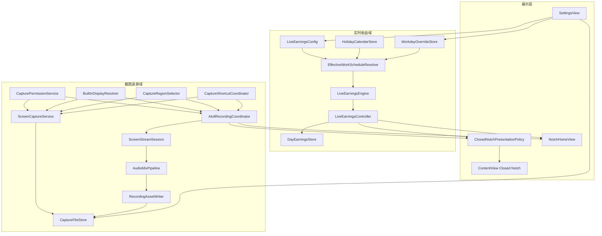

# Atoll × 薪跳二期开发技术手册

> 对应《二期项目PRD.md》1.0 与《二期技术适配声明.md》1.0

## 0. 文档信息

| 项目 | 内容 |
|---|---|
| 文档名称 | Atoll × 薪跳二期开发技术手册 |
| 文档版本 | 1.0 |
| 文档日期 | 2026-08-25 |
| PRD | [`二期项目PRD.md`](二期项目PRD.md) |
| 技术声明 | [`二期技术适配声明.md`](二期技术适配声明.md) |
| 一期基线 | `第一阶段开发最终版` / `e767ebc` |
| 工程路径 | `/Users/Apple/Desktop/Atoll` |
| 最低系统 | macOS 14.6 |
| 目标 | 指导二期从分支建立、领域实现、UI 集成、测试到本机验收 |

## 1. 使用规则

1. 开发前完整阅读二期 PRD、技术适配声明和本手册。
2. 产品规则以 PRD 为准；本手册不能擅自扩大功能范围。
3. 技术边界冲突时，先更新技术适配声明，再修改实现。
4. 任何代码任务都从测试或可验证接口开始，不能先堆叠最终 UI。
5. 每个阶段完成后运行一期回归，避免到最后才发现刘海、Home 或配置被破坏。
6. 二期不支持多显示器。开发机连接外接屏不等于获得实现外接屏功能的授权。
7. 未经用户验收，不创建“二期最终版”分支或发布标签。

## 2. 开发环境与基线

### 2.1 必需环境

- Apple Silicon MacBook，带实体刘海。
- Xcode 完整版，可编译当前 Atoll 工程。
- macOS 14.6 兼容构建能力。
- Git。
- 至少 20 GB 可用磁盘空间用于 DerivedData、录屏样本和稳定性测试。
- 可用的屏幕录制、麦克风和通知权限测试账号。

### 2.2 基线检查

```bash
cd /Users/Apple/Desktop/Atoll
git branch --show-current
git status --short
git log --oneline --decorate -5
```

开始二期前应满足：

- 当前基线能够定位到 `e767ebc`。
- 一期用户未跟踪文档不被误加入提交。
- `/Applications/Atoll.app` 的本机验收版本有可恢复备份。
- 当前工程能完成一次未修改源码的构建。

### 2.3 建议分支

用户确认开始开发后，再执行：

```bash
git switch 第一阶段开发最终版
git switch -c 二期开发
```

本文档生成本身不代表已经授权创建分支或开始代码开发。

## 3. 构建与测试命令

### 3.1 依赖解析

```bash
xcodebuild -resolvePackageDependencies \
  -project DynamicIsland.xcodeproj \
  -scheme DynamicIsland
```

### 3.2 本机 Debug 构建

```bash
xcodebuild build \
  -project DynamicIsland.xcodeproj \
  -scheme DynamicIsland \
  -destination 'platform=macOS' \
  -derivedDataPath build/Phase2DerivedData \
  CODE_SIGN_IDENTITY='-' \
  CODE_SIGNING_REQUIRED=NO \
  CODE_SIGNING_ALLOWED=NO
```

### 3.3 一期回归

```bash
python3 tests/test_live_earnings.py
python3 tests/test_privacy_configuration.py
python3 tests/test_timer_lifecycle.py
```

### 3.4 提交前检查

```bash
git diff --check
git status --short
git diff --stat
```

涉及签名、权限和正式安装时必须再使用真实签名配置构建。无签名 Debug 构建只能证明编译，不证明 TCC 权限、Hardened Runtime 和麦克风 Entitlement 正常。

## 4. 总体架构



### 4.1 依赖方向

- Store 和系统服务不能依赖 SwiftUI View。
- Engine 不能直接读取 Defaults、文件或单例。
- Controller/Coordinator 可以组合 Store 和 Service，但不能包含工资公式或音频算法。
- View 只发出 Intent、订阅公开状态和渲染。
- Screen Assistant 可以依赖新的截图服务，新的截图服务不能依赖 Screen Assistant。
- 外部录屏检测可以被展示策略读取，但不能控制 Atoll 自有录制文件。

## 5. 推荐目录结构

```text
DynamicIsland/
  features/
    LiveEarnings/
      LiveEarningsModels.swift
      LiveEarningsEngine.swift
      LiveEarningsController.swift
      Calendar/
        HolidayCalendarModels.swift
        HolidayCalendarStore.swift
        EffectiveWorkSchedule.swift
        EffectiveWorkScheduleResolver.swift
        WorkdayOverrideStore.swift
      History/
        DayEarningsRecord.swift
        DayEarningsStore.swift
        DayEarningsFinalizer.swift
        LiveEarningsHistoryViews.swift
    Capture/
      Models/
        CaptureMode.swift
        CaptureArtifact.swift
        CaptureError.swift
        RecordingState.swift
      Permissions/
        CapturePermissionService.swift
      Display/
        BuiltInDisplayResolver.swift
        CaptureCoordinateConverter.swift
      Screenshot/
        ScreenCaptureService.swift
        CaptureRegionSelector.swift
      Recording/
        AtollRecordingCoordinator.swift
        ScreenStreamSession.swift
        RecordingAssetWriter.swift
        MicrophoneCaptureSession.swift
        AudioMixPipeline.swift
        RecordingRecoveryStore.swift
      Storage/
        CapturePreferences.swift
        CaptureFileStore.swift
        SecurityScopedBookmarkStore.swift
      Shortcuts/
        CaptureShortcutCoordinator.swift
      Views/
        CaptureQuickActionsView.swift
        ActiveRecordingCard.swift
        RecordingClosedStatusView.swift
        CaptureSettingsView.swift
  Resources/
    HolidayCalendars/
      cn-2026.json
```

如果项目文件组织方式要求新文件手动加入 Xcode Target，提交前必须检查 Target Membership 和 Copy Bundle Resources。

## 6. 领域接口

### 6.1 工作日历协议

```swift
protocol HolidayCalendarProviding: Sendable {
    var version: String { get }
    var coveredYears: ClosedRange<Int>? { get }
    func rule(on date: LocalDate) -> HolidayDateRule?
}

protocol WorkdayOverrideStoring: Sendable {
    func all() async throws -> [WorkdayOverride]
    func override(on date: LocalDate) async throws -> WorkdayOverride?
    func upsert(_ override: WorkdayOverride) async throws
    func remove(on date: LocalDate) async throws
    func removeAll() async throws
}

protocol EffectiveWorkScheduleResolving: Sendable {
    func resolve(
        date: Date,
        config: LiveEarningsConfig,
        holidayRule: HolidayDateRule?,
        userOverride: WorkdayOverride?,
        calendar: Calendar
    ) -> EffectiveWorkSchedule
}
```

### 6.2 历史协议

```swift
protocol DayEarningsStoring: Sendable {
    func record(on date: LocalDate) async throws -> DayEarningsRecord?
    func records(in range: ClosedRange<LocalDate>) async throws -> [DayEarningsRecord]
    func upsert(_ record: DayEarningsRecord) async throws
    func removeAll() async throws
}
```

### 6.3 截图协议

```swift
protocol ScreenCaptureServicing: Sendable {
    func capture(_ request: ScreenshotRequest) async throws -> CaptureArtifact
}

struct ScreenshotRequest: Sendable {
    var mode: ScreenshotMode
    var selection: CGRect?
    var targetWindowID: CGWindowID?
    var excludesAtoll: Bool
    var destination: CaptureDestination
}
```

### 6.4 录屏协议

```swift
@MainActor
protocol ScreenRecordingControlling: AnyObject {
    var state: RecordingState { get }
    func start(_ request: RecordingRequest) async
    func stop(reason: RecordingStopReason) async
    func cancelPreparation()
}
```

服务协议便于测试替身注入。不要让测试直接启动真实 TCC 权限对话框。

## 7. 本地日期模型

### 7.1 禁止直接用 Date 作为日期键

工作日历和历史以本地自然日为主键。推荐定义无时区的 `LocalDate`：

```swift
struct LocalDate: Codable, Hashable, Comparable, Sendable {
    var year: Int
    var month: Int
    var day: Int
}
```

- 由显式 `Calendar` 和 `TimeZone` 从 Date 生成。
- JSON 编码为固定 `YYYY-MM-DD`。
- 比较使用年月日元组。
- 不用 ISO8601 UTC 午夜代替本地日期，避免时区切换导致日期偏移。

### 7.2 日历选择

- 日期边界使用 `Calendar(identifier: .gregorian)`。
- 注入 `.autoupdatingCurrent.timeZone`，不要在测试中读取系统真实时区。
- 中国节假日规则按公历日期匹配。
- 系统时区变化后重新生成当前 `LocalDate` 和 Snapshot。

## 8. 节假日数据包

### 8.1 JSON Schema

```json
{
  "schemaVersion": 1,
  "calendar": "CN",
  "year": 2026,
  "version": "cn-2026-1",
  "publishedAt": "2025-11-01",
  "sourceTitle": "国务院办公厅关于2026年部分节假日安排的通知",
  "sourceURL": "https://www.gov.cn/",
  "dates": [
    {
      "date": "2026-01-01",
      "kind": "publicHoliday",
      "name": "元旦"
    },
    {
      "date": "2026-01-04",
      "kind": "makeupWorkday",
      "name": "元旦调休补班"
    }
  ]
}
```

示例日期只说明格式，不得未经官方核对直接作为正式数据提交。

### 8.2 构建校验

为规则包增加脚本或测试，至少检查：

- `schemaVersion` 可识别。
- `calendar == CN`。
- year 与每条 date 年份一致。
- 日期可解析且不重复。
- kind 只允许 `publicHoliday` 和 `makeupWorkday`。
- sourceTitle 和 sourceURL 非空。
- 同一日期不能同时出现两个 kind。

### 8.3 Store

- 启动时只加载当前月统计涉及的年份。
- 加载结果按年份缓存。
- 资源缺失返回 `.uncoveredYear`，不是空日历。
- UI 根据 `.uncoveredYear` 显示“按固定工作日判断”。
- 不从网络自动下载规则。

## 9. 日期例外

### 9.1 模型

```swift
enum WorkdayOverrideKind: String, Codable, Sendable {
    case leaveDay
    case temporaryWorkday
    case customSchedule
}

struct WorkdayOverride: Codable, Equatable, Sendable {
    var date: LocalDate
    var kind: WorkdayOverrideKind
    var schedule: LiveEarningsSchedule?
    var createdAt: Date
    var updatedAt: Date
}
```

### 9.2 校验

- `leaveDay` 不带 schedule。
- `temporaryWorkday` 默认复制全局 schedule，也可以携带单日 schedule。
- `customSchedule` 必须有有效 schedule。
- 上班时间早于下班时间。
- 午休开启时严格位于工作时间内。
- 同一日期 upsert 覆盖旧例外，不产生重复项。

### 9.3 Store 文件

```json
{
  "schemaVersion": 1,
  "revision": 4,
  "items": []
}
```

- 每次成功写入 revision + 1。
- Actor 内完成 read-modify-write。
- 使用 `.atomic` 临时写入。
- Controller 可以订阅 revision publisher 或由 Store 返回变更事件。

## 10. 有效日程解析

### 10.1 输出模型

```swift
enum WorkScheduleSource: String, Codable, Sendable {
    case userOverride
    case publicHoliday
    case makeupWorkday
    case recurringWeekday
    case defaultRestDay
}

struct EffectiveWorkSchedule: Equatable, Sendable {
    var date: LocalDate
    var isWorkday: Bool
    var status: EffectiveDayStatus
    var schedule: LiveEarningsSchedule?
    var source: WorkScheduleSource
    var calendarVersion: String?
}
```

### 10.2 解析伪代码

```text
if user override exists:
  leave        -> not workday, leaveDay
  temporary    -> workday, override/global schedule
  custom       -> workday, custom schedule
else if official rule exists:
  holiday      -> not workday, publicHoliday
  makeup       -> workday, global schedule
else if weekday in config.workdays:
  workday, global schedule
else:
  rest day
```

### 10.3 月薪分母

- 遍历当月日期并调用相同 Resolver，禁止另写一套“节假日数量加减”逻辑。
- `leaveDay` 在分母中仍算计划工作日。
- `temporaryWorkday` 计入分母。
- 结果缓存键：`yearMonth + timeZone + configWorkdays + calendarVersion + overridesRevision`。
- 修改薪资金额不需要使工作日数量缓存失效；修改工作日和日期例外需要。

## 11. LiveEarningsEngine 改造

### 11.1 推荐 API

一期：

```swift
snapshot(at:config:)
```

二期：

```swift
func snapshot(
    at date: Date,
    config: LiveEarningsConfig,
    effectiveSchedule: EffectiveWorkSchedule,
    monthlyWorkdayCount: Int
) -> LiveEarningsSnapshot
```

### 11.2 兼容策略

- 可以暂时保留一期方法，内部构造 recurring schedule，确保一期测试逐步迁移。
- 新方法不读取 Store。
- `publicHoliday` 和 `leaveDay` 返回明确状态，而不是全部折叠为 `.restDay`。
- `monthlyWorkdayCount == 0` 时返回安全状态，不能除以零。
- 当前日期修改例外后，Controller 立即重新 resolve 和 snapshot。

### 11.3 测试用例

- 工作星期遇法定休息日。
- 周末调休补班。
- 手动例外覆盖官方规则。
- 删除例外恢复官方规则。
- 请假不减少月薪分母但当天金额为 0。
- 临时工作日增加月薪分母。
- 单日结束时间修改后金额和进度立即变化。
- 未覆盖年份安全降级。
- 时区和月末边界。

## 12. 一期配置迁移

### 12.1 原则

二期新增日期例外和历史不要求修改一期 Config。捕获偏好也使用独立结构。只有确实属于实时收益长期配置的字段才进入 `LiveEarningsConfig`。

### 12.2 迁移器

如果 schema 必须升级，使用显式迁移：

```swift
enum LiveEarningsConfigMigrator {
    static func decode(_ data: Data) throws -> LiveEarningsConfig {
        let envelope = try JSONDecoder().decode(ConfigVersionProbe.self, from: data)
        switch envelope.schemaVersion {
        case 1:
            return try migrateV1(data)
        case LiveEarningsConfig.currentSchemaVersion:
            return try JSONDecoder().decode(LiveEarningsConfig.self, from: data)
        default:
            throw MigrationError.unsupportedVersion(envelope.schemaVersion)
        }
    }
}
```

- 先复制原始 Data 作为内存回滚输入。
- 新配置成功编码并再次解码验证后才覆盖 Defaults。
- 失败时继续使用一期配置并提示二期扩展不可用。
- 禁止把薪资写入迁移日志。

### 12.3 固定样本

至少保留：

- 没有颜色字段的一期最早 JSON。
- 已设置绿色/自定义颜色的一期 JSON。
- 月薪、日薪、时薪各一份。
- 午休开/关。
- 功能开/关。
- workEnd 曾为 23:00 的用户配置。

## 13. 收益历史

### 13.1 记录模型

```swift
struct DayEarningsRecord: Codable, Equatable, Identifiable, Sendable {
    var id: LocalDate { date }
    var date: LocalDate
    var status: DayEarningsStatus
    var finalAmount: Decimal
    var currencyCode: String
    var paidSeconds: TimeInterval
    var salaryMode: LiveEarningsSalaryMode
    var scheduleSource: WorkScheduleSource
    var ruleVersion: String?
    var revision: Int
    var finalizedAt: Date
}
```

### 13.2 Finalizer

触发点：

- 下班边界。
- 日期切换。
- 应用即将退出。
- 睡眠/注销前。
- 下次启动发现可信 `PendingDayContext`。

逻辑：

1. 读取当日最终有效日程。
2. 生成下班时刻 Snapshot，而不是使用 UI 最后显示值。
3. 生成 Record。
4. 以 LocalDate 幂等 upsert。
5. 写入成功后删除对应 pending context。

### 13.3 历史查询

- 日：单键读取。
- 周：由 Calendar 计算周区间后范围查询。
- 月：自然月范围查询。
- 聚合在后台 Task 计算，发布不可变 ViewModel。
- 不为 365 条以内记录引入复杂分页；后续数据量实测再决定。

### 13.4 清除

- 清除历史只删除 `history-v1.json` 和 pending context。
- 清除日期例外只删除 `overrides-v1.json`。
- “清除实时收益全部数据”删除 Config、历史、pending 和例外。
- 删除前展示影响范围并二次确认。
- 删除完成后刷新 Controller，不能显示旧缓存。

## 14. 截图服务

### 14.1 不再使用剪贴板中转

新的捕获顺序：

```text
Permission
  -> Resolve built-in SCDisplay
  -> Select region/window if needed
  -> Build SCContentFilter
  -> Build SCStreamConfiguration
  -> SCScreenshotManager.captureImage
  -> Encode PNG
  -> Atomic save
  -> Preview/notification
```

### 14.2 取得内置显示器

```swift
struct BuiltInDisplayTarget: Sendable {
    var cgDisplayID: CGDirectDisplayID
    var screenFrame: CGRect
    var scaleFactor: CGFloat
    var scDisplay: SCDisplay
}
```

Resolver 步骤：

1. 从 `NSScreen.screens` 选择 `safeAreaInsets.top > 0` 的屏幕。
2. 取 `NSScreenNumber`。
3. 读取 `SCShareableContent`。
4. 用 displayID 匹配 `SCDisplay`。
5. 匹配失败返回 `.builtInDisplayUnavailable`，不选外接屏。

### 14.3 Content Filter

全屏/区域：

```swift
let filter = SCContentFilter(
    display: target.scDisplay,
    excludingApplications: excludedApplications,
    exceptingWindows: []
)
```

窗口：

```swift
let filter = SCContentFilter(desktopIndependentWindow: selectedWindow)
```

隐藏 Atoll 时，根据当前 Debug/Release Bundle ID 从 `SCRunningApplication` 里选出当前应用并排除。

### 14.4 Configuration

- `captureResolution = .best`（macOS 14）。
- `showsCursor`：截图默认关闭，二期不开放设置。
- Window 模式保留阴影，除非视觉验收另行确认。
- 区域模式设置 `sourceRect`。
- width/height 使用物理像素并限制为正数。
- 结果为 nil 或尺寸为 0 时返回 `.emptyFrame`。

### 14.5 选区 UI

- 只在内置屏幕创建透明 Overlay Panel。
- 拖拽小于最小阈值视为取消或无效。
- Escape 取消。
- Return 确认当前区域。
- Overlay 不进入最终截图；开始捕获前等待其从 WindowServer 消失的确定性回调，不使用任意 sleep。
- 选区结果必须裁剪到内置屏 frame。

### 14.6 文件输出

- 使用 ImageIO `CGImageDestination` 输出 PNG。
- 色彩空间保留为 SDR sRGB，避免不同 Mac 预览偏色。
- 临时文件成功关闭并检查非零大小后原子移动。
- 复制动作发生在文件成功后，由用户主动选择或完成行为配置决定。

## 15. 录屏状态机

### 15.1 状态定义

```swift
enum RecordingState: Equatable, Sendable {
    case idle
    case preparing(RecordingPreparationStage)
    case recording(ActiveRecordingInfo)
    case stopping
    case finalizing(progress: Double?)
    case completed(CaptureArtifact)
    case recoverable(RecoveryManifest)
    case failed(CaptureError)
}
```

### 15.2 Coordinator 规则

- `AtollRecordingCoordinator` 为 `@MainActor ObservableObject`。
- 底层 Stream、Writer、Audio 使用 Actor/串行队列。
- start 时生成 session UUID，所有回调验证 UUID，忽略旧会话迟到回调。
- preparing 期间再次 start 不创建新会话。
- recording 期间 start 解释为已在录制，不重启。
- stop 幂等；第二次 stop 等待同一 finalization。
- App 退出前通过生命周期入口请求 stop，但设置最大等待时间并保留恢复清单。

### 15.3 计时

- UI 录制时长以第一帧成功写入时的 monotonic start time 为起点。
- UI Timer 只负责展示，不决定文件时间轴。
- 视频/音频以 CMSampleBuffer PTS 为准。
- 系统时间手动变化不影响录制时长。

## 16. ScreenStreamSession

### 16.1 Configuration

推荐初始配置：

```swift
let configuration = SCStreamConfiguration()
configuration.width = evenWidth
configuration.height = evenHeight
configuration.minimumFrameInterval = CMTime(value: 1, timescale: 30)
configuration.queueDepth = 3
configuration.pixelFormat = kCVPixelFormatType_32BGRA
configuration.showsCursor = true
configuration.capturesAudio = request.capturesSystemAudio
configuration.sampleRate = 48_000
configuration.channelCount = 2
configuration.excludesCurrentProcessAudio = true
```

- 区域录屏设置 sourceRect。
- 二期统一 SDR。
- `excludesCurrentProcessAudio = true` 可避免 Atoll 提示音被重复录入；如产品以后需要录入 Atoll 自身声音再单独评审。
- `queueDepth` 不超过 8。

### 16.2 输出队列

- 视频、系统音频和麦克风分别使用专用串行队列。
- 回调只做快速校验和转交，不在 ScreenCaptureKit 回调队列执行磁盘重任务。
- Writer 输入 `isReadyForMoreMediaData == false` 时执行明确丢帧/等待策略，不能无限积压。
- 记录匿名 dropped-frame 计数可以用于 Debug，但不能记录画面。

### 16.3 生命周期

1. 建立 Filter 和 Configuration。
2. 创建 SCStream。
3. 添加 `.screen` 输出。
4. 需要系统声音时添加 `.audio` 输出。
5. 准备 Writer 和麦克风。
6. 调用 startCapture。
7. 第一帧到达后启动 Writer Session。
8. stop 时先阻止新 Intent，再停止 Stream。
9. 标记输入 finished，调用 finishWriting。
10. 校验文件并发布 completed。

## 17. RecordingAssetWriter

### 17.1 视频输入

- `AVAssetWriter(outputURL:fileType:.mp4)`。
- `AVAssetWriterInput(mediaType:.video, outputSettings: ...)`。
- H.264 Main/High profile由系统兼容设置决定。
- 平均码率依据像素数量和 30fps 计算，并设合理上下限。
- `expectsMediaDataInRealTime = true`。
- 如果直接 append ScreenCaptureKit CMSampleBuffer 的格式不满足 Writer，使用 `AVAssetWriterInputPixelBufferAdaptor`。

### 17.2 音频输入

- 单一 AAC Writer Input。
- 48 kHz、双声道。
- 系统音频和麦克风都进入 `AudioMixPipeline` 后再 append。
- 只有系统声音时仍走统一格式转换，减少分支差异。
- 两类声音都关闭时不创建音频输入。

### 17.3 时间轴

- 第一帧视频 PTS 作为 sessionStart。
- 早于 sessionStart 的音频丢弃或裁切。
- 稍晚到达的音频按时间戳写入；必要时插入静音补齐开头。
- 任何 PTS 必须单调递增。
- 发现时间戳倒退时记录匿名错误码并丢弃该 Buffer，不让 Writer 崩溃。

### 17.4 完成校验

- Writer status 为 `.completed`。
- 文件存在且大小大于 0。
- AVURLAsset 可加载至少一个视频轨。
- 请求声音时存在可用音频轨。
- duration 大于 0。
- 校验成功后移动到最终目录。

## 18. 麦克风与混音

### 18.1 权限

- `AVCaptureDevice.authorizationStatus(for: .audio)` 检查状态。
- `.notDetermined` 时按用户动作请求。
- `.denied/.restricted` 返回可降级结果，允许继续系统声音录屏。
- Info.plist 必须有 `NSMicrophoneUsageDescription`。
- Entitlements 必须有 `com.apple.security.device.audio-input`。

### 18.2 macOS 14.6 路径

推荐使用 `AVCaptureSession + AVCaptureAudioDataOutput` 获取麦克风 CMSampleBuffer，或使用经过原型验证的 Core Audio 输入。选择标准是：

- 能取得稳定时间戳。
- 能转换到 48 kHz。
- 能在 Hardened Runtime 正常签名运行。
- 停止后不残留音频设备占用。

### 18.3 macOS 15+ 路径

可以使用：

```swift
configuration.captureMicrophone = true
try stream.addStreamOutput(output, type: .microphone, sampleHandlerQueue: queue)
```

必须放在 `if #available(macOS 15.0, *)` 中。较新系统的麦克风 Buffer 仍进入同一个 Mix Pipeline。

### 18.4 混音要求

- 系统音频与麦克风转换到相同 ASBD。
- 根据 PTS 计算对应 sample frame 区间。
- 麦克风单声道复制到左右声道或按标准矩阵映射。
- 混合时防止峰值溢出，使用饱和/限幅。
- 短缺口补静音，长缺口记录状态但继续录屏。
- 定期比较两路时钟漂移；超过阈值时做小幅重采样校正，不能突然跳音。
- 单元测试使用合成正弦波和已知时间戳，不需要真实麦克风。

## 19. 异常恢复

### 19.1 P0

- 正常停止必须得到可播放 MP4。
- 权限撤销、磁盘不足和 Stream error 进入 interrupted → finalizing。
- 如果 Writer 可正常 finish，输出部分录制文件并说明被中断。
- 如果无法完成，保留临时项和错误原因，不静默删除。

### 19.2 P1 分段恢复

- 以固定时长完成独立临时片段。
- 每个完成片段后原子更新 manifest。
- 正常停止将片段按时间轴拼接为最终 MP4。
- 启动时扫描 manifest，不扫描用户整个 Movies 文件夹。
- 用户可恢复、在访达显示或删除。
- 删除属于可恢复文件管理操作，需明确确认。

### 19.3 Manifest

```json
{
  "schemaVersion": 1,
  "sessionID": "UUID",
  "createdAt": "2026-08-25T12:00:00Z",
  "state": "recoverable",
  "segments": [
    {"index": 0, "fileName": "segment-000.mov", "duration": 60.0}
  ]
}
```

Manifest 不写窗口标题、应用名称、音频内容或画面摘要。

## 20. 文件存储

### 20.1 CapturePreferences

```swift
struct CapturePreferences: Codable, Equatable, Sendable {
    var schemaVersion = 1
    var screenshotFolderBookmark: Data?
    var recordingFolderBookmark: Data?
    var capturesSystemAudio = true
    var capturesMicrophone = false
    var completionNotificationsEnabled = true
    var excludesAtollFromCapture = true
}
```

### 20.2 默认目录

```swift
FileManager.default.urls(for: .picturesDirectory, in: .userDomainMask)
FileManager.default.urls(for: .moviesDirectory, in: .userDomainMask)
```

在返回目录下创建 `Atoll Screenshots` 和 `Atoll Recordings`。

### 20.3 书签

- `NSOpenPanel.canChooseDirectories = true`。
- 保存 bookmark Data，不保存硬编码绝对路径作为唯一凭据。
- 使用时解析 stale 状态；stale 时尝试重建。
- `startAccessingSecurityScopedResource()` 与 stop 成对调用。
- 解析失败返回 `.destinationAccessLost`。

### 20.4 文件命名

格式：

```text
Atoll Screenshot 2026-08-25 19-30-15.png
Atoll Recording 2026-08-25 19-30-15.mp4
```

去重：

```text
Atoll Screenshot 2026-08-25 19-30-15 2.png
```

- 使用 POSIX 稳定数字格式，不使用文件名非法冒号。
- 同一 Actor 内执行 existence check + reserve，避免快捷键并发覆盖。
- 用户文件不自动删除。

## 21. 权限服务

### 21.1 屏幕录制

- 使用 `CGPreflightScreenCaptureAccess()` 做预检。
- 只有用户触发截图/录屏时调用 `CGRequestScreenCaptureAccess()` 或由 ScreenCaptureKit 触发系统流程。
- 授权后重新读取 `SCShareableContent` 验证，而不是只相信按钮返回值。
- 如果系统要求重启，提供“退出并重新打开 Atoll”。

### 21.2 麦克风

- 使用 AVFoundation 授权 API。
- 拒绝后自动把本次 request 降级为 `capturesMicrophone = false`，并在开始前让用户知道。
- 不循环弹窗。

### 21.3 通知

- 使用 UserNotifications。
- 拒绝后保留应用内完成反馈。
- 通知只包含通用文件名和动作，不包含收益或捕获内容预览。

### 21.4 权限文案

建议语义：

- 屏幕：Atoll 需要访问屏幕内容，以便按照你的操作创建截图和录屏。
- 系统音频：Atoll 需要访问系统音频，以便在你开启该选项时把声音写入录屏。
- 麦克风：Atoll 需要访问麦克风，以便在你开启该选项时把语音写入录屏。

最终文案进入本地化审校，不直接照搬调试字符串。

## 22. 快捷键

### 22.1 Name

在 `ShortcutConstants.swift` 中新增：

```swift
extension KeyboardShortcuts.Name {
    static let captureAreaScreenshot = Self("captureAreaScreenshot")
    static let captureWindowScreenshot = Self("captureWindowScreenshot")
    static let captureFullScreenshot = Self("captureFullScreenshot")
    static let startAreaRecording = Self("startAreaRecording")
    static let startFullRecording = Self("startFullRecording")
    static let toggleAtollRecording = Self("toggleAtollRecording")
    static let stopAtollRecording = Self("stopAtollRecording")
}
```

不设置默认组合。

### 22.2 Handler

- 统一在应用生命周期注册。
- Handler 只调用 `CaptureShortcutCoordinator.handle(action:)`。
- Coordinator 在主线程判断状态并发布 Intent。
- 区域选择需要激活 Atoll 的 Overlay，但不能强制打开 Home。
- 录屏已开始时 toggle 调 stop。
- stop Name 只在 Atoll 正在录屏时启用。

### 22.3 冲突检测

- 保存 Recorder 变化时扫描 Atoll 已启用 Name。
- 完全相同组合标记冲突，后设置项不生效。
- macOS/第三方冲突只能提示，不能保证检测全部系统占用。
- 测试启用/禁用 feature 时 Name 状态不会残留。

## 23. 关闭态刘海策略

### 23.1 Presentation Model

```swift
enum ClosedNotchPresentation: Equatable {
    case systemOverride(SystemActivity)
    case recordingWithEarnings(RecordingSummary, EarningsSummary)
    case recordingOnly(RecordingSummary)
    case mediaWithEarnings(MediaSummary, EarningsSummary)
    case earningsOnly(EarningsSummary)
    case originalAtoll
}
```

### 23.2 决策顺序

1. 锁屏或高优先级系统隐私事件。
2. Atoll 自有录屏状态。
3. 收益状态。
4. 媒体摘要。
5. 原始 Atoll 状态。

录屏和收益不是互斥项。策略应组合它们，而不是先命中录屏后丢弃收益。

### 23.3 布局

- 保留一期 `closedWingWidth` 紧凑基线。
- 左翼：红点 + 自适应 `mm:ss`；空间不足时红点优先。
- 右翼：一期收益数字。
- 文本都单行、可收紧、有最低缩放，但不能显示省略号误导数值/时长。
- 连续录制超过 99:59 时关闭态只保留红点，完整时长在展开态显示。
- 不扩大热区去覆盖右侧菜单栏应用。

### 23.4 测试

- 收益 9.99、999.99、1000.00、99999.99。
- 录制 00:05、59:59、100:00。
- 有/无媒体。
- 高优先级事件进入和退出。
- 深色、浅色、Reduce Motion。
- 实体屏幕拍照确认摄像头无遮挡。

## 24. Home 集成

### 24.1 非录制状态

- 收益卡保持一期位置。
- 增加历史和工作日历入口，不把所有历史内容直接塞进 Home。
- 截图/录屏使用 compact quick actions。

### 24.2 录制状态

`ActiveRecordingCard` 至少包含：

- 红点和完整计时。
- 区域/全屏类型。
- 系统声音和麦克风状态。
- 停止按钮。
- 保存中状态。

收益卡继续显示在下方。Home 内容采用内部滚动，顶部仍保留一期安全间距。

### 24.3 完成状态

- 轻量展示最近 CaptureArtifact。
- 截图：复制、打开、访达显示。
- 录屏：打开、访达显示。
- 不在 Home 自动播放完整视频。
- 状态在合理时间后收起，但文件不会删除。

## 25. 设置集成

### 25.1 实时收益页

新增 Section：

- 工作日历。
- 日历规则版本/覆盖年份。
- 日期例外。
- 收益历史。
- 清除历史和例外。

普通设置即时保存。无效 schedule 不覆盖最后有效值。

### 25.2 截图与录屏页

建议新增独立 SettingsTab：

- 截图保存位置。
- 录屏保存位置。
- 系统声音开关。
- 麦克风开关。
- 完成通知。
- 隐藏 Atoll。
- 快捷键 Recorder。
- 权限状态和系统设置入口。
- 可恢复录屏入口。

### 25.3 设置搜索

同步补充中文/英文关键词：

- 截图、屏幕快照、区域截图、窗口截图。
- 录屏、屏幕录制、系统声音、麦克风。
- 保存位置、快捷键。
- 法定节假日、调休、请假、临时工作日、收益历史。

## 26. Screen Assistant 兼容

### 26.1 迁移步骤

1. 新建 `ScreenCaptureService`。
2. 让 Screen Assistant 的截图入口调用 Service。
3. 保持完成回调仍可生成附件。
4. Home/快捷键调用同一 Service，但完成后不生成 AI 附件。
5. 删除或降级旧 `Process + Pasteboard` 实现。

### 26.2 验收

- Screen Assistant 三种截图仍可用。
- 截图不会自动覆盖用户剪贴板，除非用户选择复制。
- Home 截图不会进入 Screen Assistant attachedFiles。
- 服务错误不会破坏 Screen Assistant 聊天状态。

## 27. 外部录屏检测兼容

- 现有 `ScreenRecordingManager` 保持“外部活动检测”职责。
- 新 `AtollRecordingCoordinator` 只负责 Atoll 自有录制。
- `PrivacyIndicatorManager` 不应把 Atoll 自有录制重复显示为两个状态。
- 停止 Atoll 自有录制直接调用 Coordinator，不发送系统 Command-Control-Escape。
- 系统录屏停止按钮仍走现有路径。
- UI 用不同来源枚举区分 `.atoll` 和 `.external`。

## 28. 日志与隐私

### 28.1 允许记录

- 匿名状态：prepare/start/stop/finalize。
- 错误域和错误码。
- 录制模式：区域/全屏。
- 是否启用系统声音/麦克风的布尔值。
- 丢帧数量和匿名性能指标，仅 Debug。

### 28.2 禁止记录

- 薪资、实时金额和历史金额。
- 工作时间和请假日期。
- 完整文件路径和用户目录名。
- 窗口标题、应用内容和截图像素。
- 音频样本、转写或波形内容。
- 自定义快捷键组合的用户行为遥测。

使用统一 `CaptureLogger` 封装 DEBUG 日志，Release 默认关闭内容级信息。

## 29. 错误模型

```swift
enum CaptureError: Error, Equatable, Sendable {
    case screenPermissionDenied
    case microphonePermissionDenied
    case builtInDisplayUnavailable
    case selectionCancelled
    case invalidSelection
    case targetWindowUnavailable
    case destinationAccessLost
    case insufficientDiskSpace
    case streamStartFailed(code: Int)
    case streamInterrupted(code: Int)
    case writerFailed(code: Int)
    case emptyFrame
    case finalizationFailed(code: Int)
}
```

- 用户取消不是失败通知。
- 麦克风拒绝可以转成降级提示，不必终止录屏。
- 错误文案不直接展示底层路径或隐私数据。
- 可恢复错误提供明确下一步。

## 30. 自动化测试计划

### 30.1 日历与计算

| 测试组 | 覆盖 |
|---|---|
| HolidayDecodeTests | schema、重复日期、非法类型、覆盖年份 |
| ScheduleResolverTests | 三层优先级与恢复自动判断 |
| MonthlyWorkdayCountTests | 法定休息、补班、请假、临时工作日 |
| LiveEarningsPhase2Tests | 新状态、单日时间、时区、月末 |
| ConfigMigrationTests | schema 1 全样本无损迁移 |

### 30.2 Store

| 测试组 | 覆盖 |
|---|---|
| WorkdayOverrideStoreTests | upsert、remove、revision、原子写入 |
| DayEarningsStoreTests | 幂等、范围查询、清除、损坏恢复 |
| DayFinalizerTests | 下班、跨日、pending 补算、不伪造历史 |
| BookmarkStoreTests | stale、失效、回退默认目录 |
| FileNameGeneratorTests | 同秒去重、非法字符、并发保留 |

### 30.3 Capture

| 测试组 | 覆盖 |
|---|---|
| DisplayResolverTests | 内置屏匹配、外接屏不回退 |
| CoordinateConverterTests | 原点、Y 轴、2x scale、边界裁剪 |
| ScreenshotServiceTests | mode/filter/config/error/file result |
| RecordingStateMachineTests | 幂等 start/stop、迟到回调、interrupt |
| WriterTimelineTests | 首帧、PTS 单调、音频缺口 |
| AudioMixTests | 单路、双路、限幅、漂移 |
| ShortcutCoordinatorTests | toggle、stop、禁用和冲突 |
| PresentationPolicyTests | 录屏+收益+媒体+系统覆盖组合 |

### 30.4 测试替身

禁止在普通单元测试中：

- 弹出 TCC 权限。
- 真正录制用户屏幕。
- 写入 Pictures/Movies。
- 修改用户快捷键。

通过协议注入 Fake Stream、Fake Writer、临时目录和固定 Clock。

## 31. 真机验收矩阵

### 31.1 系统

- macOS 14.6：全部 P0 核心流程。
- 当前稳定 macOS：全部 P0 核心流程。
- 当前最新可用 macOS：冒烟和 API 分层。

### 31.2 权限

- 屏幕权限未决定、允许、拒绝、运行中撤销。
- 麦克风未决定、允许、拒绝。
- 通知允许、拒绝。
- 自定义目录允许、移动、删除、失效。

### 31.3 截图

- 区域、窗口、全屏。
- 取消。
- Atoll 隐藏开/关。
- 同秒多次。
- 外接屏连接但不捕获。

### 31.4 录屏

- 无声。
- 仅系统声音。
- 仅麦克风。
- 系统声音 + 麦克风。
- 区域、全屏。
- 10 分钟普通录制。
- 60 分钟稳定性。
- 睡眠、磁盘不足、权限撤销、应用退出。

### 31.5 刘海回归

- 收益关闭/开启。
- 收益三位、四位和五位整数。
- 录制计时短/长。
- 媒体播放。
- 相机/麦克风/外部录屏高优先级事件。
- 菜单栏存在多个快捷应用。
- Home 顶部安全间距。

## 32. 性能验证

### 32.1 Instruments

使用：

- Time Profiler。
- Allocations。
- Leaks。
- Energy Log。
- File Activity。

### 32.2 观察点

- ScreenCaptureKit 回调是否阻塞。
- Writer 背压是否导致内存持续增长。
- 麦克风和系统音频队列是否漂移。
- 录制结束后 Stream/Audio/Timer 是否释放。
- History 是否每秒写盘。
- 月度日历是否每秒重算。
- Home/ContentView 是否因录制时长每秒重建整个窗口。

### 32.3 目标

- 静态收益状态无 1 Hz 空转。
- 截图选区界面 300 ms 内出现。
- 录屏 1 秒内进入明确准备或录制状态。
- 录制期间 UI 可响应停止操作。
- 60 分钟无持续线性内存增长。
- 停止后没有残留屏幕或麦克风占用指示。

## 33. 分阶段实施

### 阶段 0：基线与原型

交付：

- 二期分支。
- 一期旧 JSON 样本。
- macOS 14.6 屏幕 + 系统声音 + 麦克风原型。
- 权限/Entitlement 验证。
- 关闭态共存草图。

门槛：原型生成可播放 MP4，14.6 不依赖 macOS 15 API。

### 阶段 1：日历领域

交付：

- LocalDate。
- Holiday models/store。
- WorkdayOverride store。
- EffectiveSchedule resolver。
- 单元测试。

门槛：规则优先级与月份分母 100% 通过。

### 阶段 2：收益引擎与迁移

交付：

- Engine 新 API。
- Controller 重算链路。
- schema 1 迁移。
- 设置工作日历。

门槛：一期全部回归 + P2 日历测试通过。

### 阶段 3：收益历史

交付：

- Day record/store/finalizer。
- pending context。
- 日周月 UI。
- 清除流程。

门槛：不伪造一期历史，跨日和重启一致。

### 阶段 4：截图服务

交付：

- BuiltInDisplayResolver。
- 选区 UI。
- SCScreenshotManager 服务。
- PNG 文件存储。
- Screen Assistant 迁移。

门槛：三种截图、取消、隐藏 Atoll、外接屏边界通过。

### 阶段 5：录屏核心

交付：

- Recording state machine。
- SCStream video/system audio。
- AVAssetWriter。
- 文件完成校验。

门槛：无声和系统声音录屏稳定可播放。

### 阶段 6：麦克风与恢复

交付：

- macOS 14.6 麦克风采集。
- macOS 15+ 可选优化。
- AudioMixPipeline。
- 异常中断和 P1 恢复片段。

门槛：四种声音组合与 60 分钟同步测试通过。

### 阶段 7：快捷键与 UI

交付：

- 快捷键设置与冲突检测。
- 关闭态策略。
- Home Active Recording。
- Capture Settings。
- 通知和完成操作。

门槛：收益/媒体/录制/系统事件组合无阻断回归。

### 阶段 8：发布验收

交付：

- 全量自动化。
- PRD 34 项验收。
- Instruments 报告。
- 签名、公证、安装和升级包。

门槛：二期 PRD 发布门槛全部满足。

## 34. 提交建议

按可回滚边界提交，示例：

```text
feat: 增加二期工作日历模型与规则解析
feat: 增加收益历史本地存储
refactor: 抽离独立截图服务
feat: 增加 ScreenCaptureKit 录屏状态机
feat: 增加系统音频与麦克风混音
feat: 增加截图录屏快捷键和设置
feat: 集成刘海录制状态与收益共存
test: 补充二期回归和迁移测试
```

- 不把全部二期压成一个不可审查提交。
- 不在功能提交中混入用户 PRD 或无关格式化。
- 每个提交至少能编译，关键领域提交同时包含测试。

## 35. 部署与本机验证

### 35.1 安装前

- 记录当前 `/Applications/Atoll.app` 版本和进程路径。
- 将旧 App 移到废纸篓中的唯一备份名，保持可恢复。
- 不覆盖用户 Defaults 作为测试手段；需要测试数据时先备份精确值。

### 35.2 安装

- 对构建产物签名。
- 验证 `codesign --verify --deep --strict`。
- 复制到 `/Applications/Atoll.app`。
- 使用 LaunchServices 注册。
- 启动后确认实际运行路径是 `/Applications/Atoll.app/Contents/MacOS/Atoll`。

### 35.3 权限复测

TCC 权限与 Bundle ID 和签名相关。Debug、Release、重新签名构建可能表现不同，因此至少验证：

- Debug Bundle ID。
- 正式 Bundle ID。
- 原地升级。
- 全新安装。

### 35.4 用户验收

- 先提供分阶段验收清单。
- 用户确认阶段通过后才提交阶段最终版本。
- 用户确认二期整体通过后再创建用户指定的最终分支。

## 36. 发布检查

### 36.1 工程

- [ ] Deployment Target 仍为 macOS 14.6。
- [ ] macOS 15 API 有 availability guard。
- [ ] `NSMicrophoneUsageDescription` 已添加并本地化。
- [ ] Audio Input Entitlement 已签入正式构建。
- [ ] 截图不再依赖剪贴板中转。
- [ ] Atoll 自有录屏与外部录屏检测已分离。
- [ ] 所有新增文件加入正确 Target。

### 36.2 数据

- [ ] 一期配置迁移样本全部通过。
- [ ] 节假日数据来源、版本和覆盖年份可见。
- [ ] 历史只保存每日摘要。
- [ ] 不提供 CSV 或其他导出。
- [ ] 清除和损坏恢复通过。

### 36.3 捕获

- [ ] 三种截图模式通过。
- [ ] 两种录屏模式通过。
- [ ] 系统声音默认开、麦克风默认关。
- [ ] 四种音频组合通过。
- [ ] 自定义目录和失效回退通过。
- [ ] 正常停止的 MP4 可被 QuickTime Player 打开。
- [ ] 录制结束后系统录制/麦克风指示消失。

### 36.4 UI

- [ ] 收益开启时刘海数字和 Home 卡持续展示。
- [ ] 录制与收益共存。
- [ ] 不遮挡实体摄像头。
- [ ] 不遮挡常用菜单栏应用。
- [ ] Home 不顶屏幕上边缘。
- [ ] VoiceOver 和 Reduce Motion 通过。

### 36.5 隐私

- [ ] 无自动上传截图或录屏。
- [ ] 无薪资、历史、完整路径或媒体内容日志。
- [ ] 权限按需请求。
- [ ] 第三方共享不被误描述为自动保护。

## 37. 常见错误

### 37.1 直接使用 SCRecordingOutput

它在 macOS 15 才可用，会破坏 14.6 最低版本。必须保留 AVAssetWriter 主路径。

### 37.2 把 captureMicrophone 写进无 availability 的配置

该属性 macOS 15 才可用。14.6 必须使用独立麦克风采集。

### 37.3 继续执行 `/usr/sbin/screencapture`

这会保留剪贴板耦合、阻塞和不透明权限行为，不符合二期公共服务要求。

### 37.4 用 NSScreen.main 捕获

主屏和焦点屏可能是外接显示器。必须匹配实体刘海内置屏幕。

### 37.5 每秒写历史

历史是每日摘要。每秒写入会增加磁盘、隐私和损坏风险。

### 37.6 依赖默认 Codable 迁移

新增非可选键会使旧 JSON 解码失败。必须显式迁移或拆 Store。

### 37.7 录制状态覆盖收益

PRD 要求收益开启即展示。关闭态必须使用组合策略。

### 37.8 用固定 sleep 等 Overlay 消失

不同机器和负载下会把选区边框录进成品。使用窗口关闭完成回调或下一次 WindowServer 同步点。

### 37.9 在主线程 waitUntilExit 或 finishWriting

会冻结刘海和停止按钮。所有捕获和封装异步执行。

### 37.10 承诺崩溃后完整恢复单一 MP4

未 finish 的 MP4 可能不可播放。要实现恢复必须分段或采用经过验证的可恢复封装策略。

## 38. Definition of Done

单项二期任务完成必须满足：

- 对应 PRD ID 明确。
- 不超出单显示器、macOS 和无导出边界。
- 代码通过编译和相关自动化。
- 一期回归继续通过。
- 权限和失败路径有实现，不只有成功路径。
- Task、Timer、Observer、Stream、Writer 和 Audio Session 有清理。
- 中英文和可访问性完成。
- 无敏感日志或自动上传。
- 真机 UI 变更有实体刘海证据。
- 用户可执行的验收步骤已更新。

## 39. 开发开始前最终清单

- [ ] 用户确认二期 PRD。
- [ ] 用户确认二期技术适配声明。
- [ ] 用户确认本开发手册。
- [ ] 用户明确要求开始二期开发。
- [ ] 从一期最终分支创建二期开发分支。
- [ ] 保存一期旧 JSON 测试样本。
- [ ] 完成 macOS 14.6 录屏音频原型。
- [ ] 完成节假日数据审核。
- [ ] 完成截图录屏权限文案审校。
- [ ] 准备外接屏边界测试，但不开发多屏能力。
- [ ] 准备 60 分钟录屏所需磁盘空间。
- [ ] 一期基线构建和测试通过。

## 40. 参考资料

- 二期 PRD：[`二期项目PRD.md`](二期项目PRD.md)
- 二期技术适配声明：[`二期技术适配声明.md`](二期技术适配声明.md)
- 一期 PRD：[`融合项目PRD.md`](融合项目PRD.md)
- 一期开发手册：[`开发手册.md`](开发手册.md)
- Atoll 工程：`/Users/Apple/Desktop/Atoll`
- Apple ScreenCaptureKit：[developer.apple.com/documentation/screencapturekit](https://developer.apple.com/documentation/screencapturekit)
- Apple Screenshot Manager：[SCScreenshotManager](https://developer.apple.com/documentation/screencapturekit/scscreenshotmanager)
- Apple Audio Input Entitlement：[Audio Input Entitlement](https://developer.apple.com/documentation/bundleresources/entitlements/com.apple.security.device.audio-input)
- Apple Microphone Usage：[NSMicrophoneUsageDescription](https://developer.apple.com/documentation/bundleresources/information-property-list/nsmicrophoneusagedescription)

## 41. 变更记录

| 版本 | 日期 | 变更内容 |
|---|---|---|
| 1.0 | 2026-08-25 | 基于二期 PRD、技术适配声明和一期最终工程形成首版开发技术手册 |
