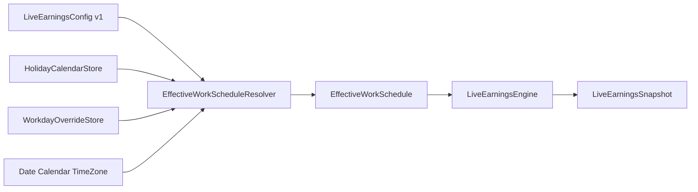
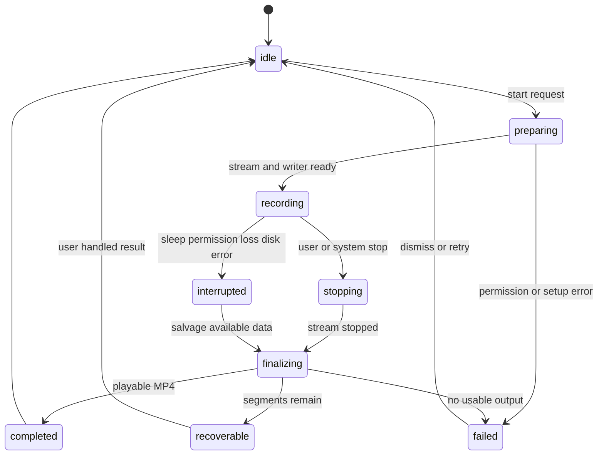

# Atoll × 薪跳二期技术适配声明

> 对应《二期项目PRD.md》1.0

## 0. 文档信息

| 项目 | 内容 |
|---|---|
| 文档名称 | Atoll × 薪跳二期技术适配声明 |
| 文档版本 | 1.0 |
| 文档日期 | 2026-08-25 |
| PRD 基线 | [`二期项目PRD.md`](二期项目PRD.md) 1.0 |
| 一期代码基线 | `第一阶段开发最终版` / `e767ebc` |
| 目标工程 | `/Users/Apple/Desktop/Atoll/DynamicIsland.xcodeproj` |
| 最低系统 | macOS 14.6 |
| 目标设备 | Apple Silicon、带实体刘海的 MacBook、内置屏幕 |
| 文档结论 | 有条件适配，可进入技术拆解；必须遵守本文的 API 分层、迁移和单显示器边界 |

## 1. 适配结论

二期全部 P0 能力可以在当前 Atoll 原生 macOS 工程内实现，不需要引入 WebView、Tauri、Node/Rust sidecar、第二应用 Target 或云端服务。

适配不是简单追加界面。需要完成以下四项结构调整：

1. 把一期固定星期判断扩展为独立的“有效工作日程解析层”。
2. 为日期例外和每日历史增加版本化本地文件存储，不能继续把所有数据塞入 Defaults。
3. 把当前 Screen Assistant 中依赖 `/usr/sbin/screencapture` 和系统剪贴板的截图逻辑抽成独立原生服务。
4. 新建 Atoll 自有录屏状态机，和现有“检测外部录屏”的 `ScreenRecordingManager` 分离。

### 1.1 适配等级

| 模块 | 适配等级 | 结论 |
|---|---:|---|
| 中国节假日与调休 | 中 | 本地规则包 + 日程解析器即可实现 |
| 日期例外 | 中 | 新增独立存储和优先级规则 |
| 收益历史 | 中 | 每日摘要规模小，JSON/Actor 足够 |
| 区域、窗口、全屏截图 | 中 | macOS 14 可使用 ScreenCaptureKit；选区 UI 需要重构 |
| 屏幕画面与系统声音录制 | 高 | `SCStream + AVAssetWriter` 可覆盖 macOS 14.6 |
| 麦克风混音 | 高 | macOS 14.6 需要独立采集、时间同步与混音 |
| 刘海录制状态共存 | 高 | 物理空间有限，必须进入统一关闭态策略 |
| 多显示器 | 不适配 | 二期明确排除，不实现降级录制 |

## 2. 现有工程基线

### 2.1 构建与运行

- 主 Target 名为 `DynamicIsland`，应用产物为 `Atoll.app`。
- Debug Bundle ID 为 `com.Ebullioscopic.Atoll.dev`，Release Bundle ID 为 `com.Ebullioscopic.Atoll`。
- 主应用 Debug/Release Deployment Target 已配置为 macOS 14.6。
- 当前工程使用 Swift、SwiftUI、AppKit、Combine、Defaults 和 KeyboardShortcuts。
- 一期实时收益代码位于 `DynamicIsland/features/LiveEarnings/`。
- 一期最终版本已经通过本机部署和回归测试。

### 2.2 一期实时收益现状

| 当前组件 | 现状 | 二期动作 |
|---|---|---|
| `LiveEarningsConfig` | schema 1，Defaults Codable | 保持向后兼容；新增数据优先拆到独立 Store |
| `LiveEarningsEngine` | 固定星期、单组白班、纯计算 | 接收解析后的 `EffectiveWorkSchedule` |
| `LiveEarningsController` | 主线程控制器、即时保存、单 Task 调度 | 订阅日历与例外版本变化，继续统一重算 |
| `LiveEarningsSnapshot` | 运行时生成，不保存历史 | 日结束时转成不可变 `DayEarningsRecord` |
| 关闭态收益 | 固定紧凑左右翼、自适应字号 | 录制状态只能使用既有紧凑空间，不能继续加宽 |
| Home 收益卡 | 位于 Home 顶部 | 增加历史/日历入口，保留顶部安全间距 |

### 2.3 截图与录屏现状

- `ScreenshotSnippingTool` 当前通过 `/usr/sbin/screencapture` 执行截图，先写剪贴板，再读取 `NSImage` 保存到 Screen Assistant 私有目录。
- 当前实现会占用系统剪贴板、使用同步 `waitUntilExit()`、缺少结构化取消/错误结果，并把文件路径写入调试日志，不适合作为二期公共截图服务。
- `ScreenRecordingManager` 当前主要检测系统或第三方录屏状态，并尝试停止系统录屏；它不负责 Atoll 自己的视频编码和文件输出。
- 现有快捷键设置已经使用 `KeyboardShortcuts.Recorder`，可直接扩展动作名称和启停协调器。

## 3. PRD 到工程的适配映射

| PRD 模块 | 现有基础 | 主要缺口 | 适配方式 |
|---|---|---|---|
| 法定节假日 | `Calendar` 和固定工作日统计 | 无官方规则包、无来源版本 | Bundled JSON + `HolidayCalendarStore` |
| 调休补班 | 无 | 周末强制工作规则 | `EffectiveWorkScheduleResolver` |
| 请假/临时工作日 | 无 | 日期例外和持久化 | `WorkdayOverrideStore` |
| 单日时间修正 | 一期时间模型 | 只支持全局时间 | 日期例外携带可选日程 |
| 日周月历史 | 仅运行时 Snapshot | 无历史持久化 | `DayEarningsStore` + 摘要视图 |
| 独立截图 | Screen Assistant 截图 | 与 AI、剪贴板和私有目录耦合 | `ScreenCaptureService` |
| 原生录屏 | 外部录屏检测 | 无视频写入与声音混合 | `AtollRecordingCoordinator` |
| 系统声音 | ScreenCaptureKit 可用 | 未连接文件写入器 | `.audio` SampleBuffer → Writer |
| 麦克风 | 现有 Info/Entitlement 不完整 | macOS 14.6 无 `captureMicrophone` | 独立音频采集与混音 |
| 保存位置 | Screen Assistant 私有目录 | 无用户目录与书签 | `CaptureFileStore` |
| 快捷键 | KeyboardShortcuts | 无截图录屏动作 | `CaptureShortcutCoordinator` |
| 刘海录制状态 | 外部录屏指示基础 | 与收益/媒体空间冲突 | 统一 `ClosedNotchPresentationPolicy` |

## 4. 系统 API 兼容声明

### 4.1 ScreenCaptureKit 基线

ScreenCaptureKit 是二期截图和录屏的主框架。Apple 将其用于高性能捕获显示器、应用和窗口，并通过 `SCStream` 输出屏幕与音频 `CMSampleBuffer`。

当前工程最低支持 macOS 14.6，因此正式实现必须以以下共同 API 为基线：

| API | 最低可用版本 | 二期用途 |
|---|---:|---|
| `SCStream` / `.screen` 输出 | macOS 12.3 | 屏幕视频流 |
| `SCStreamOutputType.audio` | macOS 13.0 | 系统声音流 |
| `SCStreamConfiguration.capturesAudio` | macOS 13.0 | 系统声音开关 |
| `SCScreenshotManager.captureImage` | macOS 14.0 | 单帧截图 |
| `SCStreamConfiguration.sourceRect` | 当前基线可用 | 区域截图和区域录屏 |
| `SCStreamConfiguration.captureMicrophone` | macOS 15.0 | 只能作为较新系统优化路径 |
| `SCRecordingOutput` | macOS 15.0 | 不能作为 macOS 14.6 唯一录屏实现 |

结论：

- 截图统一使用 macOS 14 已提供的 `SCScreenshotManager.captureImage(contentFilter:configuration:)`。
- 录屏统一以 `SCStream + AVAssetWriter` 为主路径，避免 14.6 与 15+ 生成行为分裂。
- macOS 15+ 可用 `.microphone` Stream Output 简化麦克风取样，但编码、混音和文件状态机仍复用同一套实现。
- macOS 14.6 的麦克风通过 AVFoundation/Core Audio 单独采集，再转换到共同采样率和时间轴。
- 不使用 macOS 15.2 才提供的矩形截图便捷 API，也不使用 macOS 26 新截图配置 API。

### 4.2 官方依据

- [Apple ScreenCaptureKit](https://developer.apple.com/documentation/screencapturekit)
- [Apple Capturing screen content in macOS](https://developer.apple.com/documentation/screencapturekit/capturing-screen-content-in-macos)
- [Apple SCScreenshotManager](https://developer.apple.com/documentation/screencapturekit/scscreenshotmanager)
- [Apple capturesAudio](https://developer.apple.com/documentation/screencapturekit/scstreamconfiguration/capturesaudio)
- [Apple Audio Input Entitlement](https://developer.apple.com/documentation/bundleresources/entitlements/com.apple.security.device.audio-input)
- [Apple NSMicrophoneUsageDescription](https://developer.apple.com/documentation/bundleresources/information-property-list/nsmicrophoneusagedescription)

### 4.3 录屏编码结论

- 目标容器：MP4。
- 视频编码：H.264。
- 音频编码：AAC。
- 默认帧率：30 fps，二期不开放帧率设置。
- 默认动态范围：SDR，二期不录制 HDR。
- 视频尺寸：内置显示器物理像素或区域对应物理像素，编码前保证宽高为偶数。
- 系统声音：ScreenCaptureKit `.audio` 输出，建议 48 kHz、双声道。
- 麦克风：统一转换到 48 kHz；单声道麦克风在混音时映射到双声道。
- 两类声音同时开启时必须使用同一宿主时钟校准并混合，不能简单写成两个默认播放互斥的音轨。

## 5. 权限与签名适配

### 5.1 当前缺口

当前 `Info.plist` 已包含 `NSScreenCaptureUsageDescription` 和 `NSAudioCaptureUsageDescription`，但文案仍指向 AI 截图或波形，不足以解释二期独立截图录屏用途。

当前 Entitlements 有摄像头权限，但没有麦克风音频输入 Entitlement。

### 5.2 必须调整

| 文件 | 调整 |
|---|---|
| `DynamicIsland/Info.plist` | 更新 `NSScreenCaptureUsageDescription`，说明截图和录屏 |
| `DynamicIsland/Info.plist` | 更新 `NSAudioCaptureUsageDescription`，说明录制系统声音 |
| `DynamicIsland/Info.plist` | 新增 `NSMicrophoneUsageDescription` |
| `DynamicIsland/DynamicIsland.entitlements` | 新增 `com.apple.security.device.audio-input = true` |
| String Catalog / InfoPlist.strings | 提供简体中文和 English 权限文案 |

### 5.3 请求时机

- 启动 Atoll 时不主动请求新增权限。
- 用户首次触发截图或录屏时检查屏幕录制权限。
- 用户首次打开麦克风开关并开始录制时请求麦克风权限。
- 用户开启完成通知时再请求通知权限。
- 权限拒绝不能影响实时收益、媒体或原有 Home。
- 屏幕录制权限变更如果需要重启应用才能生效，界面明确提示并提供退出重开动作。

## 6. 单显示器适配声明

### 6.1 目标显示器判定

- 二期唯一捕获目标是带实体刘海的 MacBook 内置显示器。
- 通过 `NSScreen.safeAreaInsets.top > 0` 识别实体刘海候选屏幕。
- 通过 `NSScreen.deviceDescription[NSDeviceDescriptionKey("NSScreenNumber")]` 的 `CGDirectDisplayID` 与 `SCDisplay.displayID` 对齐。
- 即使存在外接显示器，也不展示显示器选择器。
- 捕获过滤器只绑定内置显示器。

### 6.2 不支持状态

以下情况截图和录屏入口禁用并解释原因：

- 合盖后只剩外接显示器。
- 无法取得内置显示器对应的 `SCDisplay`。
- 当前 Mac 没有实体刘海。
- 当前设备不在 Apple Silicon 支持范围。

不允许静默回退到 `NSScreen.main`，因为焦点窗口可能位于外接显示器，这会违反 PRD 的单显示器边界。

### 6.3 坐标转换

- SwiftUI/AppKit 选区使用点坐标，ScreenCaptureKit 配置使用相对捕获显示器的源矩形。
- 必须处理 macOS 全局屏幕坐标原点、Y 轴方向、显示器 frame 和 backingScaleFactor。
- 区域必须与内置显示器求交，禁止跨屏矩形进入捕获配置。
- 编码尺寸由交集区域的 backing pixels 计算并修正为偶数。
- 坐标转换抽为纯函数并用不同缩放比例测试。

## 7. 工作日历适配

### 7.1 模块边界



### 7.2 日历数据包

- 使用只读、版本化 JSON 资源，随应用发布。
- 每条日期至少包含日期、类型、节日名称、公告年份和来源标识。
- 只收录已经正式公布的日期，不使用算法猜测调休。
- 构建时校验日期唯一、类型合法、补班与休息不冲突。
- 运行时加载失败则安全降级到固定星期规则并暴露状态。
- 本模块不新增网络请求。

### 7.3 规则解析

最终日程优先级固定为：

```text
WorkdayOverride
  > HolidayDateRule
    > LiveEarningsConfig.workdays
      > rest day
```

- `Resolver` 是纯逻辑或 Sendable 值类型，不直接读 Defaults 和文件。
- Store 在进入 Engine 前准备数据，UI 不重复判断。
- 月薪 `N_month` 使用整月解析结果缓存，缓存键包含年月、时区、工作日集合、日历版本和例外版本。
- 任何相关配置变化都使缓存失效并通知 Controller 重算。

## 8. 历史存储适配

### 8.1 存储选择

二期历史规模约为每天一条。JSON 文件配合 Actor、原子写入和版本字段已经足够，不需要引入 Core Data、SwiftData 或数据库依赖。

推荐目录：

```text
~/Library/Application Support/Atoll/LiveEarnings/
  overrides-v1.json
  history-v1.json
  pending-day-v1.json
```

### 8.2 写入规则

- `DayEarningsStore` 使用 Actor 串行读写。
- 文件写入使用临时文件 + 原子替换，避免半写损坏。
- 历史以本地日期为唯一键，重复 finalize 必须幂等。
- 已结束日期默认不可变；显式重算使用递增 revision。
- 只保存 PRD 列出的每日摘要，不保存逐秒快照。
- 文件损坏时先保留原文件副本，再创建空 Store 并提示；禁止静默覆盖。

### 8.3 补算边界

- 不能依据当前薪资伪造二期安装前的历史。
- 为支持应用未在下班时运行，可在工作日首次计算时保存最小 `PendingDayContext`。
- 下次启动只补算仍有可信上下文的日期。
- 超过可恢复范围或缺少上下文时标记缺失，不猜测。

## 9. 一期配置迁移适配

### 9.1 风险

Swift Codable 对新增非可选字段不会因为声明了默认值就自动兼容缺失 JSON 键。一期已经通过把颜色字段声明为可选解决过一次兼容问题；二期不能再次依赖合成解码侥幸迁移。

### 9.2 策略

- 保留一期 `LiveEarningsConfig` 字段与语义。
- 日期例外、历史和捕获偏好使用独立 Store，不强行塞入配置结构。
- 如果必须升级 `LiveEarningsConfig`，实现显式 `init(from:)` 和版本迁移器。
- 升级前读取原始 Data；成功写入新数据后才更新 schema 标记。
- 迁移失败保留一期原始值并关闭二期扩展，不能重置薪资。
- 使用一期真实 JSON 建立固定回归样本，包括没有 `closedAmountColorHex` 的旧记录。

## 10. 截图适配

### 10.1 重构结论

当前 `ScreenshotSnippingTool` 不能直接扩展为二期最终实现，原因包括：

- 依赖外部 `screencapture` 进程。
- 同步等待进程结束，存在阻塞调用线程风险。
- 借用并改变系统剪贴板。
- 结果目录固定为 Screen Assistant 内部目录。
- 成功和失败只通过日志表达，缺少 Typed Error。
- 记录了具体文件路径。

二期应保留现有入口的行为，但底层替换为 `ScreenCaptureService`。

### 10.2 模式映射

| 模式 | Content Filter | Configuration |
|---|---|---|
| 全屏 | 内置 `SCDisplay`，可排除 Atoll 应用 | 输出内置显示器像素尺寸 |
| 窗口 | `desktopIndependentWindow` | 使用窗口 frame 和 scale |
| 区域 | 内置 `SCDisplay` | 设置显示器相对 `sourceRect` |

- 选区 UI 只覆盖内置屏幕。
- 全屏与区域在“隐藏 Atoll”开启时通过 `excludingApplications` 排除当前 Bundle ID。
- 图片通过 ImageIO 写为 PNG，不经过剪贴板中转。
- 复制动作在截图成功后显式写剪贴板，不污染用户原剪贴板作为捕获前置条件。
- 服务异步返回 `Result<CaptureArtifact, CaptureError>`。

## 11. 录屏适配

### 11.1 新旧管理器分离

现有 `ScreenRecordingManager` 检测系统/第三方录屏活动，包含私有 CGS/SkyLight 事件逻辑。二期不得把 Atoll 自己的编码会话直接塞入该类，否则会混淆“外部正在录屏”和“Atoll 正在录屏”。

推荐新增：

- `AtollRecordingCoordinator`：公开状态和用户动作。
- `ScreenStreamSession`：管理 `SCStream`。
- `RecordingAssetWriter`：管理 AVAssetWriter 输入和时间轴。
- `MicrophoneCaptureSession`：管理麦克风权限和采样。
- `AudioMixPipeline`：格式转换、同步与混音。
- `RecordingRecoveryStore`：管理临时片段和恢复清单。

### 11.2 状态机



- UI 只能根据状态机展示“准备、录制、停止、保存、失败”，不能用固定延迟猜测状态。
- `recording` 以第一帧成功写入为准，不以按钮点击为准。
- `completed` 以 `finishWriting` 成功且文件可读为准。
- start/stop 命令必须幂等，连续点击不能创建多个 Stream 或 Writer。

### 11.3 音频分层

#### macOS 14.6

- 系统声音：`SCStreamOutputType.audio`。
- 麦克风：AVFoundation/Core Audio 独立输入。
- 两路统一转换到 48 kHz、双声道浮点或 PCM 中间格式。
- 使用宿主时间/PTS 对齐，处理麦克风漂移、迟到和短暂缺口。
- 混音后写入单一 AAC 输入，确保普通播放器能同时听到两类声音。

#### macOS 15+

- 麦克风可以改由 `SCStreamOutputType.microphone` 获取。
- 仍进入相同 `AudioMixPipeline`，保持文件语义与 14.6 一致。
- 不把 `SCRecordingOutput` 作为唯一实现，以免出现双状态机和不同恢复行为。

### 11.4 文件恢复

MP4 在 `finishWriting` 前异常退出可能不可播放，因此“恢复”只能设计为尽力保证，不能只保留一个未封装的大文件。

建议 P1 实现短片段策略：

- 按固定时长生成可独立完成的临时片段。
- 正常停止后无重编码拼接或导出为最终 MP4。
- 异常退出最多损失正在写入的一个片段。
- 恢复清单不包含画面内容，只包含片段 URL、顺序、时长和状态。
- 用户确认最终文件后删除临时片段。

## 12. 文件与目录适配

### 12.1 默认目录

```text
~/Pictures/Atoll Screenshots/
~/Movies/Atoll Recordings/
```

- 使用 FileManager 的系统目录 API 获取 Pictures 和 Movies，不硬编码用户名或完整绝对路径。
- 首次写入时创建子目录。
- 自定义目录通过 `NSOpenPanel` 选择。
- 即使当前应用未启用 App Sandbox，也建议保存安全作用域书签，为签名环境和未来沙盒化保留稳定访问语义。

### 12.2 文件写入

- 文件名由专门生成器产生并去重。
- 截图先写临时 PNG，校验非空后原子移动到目标目录。
- 录屏在临时路径完成封装，成功后移动到最终路径。
- 不覆盖同名文件。
- 文件路径不进入普通日志。
- 自定义目录失效时返回 Typed Error，由 UI 提供重选或回退默认目录。

## 13. 快捷键适配

- 在 `DynamicIsland/Shortcuts/ShortcutConstants.swift` 新增截图和录屏名称。
- 在 `DynamicIslandApp` 的快捷键注册生命周期中统一启用/禁用。
- 由 `CaptureShortcutCoordinator` 把快捷键动作转成服务调用，View 不直接启动录屏。
- 快捷键默认不绑定，避免覆盖 macOS 原生截图组合。
- 保存时检查 Atoll 内部 Name 的重复组合。
- 无法可靠知道所有第三方应用快捷键，界面只能提示潜在冲突。
- 停止快捷键只能作用于 `AtollRecordingCoordinator.state == .recording`。

## 14. 刘海与 Home 适配

### 14.1 关闭态

需要把一期关闭态组合扩展为：

```text
systemOverride
recordingWithEarnings
recordingOnly
mediaWithEarnings
earningsOnly
originalAtoll
```

- `recordingWithEarnings` 左翼使用固定紧凑宽度显示红点和精简时长，右翼继续使用一期收益翼宽。
- 不允许根据录制时长或金额文本无限增长窗口。
- 时长过长时缩小字号或只保留红点；不能遮挡菜单栏应用。
- 完整声音状态、停止按钮和文件保存状态只放在展开态。
- 关闭态策略抽为可测试值，不继续扩大 `ContentView` 的互斥条件链。

### 14.2 Home

- 正在录制时，Home 顶部显示 `ActiveRecordingCard`。
- 收益开启时，收益卡仍保留在录制卡之后。
- Home 内容超过可用高度时使用内部 ScrollView，外层窗口仍遵循一期顶部安全间距。
- 快速截图/录屏入口使用紧凑操作区，不长期占用 Home 主要内容。
- 停止按钮具备明显危险语义，但不能误用为删除文件。

### 14.3 设置

- 实时收益设置新增工作日历、历史和清除入口。
- 新建独立“截图与录屏”设置页，不把本地截图强制绑定到 Screen Assistant。
- 所有普通偏好即时保存。
- 目录选择、清除历史、删除恢复片段等有副作用操作使用明确确认。

## 15. 本地化与可访问性适配

- 所有新文案进入 `DynamicIsland/Localizable.xcstrings`。
- 权限使用说明同时提供简体中文和 English。
- VoiceOver 不每秒播报收益或录制时长。
- 收益日历状态使用图标/文字，不只使用颜色。
- 录制红点增加“正在录屏”可访问性标签。
- 开始、停止、正在保存和失败是独立状态，不只靠按钮颜色。
- Reduce Motion 开启后关闭不必要的数字滚动和预览弹性动画。
- 区域选取支持 Escape 取消、Return 确认和清晰焦点边框。

## 16. 性能与资源适配

### 16.1 收益侧

- 工作中保持最高 1 Hz。
- 节假日解析和月度分母按版本缓存，不能每秒扫描整月。
- 历史写入只在状态边界发生，不随每秒金额写盘。

### 16.2 捕获侧

- 截图和录屏处理使用专用串行队列或 Actor，不阻塞主线程。
- `SCStreamConfiguration.queueDepth` 从 3 开始，只有实测丢帧才提高，最大不超过 Apple 建议的 8。
- 视频和音频 SampleBuffer 应有背压策略，写入器未 ready 时不能无限缓存。
- 录屏 UI 计时使用单一 monotonic clock，不和视频帧数量绑定。
- 60 分钟录屏需要使用 Instruments 检查内存、CPU、Energy 和文件增长。

## 17. 测试适配

### 17.1 自动化

- 保留并扩展一期 Foundation-only 收益回归。
- 新增日历优先级、缺少年份、月份分母、日期例外测试。
- 新增 schema 1 真实 JSON 迁移测试。
- 新增 History Store 原子写入、幂等和损坏恢复测试。
- 坐标转换、文件名去重、状态机和快捷键冲突逻辑使用纯单元测试。
- AVAssetWriter 和 ScreenCaptureKit 使用协议注入完成状态机集成测试。

### 17.2 真机

- macOS 14.6 是必测基线，不能只在 macOS 15+ 测试。
- 测试屏幕权限首次拒绝、授权后重启、运行中撤销。
- 测试无声、系统声音、麦克风以及两者混合。
- 测试 10 分钟普通录屏和 60 分钟稳定性录屏。
- 测试连接外接屏但只捕获内置屏幕。
- 测试合盖只剩外接屏时明确禁用。
- 测试四位数收益 + 录屏状态 + 菜单栏应用共存。

## 18. 主要风险

| 风险 | 等级 | 处理要求 |
|---|---:|---|
| macOS 14.6 麦克风混音与时间漂移 | 高 | 先建音频验证原型，再进入 UI |
| MP4 异常退出不可恢复 | 高 | P1 分段或碎片化写入，不夸大恢复保证 |
| 实体刘海空间不足 | 高 | 固定翼宽、策略测试、真机截图 |
| 一期 Codable 迁移丢配置 | 高 | 显式迁移和真实旧 JSON 测试 |
| 坐标系错误捕获外接屏或错位区域 | 高 | 内置屏匹配和纯函数测试 |
| 权限文案与签名缺失 | 中 | Info/Entitlement/签名构建联检 |
| 节假日规则不完整 | 中 | 版本和覆盖年份可见、手动修正 |
| 当前私有录屏检测 API 不稳定 | 中 | 与自有录屏隔离，不作为文件录制依赖 |

## 19. 明确禁止的实现

- 禁止把 Deployment Target 直接提高到 macOS 15 来绕开兼容问题。
- 禁止用 `SCRecordingOutput` 作为唯一录屏方案。
- 禁止通过 shell `screencapture` + 剪贴板作为二期最终截图链路。
- 禁止让外接显示器或 `NSScreen.main` 成为隐式捕获目标。
- 禁止每秒保存收益历史。
- 禁止增加 CSV、Excel、PDF 或其他历史导出链路。
- 禁止新增非可选 Codable 字段后假设旧 JSON 会自动使用默认值。
- 禁止把 Atoll 自有录屏状态塞入现有外部录屏检测状态。
- 禁止为容纳录制时间继续扩大关闭态刘海宽度。
- 禁止把截图或录屏自动附加并发送给 AI。
- 禁止在日志中打印薪资、历史金额、截图内容、录屏内容或完整文件路径。

## 20. 开发前门槛

进入二期代码开发前必须完成：

- [ ] 二期 PRD 和本文完成用户确认。
- [ ] 基于 `第一阶段开发最终版` 建立二期开发分支。
- [ ] 冻结 schema 1 迁移样本和回滚策略。
- [ ] 完成 macOS 14.6 屏幕 + 系统声音 + 麦克风混音原型。
- [ ] 确定本地节假日数据来源、格式、覆盖年份和审核人。
- [ ] 确定历史 JSON schema 和原子写入策略。
- [ ] 完成关闭态录制 + 收益共存的像素级草图。
- [ ] 更新权限文案和 Entitlement 方案并完成签名预检。
- [ ] 建立二期自动化测试目标与真机矩阵。

## 21. 最终声明

二期在当前 Atoll 工程和 macOS 14.6 产品边界内技术可行，但录屏音频、异常恢复、旧配置迁移和实体刘海共存属于高风险模块，必须先验证底层再制作完整界面。

本文不授权扩大到多显示器、外接屏、夜班、历史导出、自动云同步或第三方会议隐私识别。任何范围变化应先更新 PRD，再调整技术方案。

## 22. 参考资料

- 二期 PRD：[`二期项目PRD.md`](二期项目PRD.md)
- 一期技术适配声明：[`技术适配声明.md`](技术适配声明.md)
- 一期开发手册：[`开发手册.md`](开发手册.md)
- Atoll 工程：`/Users/Apple/Desktop/Atoll`
- Apple ScreenCaptureKit：[developer.apple.com/documentation/screencapturekit](https://developer.apple.com/documentation/screencapturekit)
- Apple Screen Capture Sample：[Capturing screen content in macOS](https://developer.apple.com/documentation/screencapturekit/capturing-screen-content-in-macos)
- Apple SCScreenshotManager：[SCScreenshotManager](https://developer.apple.com/documentation/screencapturekit/scscreenshotmanager)
- Apple Microphone Usage Description：[NSMicrophoneUsageDescription](https://developer.apple.com/documentation/bundleresources/information-property-list/nsmicrophoneusagedescription)

## 23. 变更记录

| 版本 | 日期 | 变更内容 |
|---|---|---|
| 1.0 | 2026-08-25 | 基于二期 PRD、一期最终代码与 Apple 官方 API 版本边界形成首版适配声明 |
