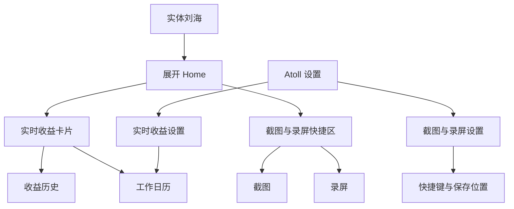
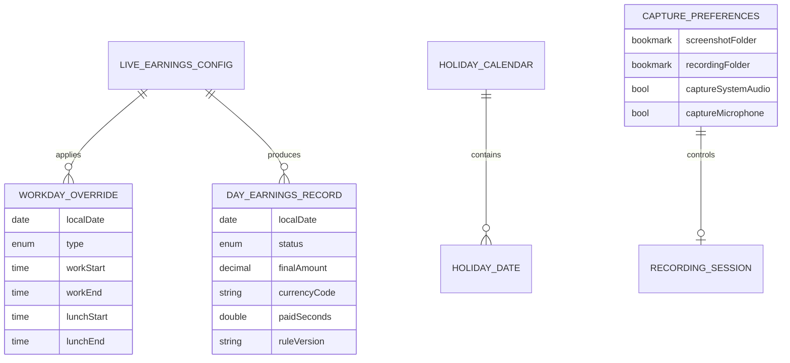
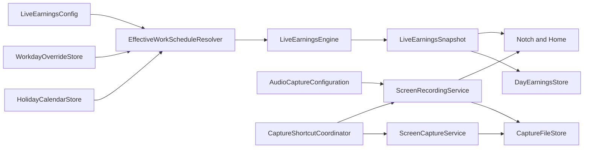

# Atoll × 薪跳二期项目 PRD

> Phase 2 需求收口版

## 0. 文档信息

| 项目 | 内容 |
|---|---|
| 文档名称 | Atoll × 薪跳二期项目 PRD |
| PRD 版本 | 1.0 |
| 文档日期 | 2026-08-25 |
| 文档状态 | 二期范围已收口，待本文最终确认后进入技术方案与开发拆解 |
| 一期基线 | `第一阶段开发最终版`，提交 `e767ebc` |
| 宿主产品 | Atoll |
| 目标平台 | macOS 14.6+ |
| 目标设备 | Apple Silicon、带实体刘海的 MacBook、内置屏幕 |
| 数据策略 | 本地计算、本地保存、无账号、无云同步 |
| 二期主题 | 工作日历、收益历史、截图、录屏、快捷键与一期体验巩固 |

## 1. 产品结论

二期继续以 Atoll 为唯一产品宿主，不恢复独立的薪跳应用，也不新增 Web、Windows 或第二套桌面外壳。

一期已经完成实时收益在实体刘海和 Home 中的基础融合。二期不再扩大平台范围，重点解决两个方向：

1. 让实时收益从“固定星期白班计算器”升级为能处理中国法定节假日、调休、请假和临时工作日的本地工作日历。
2. 把 Atoll 已有的截图基础能力产品化，并增加原生录屏、声音控制、刘海录制状态和可配置快捷键。

二期功能数量以本文为上限。除缺陷修复、可访问性、权限失败处理和发布必需项外，不再新增功能大类。

### 1.1 一句话价值

让用户在一个 MacBook 刘海入口中，既能按照真实工作日历查看收益，也能随时完成截图和录屏。

### 1.2 二期原则

1. 延续一期“本地、可选、低打扰”的产品边界。
2. 实时收益开启后，刘海数字和 Home 收益卡持续存在；不增加两个区域的独立显示开关。
3. 工作日历以自动规则为基础、用户手动修正为最高优先级。
4. 截图和录屏是独立生产力能力，不依赖 AI 服务，不自动上传文件。
5. 录屏过程必须可从刘海识别、展开和停止，不能破坏现有媒体、收益和高优先级系统事件。
6. 二期只支持 MacBook 内置屏幕，不提供多显示器选择、外接屏录制或外接屏刘海形态。
7. 一期已有配置必须原样迁移，升级后不能要求用户重新填写薪资和工作时间。

## 2. 一期基线与已知约束

### 2.1 一期已交付能力

- 月薪、日薪和时薪配置，默认月薪。
- 币种、固定工作日、同日上下班时间和午休暂停。
- 实体刘海静默状态纯数字金额。
- 展开 Home 顶部实时收益卡片。
- 媒体与收益共存，以及高优先级系统事件后的恢复。
- 隐私模式、锁屏隐藏和本地配置持久化。
- 金额数字按位数自适应字号，默认绿色，并支持自定义颜色。
- 设置修改后自动保存，薪资和工作时间变化后立即重算。
- Swift 原生计算引擎与自动化回归测试。

### 2.2 一期验收暴露的约束

- 实体摄像头区域会真实遮挡内容，不能只依赖模拟器或窗口截图判断位置。
- 关闭态宽度过大会遮挡菜单栏应用，因此二期不能通过无限加宽刘海容器解决信息冲突。
- Home 内容需要保留顶部安全间距，不能顶到屏幕上边缘。
- 设置页遵循即时生效逻辑，不能把关键保存按钮隐藏在长页面底部。
- 收益金额位数会持续变化，所有新增录制状态都必须进入同一套关闭态布局策略。

### 2.3 现有工程基础

- 主工程继续使用 Swift、SwiftUI 和 `DynamicIsland` Target，产物仍为 `Atoll.app`。
- `LiveEarningsEngine` 负责纯计算，`LiveEarningsController` 负责配置、快照和刷新调度。
- 配置当前通过 Defaults 本地保存，二期需要兼容现有 `LiveEarningsConfig`。
- Atoll 已集成 `KeyboardShortcuts`，设置中已有快捷键录制控件。
- Screen Assistant 已有区域、窗口和全屏截图基础代码，但当前能力与 AI 附件流程耦合，二期需要抽成独立截图服务。
- Atoll 已有屏幕录制状态检测，但尚未提供完整的屏幕画面录制与文件输出流程。

## 3. 产品目标与非目标

### 3.1 Phase 2 目标

1. 按中国法定节假日、调休补班和用户手动例外准确判断当天是否工作。
2. 在日期规则变化后立即更新实时金额、进度和 Home 状态。
3. 从二期启用之日起保存每日最终收益，提供日、周、月本地历史视图。
4. 支持区域、窗口、全屏截图，并可通过 Atoll 或全局快捷键触发。
5. 支持内置屏幕区域和全屏录制，系统声音与麦克风可独立控制。
6. 录制状态、计时和停止操作可在刘海中完成。
7. 截图和录屏文件按照稳定、可理解的规则保存到本地，并允许修改目录。
8. 升级不破坏一期收益、Home、媒体、设置和刘海布局。

### 3.2 Phase 2 非目标

- 不支持多显示器、外接显示器选择或外接显示器录制。
- 不支持合盖后仅使用外接显示器的截图和录屏流程。
- 不开发 Windows、Web、Intel Mac 或无实体刘海 Mac 的新产品形态。
- 不支持夜班、跨夜班、轮班或按星期设置完全不同班次。
- 不提供 CSV、Excel、PDF 或其他历史数据导出。
- 不提供账号、云同步、团队管理或跨设备同步。
- 不计算个税、社保、公积金、法定加班倍数或实际到手工资。
- 不追踪键盘、鼠标、前台应用和真实在线工时。
- 不自动识别第三方会议、投屏或屏幕共享并改变收益显示。
- 不自动上传、分析或发送截图和录屏文件到 AI 服务。
- 不提供视频剪辑、标注、转码队列、直播或摄像头画中画。

## 4. 二期范围总览

| 模块 | 二期结论 | 优先级 |
|---|---|---:|
| 中国法定节假日 | 包含，本地规则包 | P0 |
| 调休补班 | 包含，优先于固定星期规则 | P0 |
| 手动请假日 | 包含，按整日处理 | P0 |
| 临时工作日 | 包含，按普通工作日计算 | P0 |
| 单日工作时间修正 | 包含，可调整当天上下班和午休 | P1 |
| 日、周、月收益历史 | 包含，仅本地 | P0 |
| 历史数据导出 | 不包含 | — |
| 区域、窗口、全屏截图 | 包含 | P0 |
| 区域、内置屏幕全屏录制 | 包含 | P0 |
| 系统声音录制 | 包含，默认开启 | P0 |
| 麦克风录制 | 包含，默认关闭 | P0 |
| 截图与录屏快捷键 | 包含，用户可配置 | P0 |
| 自定义保存位置 | 包含 | P0 |
| 刘海录制状态与停止 | 包含 | P0 |
| 多显示器 | 明确不包含 | — |
| 夜班、轮班 | 明确不包含 | — |

## 5. 信息架构

### 5.1 Atoll 内的位置



### 5.2 入口

| 入口 | 作用 |
|---|---|
| 刘海静默状态 | 继续显示收益；录屏时同时显示最小录制状态 |
| 展开 Home | 查看收益、进入历史、快速截图、开始或停止录屏 |
| 实时收益设置 | 管理工作日历、个人日期例外和历史数据 |
| 截图与录屏设置 | 管理声音、保存位置、文件行为和快捷键 |
| 全局快捷键 | 不展开 Atoll 即可截图、开始录屏或停止录屏 |
| 系统通知 | 截图或录屏完成后打开文件或在访达中显示 |

## 6. 核心用户流程

### 6.1 升级与迁移

1. 用户从一期版本升级到二期。
2. Atoll 读取一期 `LiveEarningsConfig`，保留开关、薪资、币种、工作日、时间、午休、颜色和隐私设置。
3. 二期新增字段使用安全默认值，不能覆盖一期有效配置。
4. 收益历史从二期首次运行当天开始记录，不推测或伪造升级前历史。
5. 用户无需重新进入首次引导。

### 6.2 工作日自动判断

1. Atoll 读取用户固定工作日。
2. 查询本地中国法定节假日与调休规则包。
3. 查询用户为当前日期设置的手动例外。
4. 按“手动例外 > 官方日历 > 固定星期”的优先级生成当天日程。
5. `LiveEarningsEngine` 使用最终日程计算状态、金额和进度。
6. 用户修改当天规则后，刘海和 Home 立即刷新。

### 6.3 设置请假或临时工作日

1. 用户进入“实时收益 → 工作日历”。
2. 在月历中选择日期。
3. 选择“请假”“临时工作日”“恢复自动判断”或“修改当天时间”。
4. 保存有效例外后，当天及相关月度统计立即重算。
5. 月历用文字或图标区分来源，不能只依赖颜色。

### 6.4 查看收益历史

1. 用户从 Home 收益卡片进入历史。
2. 默认显示本周，允许切换日、周、月。
3. 用户查看累计收益、工作天数和每日明细。
4. 点击某一天可查看该日使用的工作日来源、最终金额、有效工作时间和状态。
5. 历史仅支持查看和清除，不提供文件导出。

### 6.5 截图

1. 用户从 Home 或快捷键选择区域、窗口或全屏截图。
2. 首次使用时，系统按需请求屏幕录制权限。
3. Atoll 执行选择并生成 PNG。
4. 文件保存到默认或用户指定目录。
5. 完成后显示轻量预览和系统通知，提供复制、打开文件和在访达中显示。

### 6.6 录屏

1. 用户选择区域录屏或内置屏幕全屏录屏。
2. 录制前确认系统声音、麦克风和保存位置。
3. 首次使用对应能力时请求屏幕录制或麦克风权限。
4. 开始后刘海显示红点、录制时长和可发现的停止入口。
5. 用户通过刘海、Home 或全局快捷键停止。
6. Atoll 完成文件封装后保存 MP4，并显示完成通知。
7. 失败时保留可恢复的临时文件并给出明确原因；不能静默丢失录制结果。

## 7. 工作日历需求

### 7.1 日历来源

- 二期提供中国大陆法定节假日、调休和补班规则。
- 规则以随应用发布的本地版本化数据包提供，运行时不为工作日历新增网络请求。
- 数据包只覆盖已经正式公布的年份，不推测尚未公布的安排。
- 数据缺失或年份尚未公布时，界面明确标注“按固定工作日判断”，并允许手动修正。
- 后续年份通过 Atoll 正常版本更新补充。

### 7.2 日期类型

| 类型 | 含义 | 收益行为 |
|---|---|---|
| 普通工作日 | 来自用户固定星期 | 按一期规则计算 |
| 法定休息日 | 来自官方日历 | 不显示当天收益，不生成工作金额 |
| 调休补班日 | 官方指定工作日 | 即使是周末也按工作日计算 |
| 请假日 | 用户手动设置的整日请假 | 当天不增长收益，历史标记为请假 |
| 临时工作日 | 用户手动把休息日改为工作日 | 按普通工作日计算 |
| 单日时间修正 | 只修改某一天的上下班或午休 | 使用修正后的当天日程计算 |

### 7.3 规则优先级

```text
用户手动日期例外
    > 中国法定节假日/调休规则
        > 用户固定星期工作日
            > 默认休息日
```

- 用户选择“恢复自动判断”后删除该日期例外，重新使用官方或固定星期规则。
- 同一日期最多存在一个最终例外，不能同时被标记为请假和临时工作日。
- 无效单日时间不能覆盖上一次有效结果。

### 7.4 月薪分母

月薪模式的 `N_month` 从“所选星期数量”升级为“当月最终有效工作日数量”：

```text
N_month = 固定工作日
          - 法定休息日
          + 调休补班日
          + 用户临时工作日
```

- 请假属于个人状态，不从 `N_month` 中移除，避免把请假日工资重新分摊到其他工作日。
- 请假日二期按 `0` 收益记录，不区分带薪或不带薪，也不代表真实工资扣款。
- 产品文案必须说明这是用户设定的可视化口径，不是劳动法或工资结算结果。

### 7.5 日历交互

- 默认展示当前月，并标注今天。
- 每个日期展示“工作、休息、调休、请假、临时”的文字缩写或图标。
- 官方规则和用户手动规则在详情中显示来源。
- 支持撤销单个手动例外。
- 支持清除全部个人日期例外，操作前二次确认。
- 二期不提供批量导入、公司日历订阅或第三方考勤同步。

## 8. 收益历史需求

### 8.1 记录时机

- 只保存每日摘要，不保存逐秒金额。
- 工作日结束、日期切换、应用退出前或下次启动补算时更新当天摘要。
- 如果 Atoll 在下班时未运行，下次启动可以依据当日配置快照补全最终摘要。
- 历史一旦成为已结束日期，不因用户后来修改全局薪资而自动改写。
- 用户主动修改过去日期例外时，必须明确提示是否重算该日；默认不重算。

### 8.2 历史字段

| 字段 | 说明 |
|---|---|
| 日期 | 本地自然日 |
| 日历来源 | 固定星期、官方规则或用户例外 |
| 状态 | 工作、休息、请假、临时工作 |
| 最终收益 | 当天最终预估金额 |
| 币种 | 生成记录时使用的 ISO 4217 代码 |
| 有效工作时长 | 扣除午休后的有效时长 |
| 薪资模式 | 月薪、日薪或时薪 |
| 规则版本 | 日历版本和必要配置快照版本 |

历史记录不得保存逐秒轨迹、键鼠活动或前台应用信息。

### 8.3 视图

#### 日视图

- 展示单日最终收益、状态、工作时间和规则来源。
- 当天未结束时标记为“进行中”，显示当前值而不是最终值。

#### 周视图

- 展示本周累计收益、计划工作天数、实际工作日、请假天数。
- 使用简洁柱形或列表比较每日收益。

#### 月视图

- 展示当月累计收益、有效工作日和每日明细。
- 月历与列表可以相互定位。
- 不显示“预计实际到账”或税后结论。

### 8.4 数据管理

- 支持清除全部收益历史，必须二次确认。
- 清除历史不删除当前实时收益配置。
- 清除实时收益全部数据时，同时删除工作日例外和历史摘要。
- 不提供 CSV、剪贴板批量复制或其他导出入口。
- 不上传历史，不加入普通日志、诊断包或崩溃上下文。

## 9. 截图需求

### 9.1 截图模式

| 模式 | 行为 |
|---|---|
| 区域截图 | 用户拖拽选择内置屏幕区域，默认入口 |
| 窗口截图 | 用户选择当前可见窗口 |
| 全屏截图 | 捕获 MacBook 内置屏幕，不提供显示器选择器 |

### 9.2 输出规则

- 默认格式为 PNG。
- 默认目录为 `~/Pictures/Atoll Screenshots/`。
- 用户可在设置中修改目录，Atoll 通过安全作用域书签恢复访问。
- 文件名格式为 `Atoll Screenshot YYYY-MM-DD HH-mm-ss.png`。
- 同一秒重复截图时追加序号，不能覆盖已有文件。
- 默认永久保留，Atoll 不自动清理。

### 9.3 完成操作

- 截图完成后显示轻量预览，不阻塞当前应用。
- 提供“复制图片”“打开文件”“在访达中显示”。
- 系统通知被关闭时，文件仍须正常保存。
- 用户取消选区时不保存空文件，也不显示错误通知。

### 9.4 与 Screen Assistant 的关系

- 截图引擎从 Screen Assistant 附件流程中抽离为可复用服务。
- 用户从 Screen Assistant 发起截图时，可以继续把结果作为附件。
- 用户从 Home 或快捷键发起时，只保存到本地，不自动发送给 AI。
- 两个入口共享权限、选区和文件生成逻辑，避免维护两套截图实现。

## 10. 录屏需求

### 10.1 录屏模式

| 模式 | 行为 |
|---|---|
| 区域录屏 | 用户在内置屏幕选择矩形区域后开始 |
| 全屏录屏 | 录制 MacBook 内置屏幕全部可见内容 |

二期不提供单独窗口录屏、应用录屏、外接显示器录屏或多屏拼接。

### 10.2 声音

- 系统声音和麦克风是两个独立开关。
- 系统声音默认开启。
- 麦克风默认关闭。
- 关闭系统声音且关闭麦克风时，生成无声视频。
- 首次开启麦克风时请求麦克风权限；拒绝后仍允许录制画面和系统声音。
- 运行中不支持切换音轨开关，需停止后重新开始。
- 二期不提供多麦克风混音、降噪、音量增益或独立音轨导出。

### 10.3 输出

- 默认容器为 MP4，视频采用系统兼容的 H.264，音频采用 AAC。
- 默认目录为 `~/Movies/Atoll Recordings/`。
- 用户可修改保存目录。
- 文件名格式为 `Atoll Recording YYYY-MM-DD HH-mm-ss.mp4`。
- 默认永久保留，不自动清理。
- 录制完成后提供“打开文件”和“在访达中显示”。

### 10.4 刘海录制状态

- 录制开始后，关闭态左侧优先显示红色录制点和精简计时，右侧继续保留实时收益数字。
- 如果收益功能未启用，右侧按 Atoll 原有策略显示。
- 媒体摘要在录屏期间可以暂时降级，但不能影响媒体播放本身。
- 鼠标移入刘海后，Home 顶部提供清晰的停止按钮、录制时长和声音状态。
- 停止操作优先级高于普通 Home 内容，但不能把展开窗口顶到屏幕最上方。
- 系统高优先级隐私事件仍可覆盖普通显示；覆盖结束后录制状态和收益都要恢复到当前正确值。

### 10.5 异常与恢复

- 磁盘空间不足、目录失效、编码失败或权限被撤销时必须停止并提示原因。
- 正在封装文件时显示“正在保存”，防止用户误以为录制丢失。
- 应用异常退出后，如存在可恢复临时文件，下次启动提供恢复或删除入口。
- 系统睡眠、注销或关机前尽最大努力完成封装；无法完成时保留临时文件。
- 二期不承诺在睡眠期间继续录制。

## 11. 快捷键需求

### 11.1 可配置动作

- 区域截图。
- 窗口截图。
- 全屏截图。
- 开始区域录屏。
- 开始全屏录屏。
- 停止当前录屏。
- “开始/停止录屏”切换动作。

### 11.2 规则

- 使用 Atoll 现有 `KeyboardShortcuts.Recorder` 交互和持久化方式。
- 二期默认不强占 macOS 系统截图快捷键，用户自行设置快捷键。
- 检测 Atoll 内部快捷键冲突，并阻止保存完全相同的组合。
- 如果组合已被其他应用或系统占用但无法可靠识别，应提示用户自行确认，不能声称已完成全局冲突检测。
- 录屏快捷键在 Atoll 位于后台时仍可使用。
- 停止快捷键只能停止 Atoll 自己启动的录屏。
- 快捷键触发失败时显示权限或状态提示，不能无反馈。

## 12. 设置需求

### 12.1 实时收益设置新增内容

- “工作日历”入口。
- 法定节假日规则版本与覆盖年份。
- 个人日期例外列表。
- 收益历史入口。
- 清除日期例外。
- 清除收益历史。

设置继续即时生效。有效修改后立即保存和重算，不恢复隐藏在页面底部的统一保存按钮。

### 12.2 截图与录屏设置

| 设置 | 默认值 |
|---|---|
| 截图保存位置 | 图片/Atoll Screenshots |
| 录屏保存位置 | 影片/Atoll Recordings |
| 系统声音 | 开启 |
| 麦克风 | 关闭 |
| 截图格式 | PNG，二期不可修改 |
| 录屏格式 | MP4，二期不可修改 |
| 完成通知 | 开启 |
| 自动清理 | 不提供 |

- 保存目录失效时回退到默认目录并提示用户。
- 设置目录时不得获得上级目录之外的额外访问权限。
- 权限状态应提供解释和前往“系统设置”的入口。

## 13. 展示、共存与隐私规则

### 13.1 收益展示

- 只要实时收益功能开启、配置有效且当天需要计算，刘海数字和 Home 卡片均展示。
- 不提供“只显示刘海”“只显示 Home”或“临时隐藏数字”的新增开关。
- 用户不希望展示时，可以关闭实时收益功能；一期隐私模式和锁屏隐藏继续保留。
- 二期不因 Atoll 自己开始截图或录屏而自动关闭实时收益。

### 13.2 Atoll 是否进入成品

- 沿用 Atoll 现有“截图/录屏时隐藏 Atoll”偏好。
- 该偏好只决定 Atoll 是否出现在 Atoll 自己生成的截图或录屏文件中，不改变用户本机看到的收益和录制控制。
- 默认隐藏 Atoll 窗口，避免控制条进入成品。
- 用户主动关闭该偏好后，成品可以包含 Atoll。
- Atoll 不承诺控制第三方截图、第三方录屏、投屏或会议共享中的可见性。

### 13.3 关闭态布局策略

优先级和组合至少覆盖：

```text
systemOverride
recordingWithEarnings
recordingOnly
mediaWithEarnings
earningsOnly
originalAtoll
```

- 禁止通过持续加宽关闭态窗口来容纳所有信息。
- 收益右侧翼保持紧凑并继续使用位数自适应。
- 录制状态优先使用左翼最小信息；完整控制放到展开态。
- 菜单栏应用不能被 Atoll 长期覆盖。
- 实体摄像头区域不能遮挡数字、计时或停止入口。

## 14. 计算规则变更

### 14.1 日程输入

二期引擎输入从单一 `LiveEarningsConfig` 扩展为：

```text
LiveEarningsConfig
+ HolidayCalendar
+ WorkdayOverride(date)
+ CurrentDateTime
= EffectiveWorkSchedule
```

UI 不自行组合日历规则，只消费统一计算层输出的有效日程和收益快照。

### 14.2 状态扩展

在一期状态基础上新增：

- `publicHoliday`：法定休息日。
- `leaveDay`：用户请假日。
- `makeupWorkday`：调休补班日。
- `temporaryWorkday`：用户临时工作日。

休息和请假状态不运行每秒收益定时器。临时工作日和补班日沿用工作中刷新规则。

### 14.3 变更后的即时刷新

以下事件发生后必须立即重算：

- 修改固定工作日。
- 新增、修改或删除日期例外。
- 日历规则版本变化。
- 修改薪资、上下班或午休。
- 日期、系统时间或时区变化。
- 睡眠唤醒、锁屏解锁和应用重启。

## 15. 数据模型与迁移

### 15.1 推荐实体



### 15.2 存储建议

- 小型设置继续使用 Defaults。
- 节假日规则使用版本化只读 JSON 资源。
- 日期例外和收益历史使用 Application Support 下的版本化本地存储，不放入普通日志。
- 截图和录屏文件只存放在用户选择的文件夹。
- 自定义目录访问使用安全作用域书签。
- 大型媒体文件、缩略图和逐帧数据不得写入 Defaults。

### 15.3 一期迁移

- `LiveEarningsConfig` schema 从一期版本平滑升级，新增字段必须可选或具备默认值。
- 保留 `closedAmountColorHex` 和现有时间、薪资、工作日配置。
- 迁移失败时保留一期原始数据并禁用二期扩展，不能清空用户配置。
- 迁移过程不得记录具体薪资和金额。
- 历史起始日期记录为二期首次成功运行日期。

## 16. 权限需求

| 权限 | 触发时机 | 拒绝后的降级 |
|---|---|---|
| 屏幕录制 | 首次截图或录屏前 | 收益功能继续正常；截图录屏不可用并提供设置入口 |
| 麦克风 | 首次开启麦克风录制时 | 继续录制画面和系统声音 |
| 通知 | 首次启用完成通知时 | 文件正常保存，改用应用内提示 |
| 文件夹访问 | 用户选择自定义目录时 | 使用默认目录或重新选择 |

- 不在启动时一次性索要全部权限。
- 权限文案必须说明用途，不把拒绝描述为应用无法使用。
- 不请求摄像头权限。

## 17. 本地化与可访问性

- 二期新增界面提供简体中文和 English，其他语言回退 English。
- 快捷键、录制状态、保存状态和错误提示具备 VoiceOver 名称。
- 录制计时不能每秒触发 VoiceOver 播报。
- 收益日历状态不能只依赖红绿颜色，必须配合文字或图标。
- Reduce Motion 开启后取消非必要数字滚动和预览弹性动画。
- 截图选区和录屏停止操作支持键盘取消与确认。
- 高对比度下，选区边框、录制红点和收益状态仍须可辨认。

## 18. 非功能需求

### 18.1 性能

- 收益工作中刷新不高于 1 Hz；休息、请假和下班后停止无意义刷新。
- 节假日和月度工作日计算应按月份和规则版本缓存。
- 录屏期间刘海 UI 不得因视频编码持续掉帧或失去点击响应。
- 截图触发到选区界面出现目标不超过 300 ms。
- 点击开始录屏到状态确认目标不超过 1 秒。
- 点击停止后 10 分钟以内的普通录屏，目标在 3 秒内完成封装；超大文件允许延长但必须显示状态。
- 连续录制 60 分钟无持续内存增长、音画时间轴漂移或计时器叠加。

### 18.2 可靠性

- 日历优先级、月薪分母、历史生成和一期公式测试通过率 100%。
- 截图文件不得为空、损坏或覆盖已有同名文件。
- 正常停止的录屏文件可以被 QuickTime Player 打开并正确播放声音。
- 录屏异常不能阻塞 Atoll Home、媒体或实时收益。
- 设置修改后自动保存并立即生效。
- 应用重启后快捷键、目录和声音偏好保持不变。

### 18.3 隐私与安全

- 薪资、历史、截图和录屏不自动上传。
- 文件路径、具体金额和录制内容不得进入普通日志、遥测或诊断包。
- 调试日志只能记录匿名状态和错误码，不能记录媒体内容。
- 清除历史和日期例外需要二次确认。
- Atoll 不在后台秘密开始录屏；每次录制必须有持续可见的系统或 Atoll 状态。
- 停止录屏后必须结束 ScreenCaptureKit 会话和音频采集。

### 18.4 兼容范围

| 项目 | 二期正式范围 |
|---|---|
| 芯片 | Apple Silicon |
| 设备 | 带实体刘海的 MacBook |
| 屏幕 | MacBook 内置屏幕，单显示器流程 |
| 系统 | macOS 14.6 或更高版本 |
| 语言 | 简体中文、English |

如果当前会话只剩外接显示器或内置屏幕不可用，截图和录屏入口显示不可用原因，不回退到未验收的外接屏流程。

## 19. 功能需求清单

### 19.1 工作日历与历史

| ID | 需求 | 优先级 | 验收摘要 |
|---|---|---:|---|
| P2-CAL-001 | 内置中国法定节假日规则 | P0 | 正式节假日不按普通工作日计算 |
| P2-CAL-002 | 支持调休补班 | P0 | 周末补班可产生正常收益 |
| P2-CAL-003 | 支持整日请假 | P0 | 当天收益为 0，历史标记请假 |
| P2-CAL-004 | 支持临时工作日 | P0 | 休息日可手动转为工作日 |
| P2-CAL-005 | 支持单日工作时间修正 | P1 | 只影响选定日期 |
| P2-CAL-006 | 手动例外优先级最高 | P0 | 可恢复自动判断 |
| P2-CAL-007 | 缺少年份安全降级 | P0 | 按固定工作日并明确提示 |
| P2-HIS-001 | 保存每日收益摘要 | P0 | 不保存逐秒轨迹 |
| P2-HIS-002 | 提供日、周、月视图 | P0 | 汇总与明细一致 |
| P2-HIS-003 | 支持清除历史 | P0 | 二次确认，不删除当前配置 |
| P2-HIS-004 | 禁止历史导出 | P0 | 不出现 CSV 或其他导出入口 |

### 19.2 截图、录屏与快捷键

| ID | 需求 | 优先级 | 验收摘要 |
|---|---|---:|---|
| P2-SHOT-001 | 区域截图 | P0 | 可取消，成功时生成 PNG |
| P2-SHOT-002 | 窗口截图 | P0 | 捕获用户选中的窗口 |
| P2-SHOT-003 | 内置屏幕全屏截图 | P0 | 不出现显示器选择器 |
| P2-SHOT-004 | 截图预览与完成操作 | P0 | 可复制、打开和在访达显示 |
| P2-REC-001 | 区域录屏 | P0 | 录制选区并生成 MP4 |
| P2-REC-002 | 内置屏幕全屏录屏 | P0 | 不录制外接显示器 |
| P2-REC-003 | 系统声音独立开关 | P0 | 默认开启 |
| P2-REC-004 | 麦克风独立开关 | P0 | 默认关闭，拒绝后可降级 |
| P2-REC-005 | 刘海录制状态与停止 | P0 | 红点、计时和停止可用 |
| P2-REC-006 | 录制异常恢复 | P1 | 尽可能恢复临时文件 |
| P2-FILE-001 | 默认及自定义保存位置 | P0 | 重启后仍可访问 |
| P2-FILE-002 | 文件不自动清理 | P0 | 不未经用户同意删除 |
| P2-KEY-001 | 截图与录屏快捷键 | P0 | 后台可触发，设置可修改 |
| P2-KEY-002 | Atoll 内部冲突检测 | P0 | 重复组合不能保存 |

### 19.3 一期兼容与隐私

| ID | 需求 | 优先级 | 验收摘要 |
|---|---|---:|---|
| P2-MIG-001 | 一期配置无损迁移 | P0 | 升级后无需重新填写 |
| P2-UI-001 | 收益与录制状态共存 | P0 | 不遮挡摄像头和菜单栏应用 |
| P2-UI-002 | Home 保留顶部安全间距 | P0 | 展开内容不贴屏幕顶边 |
| P2-SET-001 | 设置自动保存和立即重算 | P0 | 无隐藏保存按钮 |
| P2-PRIV-001 | 截图录屏不自动关闭收益 | P0 | 收益开关保持用户选择 |
| P2-PRIV-002 | 文件与历史不自动上传 | P0 | 无新增业务网络请求 |
| P2-DISPLAY-001 | 不支持多显示器 | P0 | 无外接屏选择和录制入口 |

## 20. 核心验收场景

| ID | 场景 | 前置条件 | 预期结果 |
|---|---|---|---|
| P2-AC-001 | 一期升级 | 已有一期有效配置 | 所有配置保留，收益立即正常显示 |
| P2-AC-002 | 法定节假日 | 日期为工作星期但官方放假 | 当天不显示收益，历史标记法定休息 |
| P2-AC-003 | 周末调休 | 日期为周末但官方补班 | 按正常工作日计算收益 |
| P2-AC-004 | 手动请假 | 普通工作日设置整日请假 | 收益停止，Home 显示请假，历史为 0 |
| P2-AC-005 | 临时工作日 | 普通休息日手动设为工作 | 刘海和 Home 按当前时间计算 |
| P2-AC-006 | 恢复自动判断 | 删除手动例外 | 立即恢复官方或固定星期结果 |
| P2-AC-007 | 单日改时间 | 当天结束时间从 23:00 改为 18:00 | 设置自动保存，金额与进度立即重算 |
| P2-AC-008 | 缺少年份 | 本地规则不覆盖目标年份 | 不崩溃，按固定星期并提示手动修正 |
| P2-AC-009 | 月薪分母 | 月内含法定休息与补班 | `N_month` 使用最终有效工作日数量 |
| P2-AC-010 | 历史起点 | 从一期升级 | 不生成升级前虚假历史 |
| P2-AC-011 | 历史稳定 | 修改今天的全局薪资 | 已结束历史默认不被改写 |
| P2-AC-012 | 清除历史 | 用户二次确认 | 历史消失，当前收益配置保留 |
| P2-AC-013 | 区域截图 | 已授权屏幕录制权限 | 选区正确生成 PNG 并保存 |
| P2-AC-014 | 取消截图 | 进入选区后按 Esc | 不生成文件，不报错 |
| P2-AC-015 | 窗口截图 | 选择一个窗口 | 图片边界与目标窗口一致 |
| P2-AC-016 | 全屏截图 | 存在内置屏幕和外接屏 | 只捕获内置屏幕，不出现屏幕选择器 |
| P2-AC-017 | 截图完成操作 | 截图成功 | 复制、打开、访达显示均可用 |
| P2-AC-018 | 静音录屏 | 两个声音开关均关闭 | MP4 可播放且无音轨或为静音 |
| P2-AC-019 | 系统声音录屏 | 系统声音开、麦克风关 | 成品包含系统声音，不含麦克风 |
| P2-AC-020 | 麦克风录屏 | 两个声音开关均开 | 成品音画同步并包含两类声音 |
| P2-AC-021 | 麦克风拒绝 | 用户拒绝麦克风权限 | 明确提示并继续录制画面和系统声音 |
| P2-AC-022 | 刘海停止录屏 | 录屏进行中 | 可从展开 Home 停止并成功封装 |
| P2-AC-023 | 快捷键停止 | Atoll 在后台录屏 | 自定义快捷键可以停止 |
| P2-AC-024 | 收益录制共存 | 收益开启且录屏进行中 | 左侧录制状态、右侧收益均清晰可见 |
| P2-AC-025 | 菜单栏回归 | 录屏且收益为四位数 | 不遮挡实体刘海和常用菜单栏应用 |
| P2-AC-026 | 目录失效 | 自定义目录被移动或权限失效 | 回退或要求重选，不丢失无提示 |
| P2-AC-027 | 同名文件 | 同一秒连续截图 | 自动追加序号，不覆盖原文件 |
| P2-AC-028 | 磁盘不足 | 录屏期间空间不足 | 安全停止并提示，尽量保留可恢复文件 |
| P2-AC-029 | 睡眠中断 | 录屏时合盖 | 停止或中断并在唤醒后说明结果 |
| P2-AC-030 | 多显示器边界 | 外接显示器已连接 | 无外接屏选择；只处理内置屏幕 |
| P2-AC-031 | 只剩外接屏 | 内置屏幕不可用 | 禁用截图录屏并显示范围说明 |
| P2-AC-032 | 权限撤销 | 运行期间撤销屏幕权限 | 不崩溃，结束会话并给出设置入口 |
| P2-AC-033 | 重启恢复 | 修改目录、声音和快捷键后重启 | 偏好保持且快捷键可用 |
| P2-AC-034 | 长时间运行 | 收益运行 24 小时并录屏 60 分钟 | 无计时器叠加、明显泄漏或音画漂移 |

## 21. 技术实现约束

本节约束后续技术方案，不代表本文确认后自动开始开发。

### 21.1 工程边界

- 在 Atoll 现有 macOS 工程内原生实现。
- 不新增 WebView、Tauri、Rust/Node sidecar 或第二应用 Target。
- 截图优先复用并重构现有 `ScreenshotSnippingTool` 的行为，不复制第二套选区代码。
- 录屏建议使用 ScreenCaptureKit 和 AVFoundation/AVAssetWriter，具体方案以 macOS 14.6 可用 API 为准。
- 快捷键复用现有 KeyboardShortcuts 体系。
- 收益日历继续通过可测试的纯计算层接入，不把节假日判断写入 SwiftUI View。

### 21.2 推荐模块



### 21.3 生命周期

- 收益、截图和录屏的 Task、Timer、Observer 与系统会话必须有明确取消路径。
- 功能关闭后停止对应观察者和刷新任务。
- 录屏停止后释放显示流、音频输入和文件写入器。
- 屏幕权限变化、显示配置变化、睡眠和应用退出必须进入状态机处理。
- 不允许使用固定延迟假装录制已经开始或保存已经完成。

## 22. 发布门槛

Phase 2 同时满足以下条件后才可发布：

1. `P2-AC-001` 至 `P2-AC-034` 全部通过。
2. 一期自动化测试和一期验收主流程全部回归通过。
3. 工作日历优先级、月份统计、日期例外和历史摘要单元测试通过率 100%。
4. 截图三种模式与录屏两种模式完成真机验收。
5. 系统声音、麦克风、无声录制和权限拒绝路径完成验收。
6. 至少一台带实体刘海的 Apple Silicon MacBook 完成 60 分钟录屏稳定性测试。
7. 连接外接显示器和只剩外接显示器两种边界行为符合“不支持多显示器”声明。
8. 简体中文、English、VoiceOver、Reduce Motion、深色和浅色完成验收。
9. 未发现薪资、历史、截图或录屏内容进入日志、遥测、诊断包或网络请求。
10. 正式构建完成签名、公证、安装、升级和 Sparkle 更新验证。

## 23. 成功判断

| 指标 | 目标 |
|---|---:|
| 一期配置升级保留率 | 100% |
| 工作日历核心用例正确率 | 100% |
| 设置后即时重算通过率 | 100% |
| 截图成功生成率 | 核心验收场景 100% |
| 正常停止录屏可播放率 | 核心验收场景 100% |
| 录屏音画同步阻断问题 | 0 |
| 截图录屏文件意外上传 | 0 |
| 菜单栏或实体刘海遮挡阻断问题 | 0 |
| 一期核心能力阻断级回归 | 0 |

二期不接入收益、截图内容或录屏内容遥测。质量判断以自动化测试、真机验收和用户主动反馈为主。

## 24. 开发顺序建议

| 阶段 | 交付物 | 门槛 |
|---|---|---|
| 0 | PRD、技术适配声明、数据与权限方案 | 范围冻结 |
| 1 | 一期配置迁移、日历模型和规则测试 | 不破坏一期数据 |
| 2 | 有效日程解析、计算引擎和日期例外 | 日历计算测试 100% |
| 3 | 历史存储与日周月界面 | 无逐秒持久化与导出 |
| 4 | 独立截图服务、文件存储和完成操作 | 三种截图模式通过 |
| 5 | 录屏视频流、系统音频和麦克风 | 成品可播放且音画同步 |
| 6 | 快捷键、刘海录制状态和 Home 控制 | 收益与录制共存通过 |
| 7 | 权限、异常恢复、可访问性和本地化 | 失败路径完整 |
| 8 | 全量回归、稳定性、签名和发布 | 发布门槛全部满足 |

工作日历和配置迁移应先于历史界面；录屏底层稳定前不先制作复杂录制动画。

## 25. Definition of Done

单项二期任务完成必须满足：

- 符合本文范围，没有引入多显示器或历史导出。
- 具备与风险相称的单元测试、集成测试或真机用例。
- 一期收益回归测试继续通过。
- 简体中文和 English 文案同时完成。
- VoiceOver、Reduce Motion 和键盘操作行为明确。
- 不记录具体薪资、历史金额、截图内容或录屏内容。
- 所有 Task、Timer、Observer、屏幕流和音频会话都有清理路径。
- Xcode 编译无新增错误或高风险警告。
- UI 变更附带实体刘海截图或录屏证据。
- 对应 PRD 验收场景已经通过。

## 26. 风险与应对

| 风险 | 影响 | 应对 |
|---|---|---|
| 中国节假日公布时间不固定 | 未公布年份无法自动判断 | 只包含已公布年份并允许手动修正 |
| 一期配置迁移失败 | 用户薪资设置丢失 | 版本化解码、失败保留原数据、迁移测试 |
| 录屏系统音频与麦克风混合复杂 | 无声、不同步或编码失败 | 独立音频测试、统一时间基准、长时录制验证 |
| 刘海空间不足 | 遮挡摄像头或菜单栏应用 | 最小录制状态、左右翼分工、真机验收 |
| 自定义目录权限失效 | 文件保存失败 | 安全作用域书签、默认目录回退、明确提示 |
| 大文件封装耗时 | 用户误判文件丢失 | 显示正在保存状态并保留可恢复临时文件 |
| 第三方屏幕共享暴露收益 | 隐私预期错误 | 明确不自动识别，保留手动隐私和功能关闭 |

## 27. 后续阶段候选项

以下内容不属于二期，必须重新评审：

- 夜班、跨夜班、轮班和复杂排班。
- 带薪假、病假、公司假期策略和考勤系统同步。
- 法定加班倍数、个税和实际到手工资。
- 多显示器、外接屏、无刘海 Mac 和 Intel Mac。
- 历史导出、云同步和跨设备同步。
- 视频剪辑、标注、转码预设、直播和摄像头画中画。
- 第三方会议或投屏状态自动隐私保护。

## 28. 参考资料

- 一期最终 PRD：[`融合项目PRD.md`](融合项目PRD.md)
- 一期技术适配声明：[`技术适配声明.md`](技术适配声明.md)
- 一期开发手册：[`开发手册.md`](开发手册.md)
- 一期验收清单：`/Users/Apple/Desktop/Atoll/docs/一期验收清单.md`
- Atoll 原始 PRD：`/Users/Apple/Desktop/Atoll/docs/Atoll_PRD_zh-CN.md`
- 一期最终分支：`第一阶段开发最终版`
- 一期最终提交：`e767ebc`

## 29. 变更记录

| 版本 | 日期 | 变更内容 |
|---|---|---|
| 1.0 | 2026-08-25 | 根据一期真实实现和验收结果，收口二期工作日历、收益历史、截图录屏、声音、快捷键和本地文件规则；明确排除多显示器与数据导出 |
