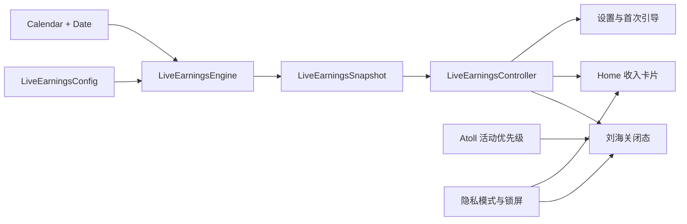

# Atoll「实时收入」技术适配声明

> 适用于《Atoll「实时收入」融合项目 PRD》Phase 1

## 0. 文档信息

| 项目 | 内容 |
|---|---|
| 文档版本 | 1.0 |
| 文档日期 | 2026-08-25 |
| 需求基线 | `融合项目/融合项目PRD.md` 2.0 |
| 宿主工程 | `/Users/Apple/Desktop/Atoll` |
| 能力参考工程 | `/Users/Apple/Desktop/薪跳` |
| 一期交付平台 | macOS 14.6+ |
| 一期正式设备 | Apple Silicon、带实体刘海的 MacBook |
| 当前状态 | 仅形成技术适配约束，尚未修改 Atoll 源码 |

## 1. 声明结论

「实时收入 / Live Earnings」必须作为 Atoll 原生能力开发。正式应用继续使用 Atoll 现有的 Swift、SwiftUI、Xcode 工程、窗口体系、Home、设置、首次引导和发布流程。

PayDance 在本项目中提供产品行为、计算规则、配置校验和金额动效参考。Phase 1 不把 Vue、TypeScript、Tauri、Rust、Node.js 运行时、Windows 窗口或 Web Preview 引入 Atoll 发布包。

推荐采用行为级重写。开发人员依据最终 PRD 和验收用例，用 Swift 重新实现薪资引擎。任何直接复制 PayDance 源代码的方案都必须先完成许可证审查，并保留所要求的版权、许可证和修改声明。

## 2. 已核实的工程基线

### 2.1 Atoll

| 项目 | 已核实情况 |
|---|---|
| 工程文件 | `DynamicIsland.xcodeproj` |
| 主 Scheme | `DynamicIsland` |
| 主 Target | `DynamicIsland`，产物为 `Atoll.app` |
| UI 技术 | SwiftUI，部分窗口与系统能力使用 AppKit |
| 主代码目录 | `DynamicIsland/` |
| 单元测试 Target | `DynamicIslandTests` |
| UI 测试 Target | `DynamicIslandUITests` |
| 本地配置 | 已使用 `Defaults` Swift Package |
| 最低部署目标 | 主 Target 的 Debug、Release 均为 macOS 14.6 |
| 发布架构 | Phase 1 只验收 Apple Silicon |
| CI | macOS 15、macOS 26，使用 latest-stable Xcode |
| 构建现实 | CI 注释明确当前源码需要 Swift 6.1+ |
| 发布 | GitHub Actions、签名、公证、DMG、Sparkle Appcast |
| 许可证 | GNU GPL v3 |

Atoll 的 ReadMe 仍写有 macOS 14.0 和 Xcode 15+，但 Xcode 工程的主 Target 已将部署目标设为 14.6，CI 也说明源码需要 Swift 6.1+。本项目以工程配置和 CI 为准。

### 2.2 PayDance

| 项目 | 已核实情况 |
|---|---|
| 当前版本 | 0.9.9 |
| 桌面技术 | Vue 3、TypeScript、Vite、Tauri 2、Rust |
| 薪资核心 | `src/lib/salary/` |
| 已有能力 | 月薪、日薪、时薪、工作日、上下班、午休、状态快照、校验 |
| 一期不能直接沿用的规则 | 固定每月工作天数、09:30 至 18:30 默认值、夜班与跨夜逻辑 |
| 许可证 | AGPL-3.0-only，并带 `legal/ADDITIONAL_TERMS.md` 附加条款 |

最终 PRD 已改变部分 PayDance 规则。Swift 实现必须以最终 PRD 为准，不能把 PayDance 当前实现当作需求真值。

## 3. 适配范围声明

### 3.1 正式支持

- macOS 14.6 或更高版本。
- Apple Silicon。
- 带实体刘海的 MacBook 内置屏幕。
- 简体中文和 English。
- 月薪、日薪、时薪。
- 用户选择的一组每周工作日。
- 同一自然日内的一组白班上下班时间。
- 可选午休暂停。
- 刘海右侧纯数字、Home 收入卡片、手动隐私模式和锁屏隐藏。

### 3.2 不进入 Phase 1 验收

- Intel Mac。
- 无刘海 Mac。
- 外接显示器胶囊形态。
- Windows 和 Web。
- 夜班、跨夜、轮班和按星期分别设置班次。
- 法定节假日、调休、请假、加班和补班。
- 历史报表、数据导出、账号和同步。
- 自动识别投屏、屏幕共享和会议状态。

Atoll 在上述设备和场景中的原有能力不得因本次改动被主动破坏。它们只是不进入实时收入的一期正式验收。

## 4. 技术路线声明

### 4.1 必须使用的路线



建议新增独立目录：

```text
DynamicIsland/
  features/
    LiveEarnings/
      Models/
        LiveEarningsConfig.swift
        LiveEarningsSnapshot.swift
        LiveEarningsStatus.swift
        SalaryMode.swift
        Weekday.swift
      Engine/
        LiveEarningsEngine.swift
        WorkdayCounter.swift
        WorkSpanResolver.swift
        LiveEarningsValidator.swift
      State/
        LiveEarningsController.swift
        LiveEarningsStore.swift
        LiveEarningsVisibilityPolicy.swift
      Views/
        LiveEarningsClosedView.swift
        LiveEarningsHomeCard.swift
        LiveEarningsSetupView.swift
        LiveEarningsSettingsView.swift
        RollingAmountText.swift
      Formatting/
        LiveEarningsCurrencyFormatter.swift
        LiveEarningsDurationFormatter.swift
```

目录名可以根据 Atoll 维护者习惯调整，但领域模型、计算、状态调度、显示策略和视图必须保持职责分离。

### 4.2 禁止采用的路线

- 不在 Atoll 中启动 PayDance Web 页面或本地 HTTP 服务。
- 不嵌入 WebView 承载实时收入主界面。
- 不把 Tauri sidecar、Rust 二进制或 Node 进程打进 Atoll。
- 不让 SwiftUI 视图自行实现薪资公式。
- 不依赖每秒累加并持久化金额。
- 不为该功能新增网络接口、账号、遥测或系统权限。
- 不直接把 PayDance 的夜班、固定 22 天或旧默认时间带入一期。

## 5. 领域模型适配

### 5.1 配置模型

`LiveEarningsConfig` 至少包含：

| 字段 | Swift 建议类型 | 说明 |
|---|---|---|
| `schemaVersion` | `Int` | 初始为 1，为未来迁移预留 |
| `isEnabled` | `Bool` | 功能总开关 |
| `salaryMode` | `SalaryMode` | monthly、daily、hourly |
| `monthlySalary` | `Decimal?` | 月薪模式值 |
| `dailySalary` | `Decimal?` | 日薪模式值 |
| `hourlyRate` | `Decimal?` | 时薪模式值 |
| `currencyCode` | `String` | ISO 4217，如 CNY、USD |
| `workdays` | `Set<Weekday>` | 至少一天，默认周一至周五 |
| `startTime` | `LocalTime` | 默认 09:00 |
| `endTime` | `LocalTime` | 默认 18:00，必须晚于开始时间 |
| `lunchBreakEnabled` | `Bool` | 默认 false |
| `lunchStart` | `LocalTime` | 默认 12:00 |
| `lunchEnd` | `LocalTime` | 默认 13:00 |
| `privacyModeEnabled` | `Bool` | 默认 false |
| `setupCompleted` | `Bool` | 首次设置是否完成 |

金额建议使用 `Decimal`，避免将二进制浮点误差带进货币计算和测试断言。工作时间建议使用可编码的 `LocalTime(hour, minute)`，不要把某一天的 `Date` 当作长期配置保存。

### 5.2 快照模型

`LiveEarningsSnapshot` 是运行时结果，不保存历史。至少包含：

- `status`
- `earnedToday`
- `estimatedToday`
- `progress`
- `effectiveWorkedSeconds`
- `effectiveTotalSeconds`
- `secondsUntilNextTransition`
- `generatedAt`

状态只保留 `invalidConfig`、`restDay`、`beforeWork`、`working`、`lunchBreak` 和 `afterWork`。Phase 1 不保留 night、overnight 或 shift 字段。

### 5.3 配置存储

- 优先沿用 Atoll 已使用的 `Defaults` 体系，存储一个带版本号的可编码配置。
- 不在多个视图中分别读写同一组薪资字段。
- 配置保存失败时保留最后一份有效配置。
- 关闭功能保留配置；清除数据删除配置和实时收入首次设置状态。
- 不保存逐秒快照和历史金额。
- 不在日志中打印配置对象。

本地保存不等同于加密保存。Phase 1 若沿用 `Defaults`，产品文案不能宣称薪资已加密。未来若增加加密，需要另行设计迁移与密钥恢复策略。

## 6. 计算适配声明

### 6.1 唯一计算真值

计算规则以最终 PRD 第 8 章为唯一真值：

```text
月薪日预计 = 月薪 / 当前月所选工作日实际天数
月薪或日薪实时收入 = 当日预计 × 已经过有效工时 / 当日总有效工时
时薪实时收入 = 时薪 × 已经过有效工时 / 3600
```

当前月工作日数量必须用 `Calendar` 遍历当前自然月，并按用户选择的星期统计。禁止使用固定 22 天、21.75 天或 PayDance 当前的 `workDaysPerMonth` 字段。

### 6.2 纯计算要求

`LiveEarningsEngine` 应是无 UI、无网络、无磁盘写入的纯计算层：

```swift
func snapshot(
    at now: Date,
    config: LiveEarningsConfig,
    calendar: Calendar
) throws -> LiveEarningsSnapshot
```

- 同一输入必须产生同一输出。
- 通过注入 `Date` 和 `Calendar` 测试月份边界、星期和时区。
- 结果始终限制在 0 到当天预计收入之间。
- 午休关闭时忽略午休字段。
- 午休开启时，午休必须完整落在上下班时间内。
- 下班时间早于或等于上班时间时返回配置错误，不推断夜班。

### 6.3 时间恢复

金额从当前时间重新推算，不以计时器累加值作为真值。Controller 在以下事件后主动重算：

- Atoll 启动或功能开启。
- 配置保存。
- Mac 唤醒。
- 锁屏和解锁。
- 日期变化。
- 系统时间或时区变化。
- 高优先级系统事件结束。

工作中最多每秒更新一次。上班前、午休、下班后和休息日只调度到下一状态边界，不维持无意义的 1 Hz 定时器。

## 7. Atoll 集成点声明

### 7.1 首次引导

真实入口位于：

```text
DynamicIsland/components/Onboarding/OnboardingView.swift
```

当前 `OnboardingStep` 依次经过 welcome、权限、媒体控制和 profileSelection。实时收入步骤建议插在 `profileSelection` 与 `finished` 之间。该步骤必须允许跳过，不能请求新权限。

### 7.2 设置

真实入口位于：

```text
DynamicIsland/components/Settings/SettingsView.swift
```

建议为 `SettingsTab` 增加 `.liveEarnings`，归入 core group，排序位于 `.general` 与 `.appearance` 之间。必须同步补充：

- 标题、系统图标和颜色。
- `availableTabs` 顺序。
- `detailView(for:)` 分支。
- 搜索条目和中英文关键词。
- 简体中文与 English 本地化资源。

### 7.3 Home

真实入口位于：

```text
DynamicIsland/components/Notch/NotchHomeView.swift
```

当前 Home 同时存在标准布局、侧边歌词和 Minimalistic UI 分支。收入卡片应放在这些分支外层，根据状态作为 Home 上部区域统一出现，避免只在某一种 Home 布局中可见。

休息日、功能关闭或配置未完成时，不能为收入卡片保留空白高度。

### 7.4 关闭态刘海

真实入口主要位于：

```text
DynamicIsland/ContentView.swift
```

当前关闭态使用长 `else-if` 链，在电池、HUD、Caps Lock、媒体、计时器、提醒、录屏、下载、Focus 和隐私指示之间选择单一内容。实时收入需要和媒体同时存在，因此不能只在这条链上增加一个互斥分支。

必须先抽出可测试的显示策略，至少区分：

```text
systemOverride
mediaWithEarnings
earningsOnly
originalAtoll
```

推荐由 `LiveEarningsVisibilityPolicy` 和 Atoll 活动状态共同生成关闭态呈现。高优先级隐私与关键系统事件可以覆盖收入；事件结束后由 Engine 使用当前时间重新生成快照。

实现右侧数字时必须同时更新关闭态宽度、右翼宽度、点击区域和悬停区域。禁止只添加视觉 overlay 而不调整窗口与命中区域，否则数字会被裁切或出现在不可交互区域。

### 7.5 锁屏与隐私

Atoll 已有 `LockScreenManager.shared` 和关闭态锁屏判断。实时收入只读取锁屏状态，不新增锁屏组件。锁屏时停止暴露金额，解锁后恢复用户原有隐私设置并重新计算。

## 8. UI 适配声明

### 8.1 关闭态数字

- 位于实体刘海右侧黑色区域。
- 只显示数字和小数点，不显示币种、代码、图标或标签。
- 固定两位小数。
- 使用等宽数字或 `.monospacedDigit()`。
- 右对齐，右边界和基线固定。
- 金额过长时优先缩小字号，不使用 K、M 缩写。
- 工作中每秒刷新，只有变化位滚动。
- Reduce Motion 开启后直接替换数字。

### 8.2 Home 卡片

收入卡片位于 Home 上部，目标高度约占可用内容的 40%，至少展示当前金额、今日预计、进度、有效工作时间、剩余时间和状态。

媒体保留在下部。收入功能不应删除、替换或复制现有媒体控制逻辑。

### 8.3 可访问性

- VoiceOver 聚焦时读取完整币种、金额和状态。
- 金额每秒变化不能每秒发送 live-region 播报。
- 设置表单具备键盘焦点顺序和明确错误文本。
- 状态不能只通过颜色区分。
- Reduce Motion 和高对比度必须进入测试矩阵。

## 9. 本地化声明

- 功能名称固定为「实时收入 / Live Earnings」。
- 使用 Atoll 的 String Catalog，不在 Swift 文件中维护两套硬编码文案。
- 目标资源为 Atoll 主 Target 实际引用的 `DynamicIsland/Localizable.xcstrings`，提交前检查 Target Membership。
- 简体中文与 English 必须同时完成。
- 其他系统语言回退 English。
- 币种保存 ISO 4217 代码，Home 使用系统货币格式化能力；关闭态只取数字部分并固定两位小数。

## 10. 隐私与安全声明

- 实时收入不新增网络访问。
- 实时收入不新增 macOS 权限。
- 薪资、工作时间、币种和实时金额不得进入日志、遥测、崩溃报告或诊断包。
- 不记录用户是否操作键盘、鼠标或具体应用。
- 不持久化逐秒金额。
- 设置中的清除操作必须二次确认。
- 清除后重启不能恢复已删除配置。
- 自动识别屏幕共享不在一期范围内，界面不得暗示已经具备该保护。

## 11. 许可证与品牌边界

### 11.1 已知许可证

- Atoll 使用 GNU GPL v3。
- PayDance 使用 AGPL-3.0-only，并带第 7 条附加条款。
- PayDance 附加条款要求保留版权和许可证声明、标注修改、避免暗示官方背书，并保留商标权。

### 11.2 执行要求

优先依据 PRD、公式和验收场景进行 Swift 原生重写。若直接复制或改写 PayDance 代码：

1. 先由项目负责人完成许可证兼容性审查。
2. 保留原文件中的 SPDX、版权和附加条款引用。
3. 在 Atoll 合理可访问的法律声明或关于页面添加 PayDance 要求的来源声明。
4. 明确标注这是修改版本，并非 PayDance 官方版本。
5. 不使用 PayDance Logo、官方图标或产品品牌作为 Atoll 功能品牌。
6. 重新检查 Atoll 发布源码、NOTICE、About 和分发包是否满足两个项目的要求。

本文只记录工程风险和执行门槛，不替代正式法律意见。

## 12. 测试与发布适配

### 12.1 自动化测试

至少新增：

```text
DynamicIslandTests/
  LiveEarningsEngineTests.swift
  LiveEarningsWorkdayCounterTests.swift
  LiveEarningsValidatorTests.swift
  LiveEarningsVisibilityPolicyTests.swift
  LiveEarningsStoreTests.swift
```

测试必须覆盖 PRD 的月薪、日薪、时薪、午休、月份切换、休息日、日期变化、配置错误、隐私模式和系统事件恢复。

### 12.2 CI

沿用 Atoll `DynamicIsland` Scheme，不为实时收入创建第二个应用 Target。CI 至少继续执行：

- Atoll 主 Target 编译。
- `DynamicIslandTests`。
- 现有隐私配置回归。
- 现有 Timer 生命周期回归。
- 新增的实时收入单元测试。

### 12.3 发布

- 沿用 Atoll 现有签名、公证、DMG 和 Sparkle 更新流程。
- 不创建 PayDance 独立更新通道。
- 发布说明必须写明功能为可选、本地计算，并列出一期设备边界。
- 发布前执行最终 PRD 的 `AC-001` 至 `AC-020`。

## 13. 适配风险

| 风险 | 影响 | 处理要求 |
|---|---|---|
| 关闭态当前为互斥活动链 | 无法自然实现媒体与收入共存 | 先抽显示策略，再接收入视图 |
| 收入数字增加右侧宽度 | 裁切、错位或悬停区域不一致 | 同步修改窗口尺寸、翼宽和命中区域 |
| Home 有多种布局分支 | 某些模式看不到收入卡片 | 卡片放在 Home 分支外层统一组合 |
| 当前 PayDance 支持夜班和固定月工作天数 | 误带入已排除规则 | Swift 引擎只实现最终 PRD 规则 |
| 长时间 1 Hz 更新 | 续航下降、任务泄漏 | 静态状态边界调度，关闭时停止任务 |
| 锁屏或抢占结束恢复旧值 | 暴露金额或金额回跳 | 恢复时从当前时间重新计算 |
| 金额宽度不可控 | 刘海右侧数字跳动或溢出 | 等宽、右对齐、字号自适应、真机矩阵 |
| AGPL 与附加条款 | 发布义务不清 | 优先行为级重写，复制前完成许可证审查 |
| ReadMe 与工程最低版本不一致 | 开发环境和验收口径混乱 | 以主 Target 14.6 和当前 CI 为准 |

## 14. 适配完成定义

只有同时满足以下条件，才能声明 Phase 1 技术适配完成：

1. Atoll 仍是唯一应用和发布产物。
2. 发布包中不存在 PayDance Web、Tauri、Rust 或 Node 运行时。
3. 最终 PRD 的全部 P0 需求和 `AC-001` 至 `AC-020` 通过。
4. Atoll 原有 Home、媒体、悬停、系统事件、设置和发布流程无阻断回归。
5. 计算层具备独立单元测试，UI 不重复实现公式。
6. 关闭功能后，定时任务和观察者全部停止。
7. 薪资数据未进入网络、日志、遥测或崩溃报告。
8. 简体中文、English、VoiceOver、Reduce Motion 和高对比度通过验收。
9. 至少两种刘海尺寸的 Apple Silicon MacBook 完成真机测试。
10. 许可证、NOTICE、About 和品牌声明完成发布前检查。

## 15. 参考文件

- 最终 PRD：[`融合项目PRD.md`](融合项目PRD.md)
- 开发手册：[`开发手册.md`](开发手册.md)
- PayDance 薪资核心：`../src/lib/salary/`
- PayDance 附加条款：`../legal/ADDITIONAL_TERMS.md`
- Atoll 工程：`/Users/Apple/Desktop/Atoll/DynamicIsland.xcodeproj`
- Atoll Home：`/Users/Apple/Desktop/Atoll/DynamicIsland/components/Notch/NotchHomeView.swift`
- Atoll 关闭态：`/Users/Apple/Desktop/Atoll/DynamicIsland/ContentView.swift`
- Atoll 首次引导：`/Users/Apple/Desktop/Atoll/DynamicIsland/components/Onboarding/OnboardingView.swift`
- Atoll 设置：`/Users/Apple/Desktop/Atoll/DynamicIsland/components/Settings/SettingsView.swift`
