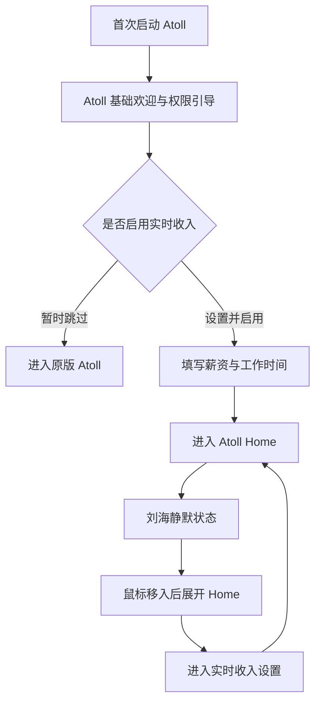
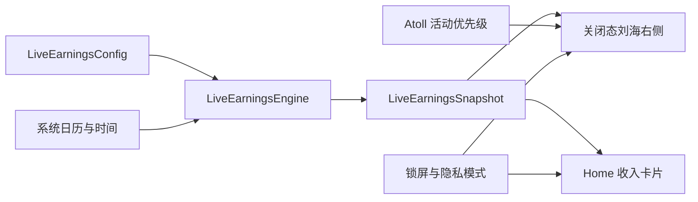

# Atoll「实时收入」融合项目 PRD

> Phase 1 最终版

## 0. 文档信息

| 项目 | 内容 |
|---|---|
| 文档名称 | Atoll「实时收入」融合项目 PRD |
| PRD 版本 | 2.0 |
| 文档日期 | 2026-08-25 |
| 文档状态 | Phase 1 需求已确认，可进入设计细化与技术拆解 |
| 宿主产品 | Atoll |
| 新增能力 | 实时收入 / Live Earnings |
| 能力来源 | 薪跳 / PayDance 的薪资实时计算与金额动效能力 |
| 一期平台 | macOS 14.6+ |
| 一期设备 | 搭载 Apple Silicon、带实体刘海的 MacBook |
| 数据策略 | 本地计算、本地保存、无账号、无云同步 |

## 1. 产品结论

Atoll 是融合后的唯一宿主产品。「实时收入 / Live Earnings」作为 Atoll 的可选核心能力进入现有产品，不保留独立的 PayDance 窗口、托盘、Web Preview 或第二套应用外壳。

用户启用功能并完成薪资与工作时间设置后，Atoll 在 MacBook 实体刘海右侧持续显示当天收入数字。鼠标移入刘海后，Atoll 按原有方式展开，Home 顶部展示完整的实时收入卡片。用户跳过或关闭该能力后，Atoll 按原有逻辑运行。

一期只解决普通白班用户的实时收入可视化。产品不追踪用户是否操作电脑，也不承担考勤、计税或工资结算职责。

### 1.1 一句话价值

让固定白班用户不离开当前工作，就能在 MacBook 刘海上看见今天已经获得的预估收入。

### 1.2 融合原则

1. Atoll 的产品名称、应用进程、导航结构和系统能力保持不变。
2. 「实时收入」是可选择的核心能力，默认进入首次引导，但必须允许跳过。
3. 静默状态只显示必要的数字，完整信息放在展开后的 Home 中。
4. 薪资和作息数据只保存在本机，不上传、不进入普通日志或遥测。
5. 一期优先保证计算准确、位置稳定、低打扰和低资源占用。
6. PayDance 只作为能力与实现参考，其品牌不出现在日常功能界面中；必要的来源和许可信息放入法律或致谢页面。

## 2. 背景与用户问题

### 2.1 背景

Atoll 已经把 MacBook 刘海变成可展开的桌面入口，Home 中承载媒体、日历和快捷能力。PayDance 已经具备月薪、日薪、时薪、工作时间、午休和滚动金额等薪资可视化能力。

本项目把 PayDance 的核心薪资能力转化为 Atoll 原生模块，使实时收入成为刘海区域中的长期可见信息，同时保持 Atoll 原有功能可以独立使用。

### 2.2 用户问题

- 固定薪资通常只在发薪时出现，工作过程中缺少直观反馈。
- 单独打开一个工资应用会打断工作，也浪费桌面空间。
- 常驻数字如果包含货币符号、标签或宽度跳动，会破坏刘海的克制感。
- 薪资属于敏感信息，用户需要随时隐藏，并能确认数据没有离开本机。

### 2.3 目标用户

一期面向同时满足以下条件的用户：

- 使用带实体刘海的 Apple Silicon MacBook。
- 使用 macOS 14.6 或更高版本。
- 工作时间位于同一个自然日内。
- 每周有一组固定工作日，所有工作日共用一组上下班时间。
- 采用月薪、日薪或时薪，希望看到按时间推算的当天收入。

## 3. 产品目标与非目标

### 3.1 Phase 1 目标

1. 新用户可在 Atoll 首次引导中完成设置，或无负担地跳过。
2. 工作日内，刘海右侧数字能按照真实时间稳定增长。
3. 展开 Home 后，用户能理解当前金额、工作进度和剩余时间。
4. 播放媒体时保留 Atoll 原有价值，高优先级系统事件仍可正常展示。
5. 用户可以快速隐藏金额、关闭功能、修改设置或清除本地数据。
6. 休眠、锁屏、重启和系统时间变化后，金额能按当前时间重新计算。

### 3.2 Phase 1 非目标

- 不开发 Windows 版和 Web 版。
- 不把无刘海 Mac、Intel Mac 或外接显示器胶囊形态列入正式验收。
- 不处理旧用户迁移或 PayDance 历史配置导入。
- 不支持夜班、跨夜班次、轮班或每天不同的班次。
- 不识别法定节假日、调休、请假、加班或补班。
- 不计算个税、社保、公积金、奖金、提成或实际到账工资。
- 不记录键盘、鼠标、应用使用情况或真实在线工时。
- 不提供历史收入报表、趋势图、数据导出或工资单。
- 不提供里程碑通知、声音、上班提醒、午休提醒或下班通知。
- 不提供账号、云同步、团队能力或跨设备同步。
- 不自动识别录屏、投屏和会议共享；自动隐私保护留到后续阶段。
- 不保留独立 PayDance 窗口、菜单栏项目、托盘或更新流程。

## 4. Phase 1 功能范围

### 4.1 范围总览

| 能力 | 一期结论 | 优先级 |
|---|---|---:|
| 首次引导中的可选启用 | 包含 | P0 |
| 月薪、日薪、时薪 | 包含，默认月薪 | P0 |
| 币种选择 | 包含，跟随系统地区推荐 | P0 |
| 每周工作日选择 | 包含，默认周一至周五 | P0 |
| 单组白班上下班时间 | 包含，默认 09:00–18:00 | P0 |
| 午休暂停 | 包含，默认关闭 | P0 |
| 刘海右侧实时数字 | 包含 | P0 |
| Home 实时收入卡片 | 包含 | P0 |
| 媒体与收入共存 | 包含 | P0 |
| 高优先级系统事件抢占与恢复 | 包含 | P0 |
| 隐私模式与锁屏隐藏 | 包含 | P0 |
| 设置修改、关闭与清除 | 包含 | P0 |
| 简体中文和 English | 包含 | P0 |
| 复杂排班、节假日和请假 | 后续版本 | P2 |
| 历史报表、导出和云同步 | 后续评估 | P2 |

### 4.2 产品命名

- 中文名称为「实时收入」。
- 英文名称为「Live Earnings」。
- Atoll 继续作为应用和整体产品名称。
- 「薪跳 / PayDance」只用于来源说明、许可证或致谢，不作为普通界面标签。

## 5. 信息架构

### 5.1 Atoll 内的位置



### 5.2 入口

| 入口 | 作用 |
|---|---|
| Atoll 首次引导 | 新用户选择启用或跳过，并完成第一份配置 |
| 刘海静默状态 | 在实体刘海右侧显示当天收入数字 |
| 展开后的 Home | 展示收入详情、进度和时间信息 |
| Atoll 设置 | 修改配置、切换隐私模式、关闭功能或清除数据 |

一期不新增独立标签页。实时收入直接融入 Home。

## 6. 核心用户流程

### 6.1 首次启动

1. 用户完成 Atoll 原有的基础欢迎与必要权限引导。
2. Atoll 展示「开启实时收入」步骤，说明数据只保存在本机。
3. 用户可以选择「设置并启用」或「暂时跳过」。
4. 选择跳过后，用户直接进入原版 Atoll，不显示收入数字。
5. 选择启用后，用户依次设置薪资、币种、工作日、上下班时间和可选午休。
6. 所有必填项通过校验后，用户保存配置并进入 Home。
7. Atoll 立即根据本地日期与时间生成当前收入状态。

### 6.2 日常使用

1. Atoll 启动后读取本地配置。
2. 系统判断今天是否为用户选择的工作日。
3. 工作日按当前时间显示 `0.00`、实时金额、午休冻结金额或当日最终金额。
4. 非工作日不显示收入数字，刘海恢复 Atoll 原有内容。
5. 鼠标移入刘海后展开 Home，收入卡片位于 Home 上部。
6. 用户移出并满足 Atoll 原有收起条件后，界面返回静默状态。

### 6.3 关闭与重新开启

1. 用户在设置中关闭「实时收入」。
2. 收入数字与 Home 收入卡片立即退出，Atoll 恢复原有表现。
3. 薪资和工作时间配置继续保存在本机。
4. 用户重新开启后无需重复填写，系统按当前时间立即恢复。
5. 用户可以单独选择「清除实时收入数据」。清除前必须二次确认。
6. 清除完成后删除全部实时收入配置；再次开启时重新进入设置流程。

## 7. 配置需求

### 7.1 配置字段

| 字段 | 类型 | 默认值 | 规则 |
|---|---|---|---|
| 功能开关 | Boolean | 首次未决定 | 完成设置后开启；跳过时关闭 |
| 薪资模式 | Enum | 月薪 | 月薪、日薪、时薪三选一 |
| 薪资金额 | Decimal | 空 | 必填，必须大于 0 |
| 币种 | ISO 4217 Currency | 根据 macOS 地区推荐 | 用户可修改；不进行汇率换算 |
| 工作日 | Weekday Set | 周一至周五 | 可选周一至周日，至少一天 |
| 上班时间 | Local Time | 09:00 | 必须早于下班时间 |
| 下班时间 | Local Time | 18:00 | 必须晚于上班时间，且在同一自然日 |
| 午休暂停 | Boolean | 关闭 | 开启后才显示午休时间字段 |
| 午休开始 | Local Time | 12:00 | 必须位于上下班时间内 |
| 午休结束 | Local Time | 13:00 | 必须晚于午休开始并位于上下班时间内 |
| 隐私模式 | Boolean | 关闭 | 开启后隐藏具体薪资金额 |

### 7.2 配置交互

- 默认选中月薪。
- 切换薪资模式时，只展示当前模式对应的金额字段。
- 用户已经填写的其他模式金额可以保留在本地，切回时恢复。
- 币种默认根据 macOS 地区推荐，用户可以从系统币种列表中选择。
- 所有选中的工作日共用同一组上下班时间和午休设置。
- 一期不提供“每月工作 22 天”字段。
- 保存前完成字段校验，错误信息紧邻对应字段显示。
- 无效配置不能覆盖最后一次有效配置。

### 7.3 薪资口径说明

设置页必须展示以下等义说明：

> 请填写你希望用于实时计算的固定薪资金额。Atoll 不区分税前或税后，也不计算税费、社保、公积金、奖金和加班费。

## 8. 计算规则

### 8.1 基本定义

| 符号 | 含义 |
|---|---|
| `S_month` | 用户填写的月薪 |
| `S_day` | 用户填写的日薪 |
| `R_hour` | 用户填写的时薪 |
| `N_month` | 当前自然月内，星期属于用户所选工作日集合的日期数量 |
| `T_total` | 当天有效工作总秒数 |
| `T_elapsed` | 截至当前时刻已经过的有效工作秒数 |
| `E_today` | 当天实时收入 |

法定节假日、调休、请假和补班不参与 `N_month` 的计算。系统只依据当前自然月、系统日历和用户选择的星期自动统计。

### 8.2 有效工作时间

- 午休暂停关闭时，`T_total = 下班时间 - 上班时间`。
- 午休暂停开启时，`T_total = 上班至午休开始 + 午休结束至下班`。
- 午休期间不增加 `T_elapsed`。
- 上班前 `T_elapsed = 0`。
- 下班后 `T_elapsed = T_total`。
- 所有时间都按 macOS 当前日历、时区和本地时间计算。

### 8.3 三种薪资模式

月薪模式：

```text
D_today = S_month / N_month
E_today = D_today × clamp(T_elapsed / T_total, 0, 1)
```

日薪模式：

```text
D_today = S_day
E_today = D_today × clamp(T_elapsed / T_total, 0, 1)
```

时薪模式：

```text
D_today = R_hour × T_total / 3600
E_today = R_hour × T_elapsed / 3600
```

其中 `D_today` 为当天工作完整时长对应的预计收入。任何模式下，`E_today` 都不能小于 0，也不能超过 `D_today`。

### 8.4 精度与显示

- 内部计算保留足够精度，不把每秒结果反复写回持久化存储。
- 一期金额统一显示两位小数。
- 静默刘海不显示货币符号、货币代码或文字标签，例如 `128.46`。
- 展开后的 Home 使用本地化货币格式，例如 `¥128.46` 或 `$128.46`。
- 一期不进行任何币种换算。
- 日期切换后，上一工作日金额清零，并根据新日期重新判断工作日状态。

### 8.5 时间恢复

- 收入依据当前时间和配置即时推算，不依赖持续累加的计数器。
- 锁屏、合盖休眠和暂时离开电脑仍按设定工作时间计算。
- Atoll 重启或 Mac 唤醒后，系统按当前时间重新生成金额，不逐秒补播动画。
- 用户修改系统时间或时区后，下一次刷新必须重新计算，不能出现负金额或超过当日预计金额。

## 9. 状态与展示规则

### 9.1 状态机

| 状态 | 进入条件 | 静默刘海 | 展开后的 Home |
|---|---|---|---|
| 未启用 | 用户跳过或关闭功能 | Atoll 原有内容 | 不显示收入卡片 |
| 配置未完成 | 开启但缺少有效配置 | Atoll 原有内容 | 提供完成设置入口 |
| 隐私模式 | 用户主动开启 | Atoll 原有内容 | 保留卡片结构，金额显示为隐藏状态 |
| 锁屏 | macOS 进入锁屏 | 隐藏金额 | 不向锁屏暴露薪资 |
| 非工作日 | 今天不在所选工作日中 | Atoll 原有内容 | 不显示收入卡片 |
| 上班前 | 工作日且当前时间早于上班时间 | `0.00` | 显示今日预计和距离上班时间 |
| 工作中 | 位于有效工作时段 | 实时增长金额 | 显示实时金额、进度和剩余时间 |
| 午休中 | 启用午休且位于午休时段 | 冻结在午休开始金额 | 显示午休状态和距离复工时间 |
| 已下班 | 工作日且当前时间晚于下班时间 | 当天最终金额 | 显示 100% 进度和当天最终金额 |

上一天的金额在 24:00 失效。进入新日期后，系统按新日期是否为工作日独立决定显示 `0.00` 或恢复 Atoll 原有内容。

### 9.2 刷新规则

- 工作中每秒刷新一次可见金额。
- 只有发生变化的数字位执行轻微滚动动画。
- 数字变化必须来自真实计算结果，不播放伪循环动画。
- 午休、上班前、下班后和非工作日不运行无意义的每秒计算；只在下一个时间边界或状态变化时刷新。
- 用户开启 macOS“减少动态效果”后，改用无滚动的直接数字更新。

## 10. 刘海与 Home 交互

### 10.1 静默刘海

- 收入数字锚定在实体刘海右侧的黑色区域，对应用户标注的白框位置。
- 数字只占用右侧最小必要宽度，不包含币种、单位、图标和文案。
- 使用等宽数字或 `tabular-nums`，右对齐，金额增长时整体位置不能左右跳动。
- 优先通过字号自适应处理较长金额，不使用 `K`、`M` 等缩写，保持“只显示数字”。
- 字体、颜色、圆角、阴影和动画节奏沿用 Atoll 当前视觉语言。
- 鼠标进入 Atoll 现有刘海热区后，沿用原有悬停延迟和展开动画。

### 10.2 展开后的 Home

工作日且功能启用时，Home 上部展示实时收入卡片，建议占 Home 可用内容高度约 40%。卡片至少包含：

- 当前已获得金额。
- 今日预计收入。
- 工作进度条和百分比。
- 已经过的有效工作时间。
- 距离上班、复工或下班的时间。
- 当前状态，如上班前、工作中、午休中或已下班。
- 隐私模式快捷入口和设置入口。

媒体信息与控制保留在 Home 下部。休息日、功能关闭或配置未完成时，Home 恢复 Atoll 原有布局。

### 10.3 媒体共存

- 静默状态左侧保留 Atoll 媒体状态，例如封面或播放指示。
- 静默状态右侧保留实时收入数字。
- 完整媒体控制在展开后的 Home 中呈现。
- 媒体播放不能长期覆盖实时收入数字。

### 10.4 系统事件优先级

显示优先级从高到低为：

1. Atoll 已有的高优先级隐私与关键系统事件，例如相机、麦克风和录屏状态。
2. 用户正在主动操作的展开界面。
3. 静默状态右侧的实时收入数字。
4. 静默状态左侧的媒体摘要和普通状态。

高优先级事件可以临时占用收入区域。事件结束后必须自动恢复当时正确的收入金额，不从旧的显示值继续累加。

## 11. 隐私与数据

### 11.1 隐私模式

- 隐私模式默认关闭。
- 用户可以从设置或 Home 收入卡片快速开启。
- 开启后，静默刘海恢复 Atoll 原有内容，不显示具体金额。
- Home 收入卡片保留必要结构，但具体金额使用隐藏状态表示。
- 关闭隐私模式后按当前时间立即恢复正确金额。
- macOS 锁屏时自动隐藏金额，解锁后恢复用户原有隐私模式状态。
- 自动识别屏幕共享、投屏和会议状态不在一期范围内。

### 11.2 本地数据

一期仅持久化以下信息：

| 实体 | 内容 | 生命周期 |
|---|---|---|
| `LiveEarningsConfig` | 开关、薪资模式、各模式金额、币种、工作日、时间、午休、隐私模式 | 本地持久化，用户可清除 |
| `LiveEarningsSnapshot` | 当前金额、今日预计、进度、状态、下一时间边界 | 运行时生成，不保存历史 |
| `LiveEarningsUIState` | 首次引导是否完成、必要的界面偏好 | 本地持久化 |

强制规则如下：

- 不建立账号，不上传薪资和工作时间。
- 不把具体金额写入普通日志、分析事件、崩溃报告或诊断包。
- 不为实时收入新增网络请求。
- 不保存逐秒金额记录和历史工作轨迹。
- 清除数据后，以上配置与界面状态必须从本地删除。

## 12. 功能需求清单

### 12.1 首次引导与设置

| ID | 需求 | 优先级 | 验收摘要 |
|---|---|---:|---|
| LE-ONB-001 | 在 Atoll 基础引导后提供实时收入可选步骤 | P0 | 用户可以设置并启用，也可以暂时跳过 |
| LE-ONB-002 | 支持月薪、日薪、时薪，默认月薪 | P0 | 切换模式后只显示对应金额字段 |
| LE-ONB-003 | 根据系统地区推荐币种 | P0 | 用户可修改，静默状态不显示币种 |
| LE-ONB-004 | 支持选择周一至周日中的一个或多个工作日 | P0 | 默认周一至周五，至少选择一天 |
| LE-ONB-005 | 支持同日上下班时间 | P0 | 默认 09:00–18:00，下班必须晚于上班 |
| LE-ONB-006 | 支持可选午休暂停 | P0 | 默认关闭；开启后午休必须位于工作时间内 |
| LE-SET-001 | 设置中可修改全部配置 | P0 | 保存后立即按当前时间重新计算 |
| LE-SET-002 | 设置中可关闭功能并保留配置 | P0 | 关闭后 Atoll 立即恢复原有表现 |
| LE-SET-003 | 设置中可清除全部实时收入数据 | P0 | 二次确认后删除，重新开启需要再次设置 |

### 12.2 计算与状态

| ID | 需求 | 优先级 | 验收摘要 |
|---|---|---:|---|
| LE-CALC-001 | 月薪按当月所选星期的实际日期数量换算 | P0 | 不要求用户填写每月工作天数 |
| LE-CALC-002 | 日薪按当天有效工作进度换算 | P0 | 下班时等于用户填写的日薪 |
| LE-CALC-003 | 时薪按有效工作秒数换算 | P0 | 午休开启时不累计午休时间 |
| LE-CALC-004 | 休眠、锁屏、重启后按当前时间重算 | P0 | 金额不依赖应用持续活跃 |
| LE-CALC-005 | 系统日期、时间或时区变化后安全校准 | P0 | 不出现负数或超过当天预计金额 |
| LE-STATE-001 | 覆盖未启用、上班前、工作中、午休、下班和休息日 | P0 | 每个状态的金额与 Home 信息符合状态表 |

### 12.3 刘海、Home 与隐私

| ID | 需求 | 优先级 | 验收摘要 |
|---|---|---:|---|
| LE-NOTCH-001 | 静默状态在实体刘海右侧显示纯数字金额 | P0 | 无货币符号和标签，位置不随数字变化 |
| LE-NOTCH-002 | 金额每秒更新并滚动变化数字位 | P0 | 无伪动画；减少动态效果时直接更新 |
| LE-HOME-001 | 实时收入融入 Home 上部 | P0 | 展示金额、预计、进度、已工作与剩余时间 |
| LE-MEDIA-001 | 媒体摘要在左、收入数字在右 | P0 | 两者同时可见；完整控制在展开态 |
| LE-EVENT-001 | 高优先级系统事件可抢占并自动恢复 | P0 | 事件结束后恢复按当前时间计算的金额 |
| LE-PRIV-001 | 提供手动隐私模式 | P0 | 静默状态隐藏金额，Home 不暴露具体数值 |
| LE-PRIV-002 | 锁屏自动隐藏金额 | P0 | 解锁后恢复用户原有设置 |

### 12.4 本地化与可访问性

| ID | 需求 | 优先级 | 验收摘要 |
|---|---|---:|---|
| LE-I18N-001 | 提供简体中文和 English | P0 | 默认跟随 macOS；不支持语言回退 English |
| LE-A11Y-001 | 控件具备 VoiceOver 名称和键盘焦点 | P0 | 用户无需鼠标也能完成设置 |
| LE-A11Y-002 | 实时金额不每秒触发 VoiceOver 播报 | P0 | 聚焦或主动展开时读取当前金额和状态 |
| LE-A11Y-003 | 尊重减少动态效果和高对比度 | P0 | 动画可降级，状态不只依赖颜色 |

## 13. 技术实现约束

本节用于约束后续技术方案，不代表现在开始开发。

### 13.1 集成方式

- 在 Atoll 现有 macOS 工程内原生实现，沿用 Swift、SwiftUI 和 Atoll 的状态管理方式。
- 不把 PayDance 的 Vue、Tauri、Windows 窗口或 Web Preview 打包进 Atoll。
- PayDance 的计算逻辑、字段校验和数字动效可作为行为参考；复制源代码前必须完成许可证与代码边界检查。
- 实时收入应作为独立领域模块接入 Atoll Home 和关闭态刘海，不能与媒体模块互相持有业务状态。

### 13.2 推荐模块边界



- `LiveEarningsEngine` 应设计为可测试的纯计算层，输入配置和当前时间，输出快照。
- UI 不自行推导工资公式，只消费同一份快照。
- 工作中最多以 1 Hz 驱动可见数字；其他状态按下一时间边界调度。
- 应用唤醒、设置修改、日期变化、时区变化和高优先级事件结束时主动重算。
- 功能关闭后停止相关定时器和观察者。

### 13.3 兼容范围

| 项目 | Phase 1 正式范围 |
|---|---|
| 芯片 | Apple Silicon |
| 设备 | 带实体刘海的 MacBook |
| 系统 | macOS 14.6 或更高版本 |
| 显示形态 | 内置屏幕实体刘海 |
| 语言 | 简体中文、English |

Atoll 在其他设备上的现有功能不应因本次改动被主动移除，但这些设备上的实时收入布局不属于一期发布验收。

## 14. 非功能需求

### 14.1 性能

- 静态状态不得维持每秒定时器。
- 工作中的刷新频率不高于 1 Hz。
- 计算、币种格式化和日期统计不得在主线程执行明显的重复重任务。
- 刘海现有展开性能目标保持不变，首帧响应不超过 100 ms，完整展开动画不超过 350 ms。
- 连续运行 24 小时后，不应出现定时器叠加、持续内存增长或金额动画任务残留。

### 14.2 可靠性

- 核心公式、状态边界和当月工作日统计的自动化测试通过率必须为 100%。
- 配置保存与重启恢复的验收用例通过率必须为 100%。
- 金额任何时候都不能为负数、`NaN`、无穷值或超过当天预计收入。
- 功能异常不能阻塞 Atoll Home、媒体和高优先级系统事件。
- 无效配置不能导致崩溃，也不能覆盖最后一次有效配置。

### 14.3 视觉与交互质量

- 收入数字在所有一期支持机型上不得进入实体刘海、越出屏幕或遮挡系统区域。
- 数字增长时基线、右边界和整体容器保持稳定。
- 展开、收起、事件抢占和恢复不能出现明显闪烁或旧金额回跳。
- 深色、浅色、高对比度和减少动态效果均需完成视觉验收。

### 14.4 隐私与安全

- 实时收入功能不新增联网行为和系统权限。
- 薪资、作息和具体金额不得进入日志、遥测或崩溃报告。
- 清除本地数据后，重新启动 Atoll 不能恢复已删除配置。
- 发布前必须确认 PayDance 代码、名称和视觉资产的许可证使用边界。

## 15. 核心验收场景

| ID | 场景 | 前置条件 | 预期结果 |
|---|---|---|---|
| AC-001 | 首次启用 | 新用户完成 Atoll 基础引导 | 可以设置实时收入或暂时跳过；跳过后原版 Atoll 正常可用 |
| AC-002 | 月薪半日 | 月薪 10000，当月所选工作日共 20 天，无午休，09:00–18:00 | 当日预计 500；有效时间过半时显示 250.00 |
| AC-003 | 日薪半日 | 日薪 400，无午休，工作进度 50% | 显示 200.00，下班后固定为 400.00 |
| AC-004 | 时薪与午休 | 时薪 60，09:00–18:00，午休 12:00–13:00 | 当日有效 8 小时，预计 480；午休期间金额不变 |
| AC-005 | 上班前 | 今天为工作日，当前早于 09:00 | 静默刘海显示 `0.00`，Home 显示距离上班时间 |
| AC-006 | 下班后 | 今天为工作日，当前晚于 18:00 | 静默刘海显示当日最终金额，Home 显示 100% |
| AC-007 | 非工作日 | 今天不在所选工作日中 | 静默刘海和 Home 恢复 Atoll 原有内容 |
| AC-008 | 日期切换 | 已下班并跨过 24:00 | 上一日金额失效，按新日期重新判断并显示 |
| AC-009 | 休眠恢复 | 工作中合盖 30 分钟后唤醒 | 按当前时间直接显示正确金额，不补播 30 分钟动画 |
| AC-010 | 重启恢复 | 工作中退出并重新打开 Atoll | 配置保留，金额按当前时间恢复 |
| AC-011 | 播放媒体 | 工作中开始播放音乐 | 左侧保留媒体摘要，右侧收入持续显示，展开后两部分均可操作或查看 |
| AC-012 | 系统事件抢占 | 收入显示时出现高优先级隐私事件 | 事件正常显示；结束后恢复当前正确金额 |
| AC-013 | 隐私模式 | 用户主动开启隐私模式 | 静默状态不显示金额，Home 不暴露具体金额 |
| AC-014 | 锁屏与解锁 | 工作中锁屏再解锁 | 锁屏不暴露金额，解锁后恢复原有隐私设置和正确金额 |
| AC-015 | 关闭与重开 | 用户关闭后再次开启功能 | 关闭时恢复原版 Atoll；重开后使用保留配置立即计算 |
| AC-016 | 清除数据 | 用户确认清除并重启 Atoll | 原配置不可恢复，再次开启需要重新设置 |
| AC-017 | 无效时间 | 下班时间早于或等于上班时间 | 阻止保存并提示一期只支持同日白班 |
| AC-018 | 减少动态效果 | macOS 开启减少动态效果 | 金额仍每秒准确更新，但不执行滚动动画 |
| AC-019 | 本地化 | 分别使用简体中文、English 和其他系统语言 | 前两者显示对应文案，其他语言回退 English |
| AC-020 | 长时间运行 | 连续运行 24 小时并跨越多个状态 | 无明显资源持续增长、重复计时器或状态卡死 |

## 16. 发布门槛

Phase 1 同时满足以下条件后才可发布：

1. `AC-001` 至 `AC-020` 全部通过。
2. 月薪、日薪、时薪、午休、月份切换和工作日统计的单元测试全部通过。
3. 至少覆盖两种不同刘海尺寸的 Apple Silicon MacBook 真机。
4. macOS 14.6、当前稳定版 macOS 和当前最新 macOS 各完成一次核心冒烟。
5. 深色、浅色、简体中文、English、VoiceOver 和减少动态效果完成验收。
6. Atoll 原有 Home、媒体、悬停展开、系统事件和设置入口无阻断级回归。
7. 未发现薪资数据进入日志、遥测、崩溃报告或网络请求。
8. PayDance 的代码与品牌使用边界完成许可证检查。
9. 正式构建完成签名、公证和基础安装验证。

## 17. 成功判断

一期默认不接入行为遥测。通过自动化测试、真机验证、小样本可用性测试和用户主动反馈判断结果。

| 指标 | 目标 |
|---|---:|
| 首次实时收入设置完成时间 | 中位数不超过 2 分钟 |
| 核心计算用例通过率 | 100% |
| 设置重启恢复通过率 | 100% |
| 高优先级事件结束后的收入恢复通过率 | 100% |
| 阻断级隐私问题 | 0 |
| Atoll 原有核心能力阻断级回归 | 0 |
| 测试用户对计算口径的理解 | 能说明这是按时间推算的预估收入，不是实际工资结算 |

## 18. 后续阶段候选范围

### Phase 2

- 中国法定节假日、调休和补班日历。
- 请假、加班和临时工作日调整。
- 夜班、跨夜班次、轮班和按星期设置不同班次。
- 屏幕共享、投屏和会议状态的自动隐私保护。
- 历史日、周、月视图与本地数据导出。

### Phase 3

- 无刘海 Mac 和外接显示器胶囊形态。
- Intel Mac 兼容性评估。
- Windows 和 Web 产品形态评估。
- 可选跨设备同步与更广泛的币种显示规则。

后续能力必须独立评审，不能改变一期“本地、可选、低打扰”的产品边界。

## 19. 来源能力映射

| 融合区域 | PayDance 提供的参考 | Atoll 提供的宿主能力 | Phase 1 动作 |
|---|---|---|---|
| 薪资配置 | 月薪、日薪、时薪、工作日、工作时间、午休 | 设置体系与本地偏好 | 改造成 Atoll 原生设置页 |
| 收入计算 | 实时金额、工作状态、恢复与校验思路 | macOS 生命周期与状态管理 | 建立 Swift 原生计算引擎 |
| 数字动效 | 金额滚动与等宽数字 | 刘海关闭态动画和布局 | 放入实体刘海右侧区域 |
| 展开信息 | 今日收入、进度、时间信息 | Home、悬停展开和媒体控制 | 收入卡片进入 Home 上部 |
| 活动优先级 | 收入作为长期状态 | 隐私事件、媒体与系统事件 | 定义抢占、共存和恢复规则 |
| 隐私 | 本地薪资设置 | 锁屏与系统状态 | 增加手动隐私模式和锁屏隐藏 |

## 20. 文档与开发关系

- 本文是 Phase 1 产品范围和验收的唯一基线。
- 开发前还需基于本文产出像素级设计稿、技术方案、任务拆解和测试用例，但不得擅自扩大一期范围。
- 产品规则发生变化时，先更新本文及对应验收场景，再修改实现。
- 当前阶段尚未开始功能开发。

## 21. 参考资料

- PayDance 产品边界：[`../docs/PRODUCT.md`](../docs/PRODUCT.md)
- PayDance 架构：[`../docs/ARCHITECTURE.md`](../docs/ARCHITECTURE.md)
- PayDance 设计规范：[`../docs/DESIGN.md`](../docs/DESIGN.md)
- PayDance 路线图：[`../docs/ROADMAP.md`](../docs/ROADMAP.md)
- PayDance 原始 PRD：[`../docs/PRD.md`](../docs/PRD.md)
- Atoll 原始 PRD：`/Users/Apple/Desktop/Atoll/docs/Atoll_PRD_zh-CN.md`

## 22. 变更记录

| 版本 | 日期 | 变更内容 |
|---|---|---|
| 1.0 | 2026-08-25 | 初步形成 Windows、macOS 与 Web 对等融合方案 |
| 2.0 | 2026-08-25 | 根据多轮产品讨论，改为 Atoll 宿主、macOS 实体刘海优先的 Phase 1 最终版 |
