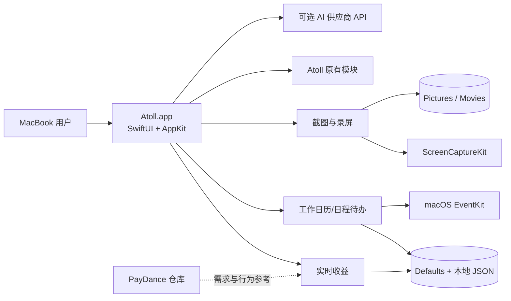
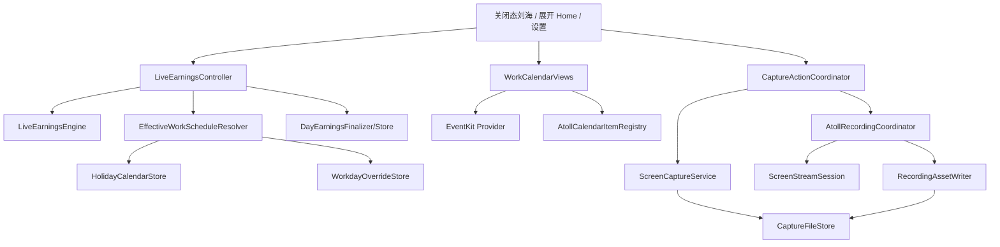

# 系统架构

## 1. 架构范围

本项目存在两个 Git 仓库，但只有一个运行时产品：Atoll。PayDance 仓库是能力来源和资料库，不参与最终 macOS 应用运行。



## 2. 系统上下文

| 外部对象 | 关系 | 数据 |
|---|---|---|
| 用户 | 配置、查看、捕获和管理事项 | 薪资、时间、日程标题、录制选择 |
| macOS 权限系统 | 授权屏幕、麦克风、日历等能力 | 授权状态，不由应用绕过 |
| macOS EventKit | 日历和提醒事项读写 | 用户主动创建/修改的事项 |
| 文件系统 | 保存 JSON、截图和录屏 | 本地文件 |
| OpenAI/Gemini/Claude/Groq 等 | AI 助手可选调用 | 用户主动发送的消息、附件和 API Key 鉴权 |
| Sparkle 更新源 | Atoll 原有更新能力 | 版本元数据和安装包 |

## 3. Atoll 容器与组件



## 4. 关键依赖方向

- View 只负责展示和操作，不重复实现收益公式。
- Controller 负责状态、刷新和跨模块协调。
- Engine/Resolver 是可测试的规则层。
- Store 是本地持久化事实来源，使用 actor 隔离并原子写入。
- 捕获 UI 不直接操作 ScreenCaptureKit；通过 Coordinator 和 Service。
- 录屏状态机负责生命周期，文件写入与展示分离。
- Atoll 原有 Home 和导航以组合方式加入新卡片，不通过替换原页面实现。

## 5. 主要运行数据流

### 5.1 实时收益

```text
用户配置/当前时间
  → EffectiveWorkScheduleResolver 解析当天日程
  → LiveEarningsEngine 计算状态、金额、进度
  → LiveEarningsController 发布快照
  → 关闭态数字 + Home 卡片同步更新
  → 当日结束后 DayEarningsFinalizer 固化历史
```

### 5.2 日历事项

```text
选择日期 → EventKit 查询日程/提醒事项
  → 双击打开事项面板
  → 创建/修改/完成/删除
  → AtollCalendarItemRegistry 记录由 Atoll 管理的 ID
  → 月历刷新日期下方计数
```

### 5.3 截图录屏

```text
Home/快捷键 → CaptureActionCoordinator
  → 权限检查 → 内置屏幕解析/选区
  → 截图服务 或 录屏状态机
  → CaptureFileStore 临时写入、校验、原子完成
  → 通知/打开/复制/访达操作
```

## 6. 部署结构

```mermaid
flowchart LR
    SRC[Atoll Git 工作树] --> XCODE[xcodebuild]
    XCODE --> APP[DerivedData/Debug/Atoll.app]
    APP --> SIGN[正式签名或本机临时签名]
    SIGN --> INST[/Applications/Atoll.app]
    INST --> DATA[~/Library/Application Support/Atoll]
    INST --> MEDIA[~/Pictures 与 ~/Movies]
```

## 7. 架构质量属性

- **本地优先**：收益、规则、历史和捕获文件默认留在本机。
- **可降级**：拒绝权限不应拖垮无关能力。
- **单一事实来源**：金额由 Engine，日期由 Resolver，历史由 Store，录屏由状态机管理。
- **可恢复**：JSON 使用 schemaVersion 和原子写入；录制先写临时文件。
- **低打扰**：关闭态尺寸受控，完整操作放在展开态。
- **可测试**：规则和 Store 独立于最终 UI。
