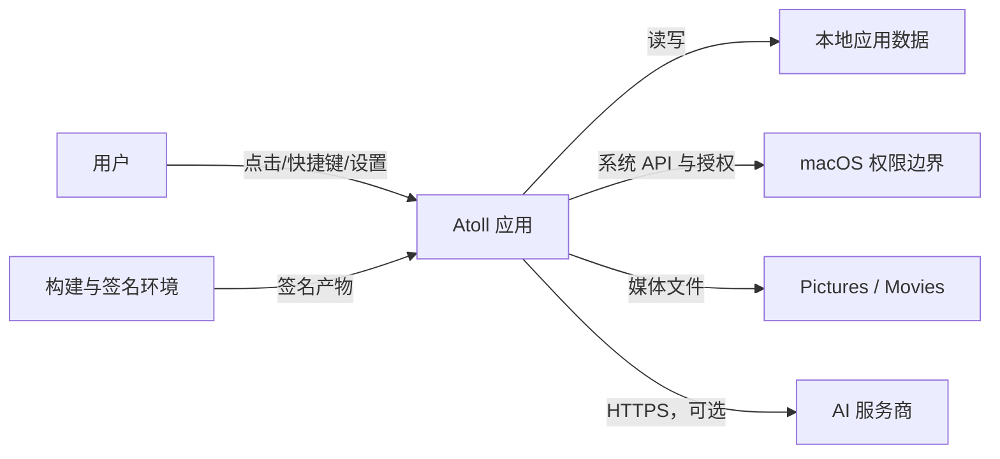

# 威胁模型

## 1. 方法与范围

本模型采用 OWASP 推荐的四问框架：正在构建什么、可能出什么问题、如何应对、应对是否有效。范围为 Atoll macOS 客户端、其本地数据、系统权限、媒体输出和可选 AI 服务商；不包含当前未建设的服务端。

## 2. 系统与资产

关键资产：

- API Key；
- 薪资、工作时间、请假/倒班与收益历史；
- 日程、待办正文及完成状态；
- 截图、录屏、麦克风和系统音频；
- 应用签名身份、构建产物与更新渠道；
- 用户对刘海 UI、快捷键和权限提示的信任。

主要信任边界：

## 3. 威胁与控制

| ID | 场景 | 影响 | 现有/计划控制 | 剩余风险 |
|---|---|---|---|---|
| T-01 | API Key 以 UserDefaults 明文保存 | 本机其他恶意进程或备份泄露密钥 | UI 掩码、禁止日志；计划迁移 Keychain | 高，发布前处理 |
| T-02 | 全局 ATS 放行导致弱网络策略 | 中间人、错误端点或降级风险 | 服务商使用 HTTPS；计划移除全局例外 | 中高 |
| T-03 | 应用在非预期时间录屏/录音 | 严重隐私侵犯 | 用户主动触发、系统权限、可见状态、停止入口 | 中，需持续实机验证 |
| T-04 | 快捷键冲突误触截图或录屏 | 捕获敏感内容 | 冲突检测、可重配、恢复默认、明确状态 | 中 |
| T-05 | 恶意/损坏 JSON 导致崩溃或数据覆盖 | 不可用、事项丢失 | 类型解析、失败降级、备份与隔离流程 | 中 |
| T-06 | 路径或文件名处理不当 | 覆盖任意文件、写入失败 | 固定用户媒体目录、系统文件 API、避免拼接执行 | 低中 |
| T-07 | AI 服务商接收超出必要的上下文 | 薪资、日程或屏幕内容泄露 | 明示模型选择、最小上下文、用户主动发送 | 中，需产品提示 |
| T-08 | 模型输出被当作可信命令 | 本机代码执行或数据破坏 | 仅展示文本，不直接执行输出；危险操作需显式确认 | 低中 |
| T-09 | 未签名/被替换的应用冒充 Atoll | 恶意采集权限与数据 | 正式签名、公证、可信渠道和哈希验证 | 本机临时签名阶段为中高 |
| T-10 | 日历清空或删除误操作 | 用户事项丢失 | 二次确认、一键清空范围明确、备份/恢复说明 | 中 |
| T-11 | 日志或截图用于缺陷反馈时含隐私 | 二次泄露 | 脱敏指南、禁止自动上传、最小证据 | 中 |
| T-12 | 依赖供应链被污染 | 代码执行、数据泄露 | 固定解析版本、依赖审查、发行前许可证与来源验证 | 中 |

## 4. 滥用场景

### 场景 A：伪装成快捷键配置的录屏

攻击者诱导用户安装被替换的应用，申请屏幕权限并后台录制。控制重点是可信签名、公证、下载渠道、录制可见状态和系统权限说明。

### 场景 B：调试时复制完整 Key

用户把 API Key 粘贴到聊天、Issue 或日志。应用和文档必须明确说明：密钥只能粘贴到本机设置页，泄露后立即撤销，维护者不会索要密钥。

### 场景 C：AI 响应诱导执行危险操作

模型内容含删除文件或终端命令。AI 助手不得自动执行这些内容；未来若加入工具调用，必须有参数校验、最小权限和不可逆操作确认。

## 5. 验证计划

- 检查 Keychain 迁移后 UserDefaults 与日志无遗留密钥；
- 在拒绝、撤销、重新授权屏幕/麦克风权限下回归；
- 使用冲突快捷键、连续触发和应用失焦场景测试；
- 对损坏、超大和未知字段 JSON 做健壮性测试；
- 验证 AI 请求目标域名、TLS 和最小上下文；
- 对发布产物执行签名、公证、哈希和干净机安装验证；
- 每次新增权限、网络端点或自动化能力时更新本模型。

## 6. 当前结论

本机验收版本的主要功能风险已受控，但 T-01、T-02、T-09 仍不满足公开发行标准。公开发布前必须完成密钥、网络策略与正式签名三项整改并复测。
